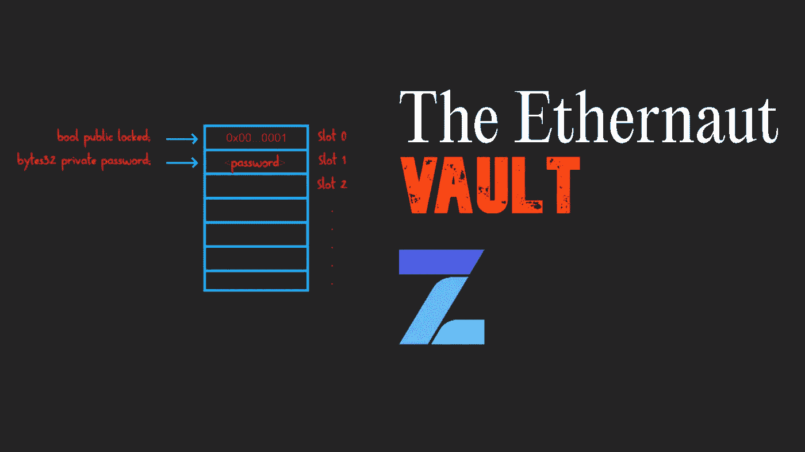
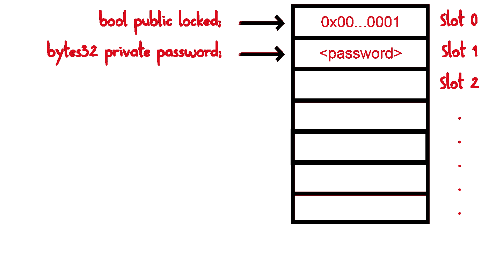

# 以太 9 级:金库

> 原文：<https://medium.com/coinmonks/ethernaut-vault-774f8875149f?source=collection_archive---------25----------------------->

ethernaut vault

## 以太者跳马挑战的解决方案

# 挑战简介

以太英雄是一个基于 Web3/Solidity 的战争游戏，灵感来自 overthewire.org，在以太坊虚拟机上玩。每一层都是需要‘黑’的智能合约。游戏是 100%开源的，所有关卡都是其他玩家做出的贡献。请完成[这个](https://ethernaut.openzeppelin.com/level/0x4E73b858fD5D7A5fc1c3455061dE52a53F35d966)挑战，以便更好地了解游戏。

以太挑战:【https://ethernaut.openzeppelin.com/ 

# 所有问题

*   [退路](/@kevin30101999/ethernaut-fallback-c8ead99dca4a)
*   余波
*   [硬币翻转](/@kevin30101999/ethernaut-coinflip-121f590d90af)
*   [力](/@kevin30101999/ethernaut-force-b980687c77b)
*   跳马(这个)

# 智能合同黑客！！

# 工作

解锁金库通过关卡！

# 可能有帮助的事情

合同的结帐存储布局

## 理解合同

**第 8–11 行**这里我们在构造函数中设置**密码**和**锁定**变量的值。为了完成任务，我们需要以某种方式将**锁定**的状态改为假。

**第 13–16 行**我们可以使用 **unlock()** 方法来做到这一点，但这需要我们有密码值来解锁。

## 解决办法

解决方案是，即使变量被标记为私有，我们也可以在区块链上看到它的值！！是的，如果这让你感到震惊，请再读一遍。将变量标记为私有只会阻止其他智能合约访问它。我们可以通过查看合同的存储布局来访问任何存储变量。

现在，让我们了解一下解决这一挑战的存储布局。

以太坊虚拟机上的每个智能合约可以将其变量值存储在一个永久存储器**中**。这个永久存储器就像一个数组，数组的每个块可以存储 32 字节的数据。这种块也称为槽。这些插槽总共有 **2 个⁵⁶** 。好吧，如果你在想，如果那已经耗尽了呢？新的智能合约将在哪里存储其变量。那么让我告诉你，这个数字远远大于整个地球上的原子数量。所以，至少在这一生中我们不会面对这个问题。

让我们看一下智能合同的简化存储模型，以便更好地理解它。我们的智能合约中有 2 个变量**锁定**和**密码。在渗透存储上看起来会像这样。**

Simplified version of memory Layout

现在，如果我们知道智能合同的地址，我们还可以访问其存储内存，并获得**密码的值。**我们可以使用 ethersjs、web3 等库。在我们的控制台中，我们有 web3 的实例，因此我们将使用它。

*   您可以在控制台
    `await contract.address`中使用下面一行获取您的以太网联系人地址
*   要获取插槽 1(存储密码的位置)的值，请运行以下代码。
    T1。这里第一个参数是合同地址，第二个是槽号。
*   复制该值，并使用该值调用契约中的 **unlock()** 方法。
    `await contract.unlock(“<Copied Value>”)`。
*   检查**锁定**的值并提交实例。

## 结论

重要的是要记住，将变量标记为私有只会阻止其他契约访问它。标记为私有和局部变量的状态变量仍然可以公开访问。因此，我们应该避免在智能合约中存储任何密码或 API 密钥。安全存储它们的一种方法是加密其值，然后存储它。这样，没有人可以得到价值，除非他们有加密。

这个挑战很快就能解决，但是写这篇文章花了更多的时间。请欣赏👏(鼓掌)如果你从中得到任何有意义的东西。此外，如果我在评论中遗漏了什么，请纠正我。

> 加入 Coinmonks [电报频道](https://t.me/coincodecap)和 [Youtube 频道](https://www.youtube.com/c/coinmonks/videos)了解加密交易和投资

# 另外，阅读

*   [如何在 Bitbns 上购买柴犬(SHIB)币？](https://coincodecap.com/buy-shiba-bitbns) | [购买弗洛基](https://coincodecap.com/buy-floki-inu-token)
*   [CoinFLEX 评论](https://coincodecap.com/coinflex-review) | [AEX 交易所评论](https://coincodecap.com/aex-exchange-review) | [UPbit 评论](https://coincodecap.com/upbit-review)
*   [十大最佳加密货币博客](https://coincodecap.com/best-cryptocurrency-blogs) | [YouHodler 评论](https://coincodecap.com/youhodler-review)
*   [AscendEx 保证金交易](https://coincodecap.com/ascendex-margin-trading) | [Bitfinex 赌注](https://coincodecap.com/bitfinex-staking)
*   [最好的卡达诺钱包](https://coincodecap.com/best-cardano-wallets) | [Bingbon 副本交易](https://coincodecap.com/bingbon-copy-trading)