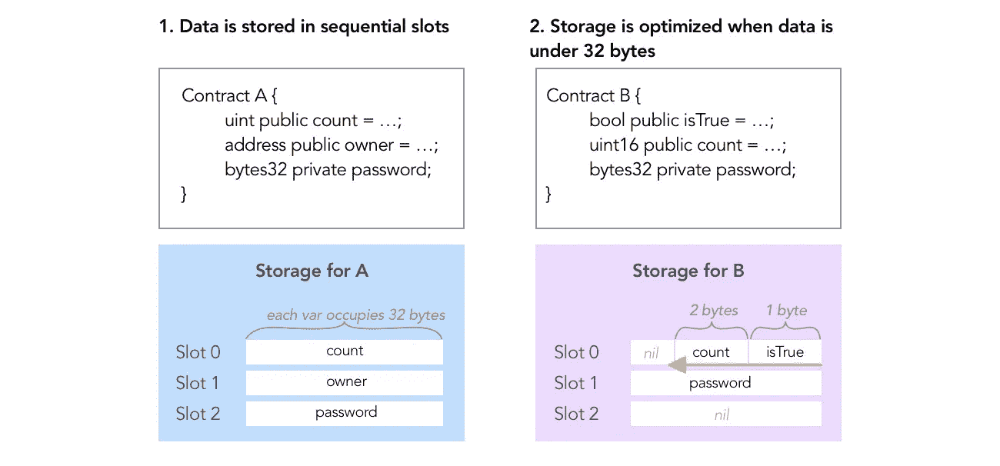

# ether naut-Vault——如何解读秘密？

> 原文：<https://medium.com/coinmonks/ethernaut-vault-how-to-read-the-secret-988851a27c08?source=collection_archive---------36----------------------->

如果我们想在我们的契约中保存一些东西，但是我们不希望其他人可以读取它，我们将使用私有状态(更多关于状态的信息在这里)，不是吗？没那么简单。在区块链保存的每一个信息都是公开的，即使是私人变量。那么我们为什么要使用私有变量，它们之间有什么不同呢？公共变量每个人都可以很容易地阅读，因为在编译后，我们可以调用她喜欢的函数，并获得值。对于 private 来说，这是行不通的，如果我们想读取它的值，我们必须使用一个特殊的函数。但是让我们从头开始。

我们知道，可靠性以二进制形式保存信息，可以用十六进制表示(更多关于二进制和十六进制的信息[在这里](/coinmonks/ethernaut-token-what-if-our-alphabet-could-have-only-two-letters-6173d63c62ce))，但是这些信息究竟包含在哪里呢？

> Solidity 使用带有 2 个⁵⁶插槽的存储。每个时隙有 32 个字节。数据按照声明的顺序存储。这种存储经过优化以节省空间。如果相邻的变量适合一个 32 字节，那么它们被打包到同一个槽中，从右边的
> T5 开始，依次为

Optimized of space made by Solidity. The picture comes from [0xSage](/@0xsage?source=post_page-----c9b01ec6adb6--------------------------------)

因此，每个合同都有自己的存储空间，其中包含所有变量的值。对它的访问是免费的，但你将需要一个特殊的功能: *web3.eth.getStorageAt.* 它需要合同的地址和你感兴趣的槽号。这一切。

除非你会使用[映射](https://www.tutorialspoint.com/solidity/solidity_mappings.htm)或者动态数组。如果你使用其中的一个，从存储器中读取会有点困难。为什么是动态数组？让我们从比较动态和静态数组开始。

静态数组是从一开始就有确定大小的数组。我们像*字节 32【3】公共数据一样写这个。*这告诉我们，数据是一个三元素数组，数组的每个元素都是 bytes32。因此，如果数组前的变量在槽号 n 中是安全的，那么这个数组的元素将在槽号 n+1，n+2 和 n+3 中。这一切。

当我们创建一个动态数组时，在 Solidity 中创建，例如 *bytes32[] public data，*编译器不知道应该为这个数组预定多少空间。这是一个问题，因为如果它像静态数组那样工作，编译器会假设这个数组需要 k 个槽。所以它会在预定空间之外写下一个变量。但是当我们的数组需要超过 k 个槽时，它将开始覆盖其他变量。我们肯定不要。映射的问题也类似。

那么我们的编译器是如何处理这两个问题的呢？我们假设下一个空闲槽叫做 *p.* 如果下一个要写入存储的变量是动态数组，编译器会把 *p* 放到 keccak256 函数中。这个函数的结果将被放入编译器开始保存数组的存储器中。数组中的下一个元素将位于槽号
keccak 256(*p*)+(index * elementSize)中。

现在让我们关注映射。同样，假设第一个未被占用的槽的编号是 *p，*，我们希望在那里保存一个映射。在这种情况下，我们的编译器会将分配给*键*的值保存在编号
keccak256( *键*，*槽*)的槽中。

我希望这篇文章对你有用。如果你有任何想法，我如何能使我的帖子更好，请告诉我。我随时准备学习。你可以在 [LinkedIn](https://pl.linkedin.com/in/szymon-skrzy%C5%84ski-881462214) 和 [Telegram](https://t.me/eszymi) 上和我联系。

如果你想和我谈论这个话题或者我写的其他话题，请随意。我乐于交谈。

快乐学习！

> 交易新手？试试[加密交易机器人](/coinmonks/crypto-trading-bot-c2ffce8acb2a)或者[复制交易](/coinmonks/top-10-crypto-copy-trading-platforms-for-beginners-d0c37c7d698c)