# 以太扫描初学者指南| 11 加密浏览器的功能

> 原文：<https://medium.com/coinmonks/etherscan-beginner-guide-11-functions-of-crypto-browser-76c199945d90?source=collection_archive---------46----------------------->

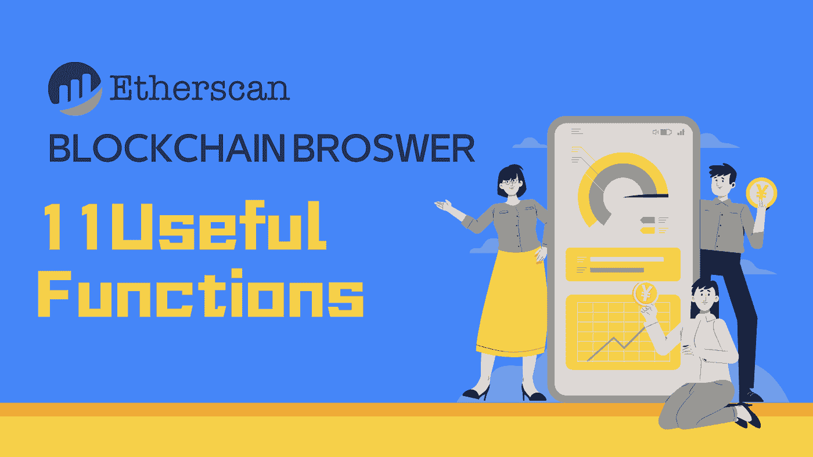

> 不知道如何使用加密浏览器的全部功能？Etherscan 可让您在一个位置访问气体跟踪器、最新令牌信息、多链搜索、持有者观察列表。

**👉跟我上** [***推特***](https://twitter.com/TheCryptoKK)***|***[***中***](/@TheCryptoKK) **让自己升职！**

**聚焦#NFT 研究员&#网路搜寻家**

**每日分享# web 3 # Crypto # NFT #比特币的真实素材**

therscan 是领先的区块链浏览器、搜索、API 和分析平台，面向以太坊，一个去中心化的智能合约平台。它于 2015 年建立并启动，是围绕以太坊及其社区建立的最早、运行时间最长的独立项目之一，其使命是提供对区块链数据的公平访问。

今天我给大家介绍一下 Etherscan 的 11 个有用的功能。

1.  **气体跟踪器**

[http://etherscan.io/gastracker](https://t.co/qApBmYhilq)

查看实时气价和空投信息。

如果你不赶时间，等到油价低了再互动也是很好的。

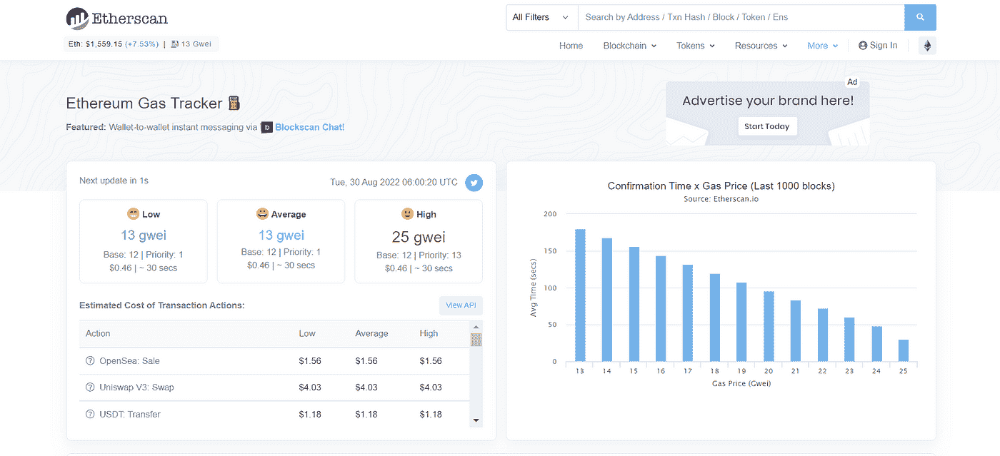

你也可以查看过去 7 天的历史油价，这给你一个更全面的参考。

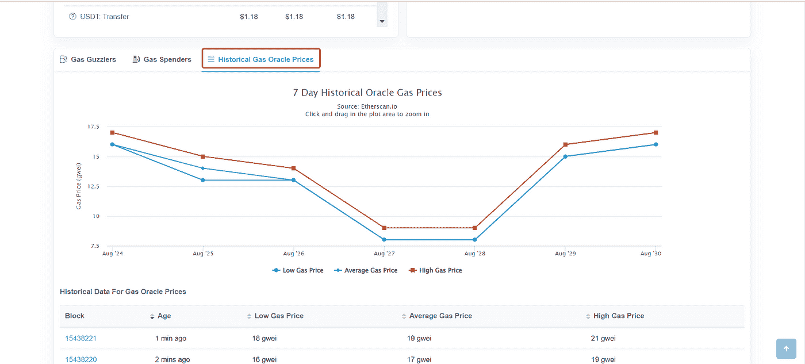

**2。撤销令牌批准**

 [## 令牌批准|以太网扫描

### 审查和更新您对任何智能合同的令牌批准。

etherscan.io](https://etherscan.io/tokenapprovalchecker) 

先连接你的钱包。

这里显示了您所有批准的支出者。只需选择您想要撤销的。

**3。检查代币持有量**

搜索一个地址，然后单击令牌列最右侧的 wallet 徽标，查看其令牌持有量，包括该地址的所有令牌、LP 令牌和 NFT 持有量。你可以对自己或他人的钱包这样做。

这里显示了象征性持有 SBF 的钱包。

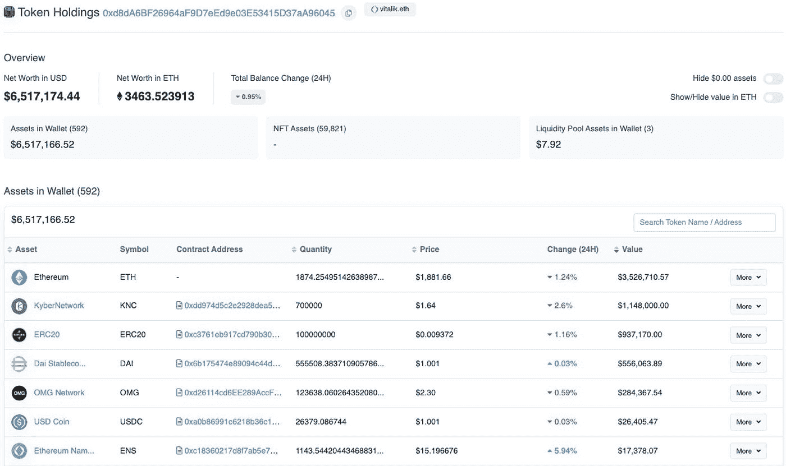

**4。NFT 智能合约**

获取 NFT 的合同地址，然后在 Etherscan 上搜索。

合同>写合同>链接到钱包>找薄荷>填写总价和数量>点击写>在你的钱包里确认。

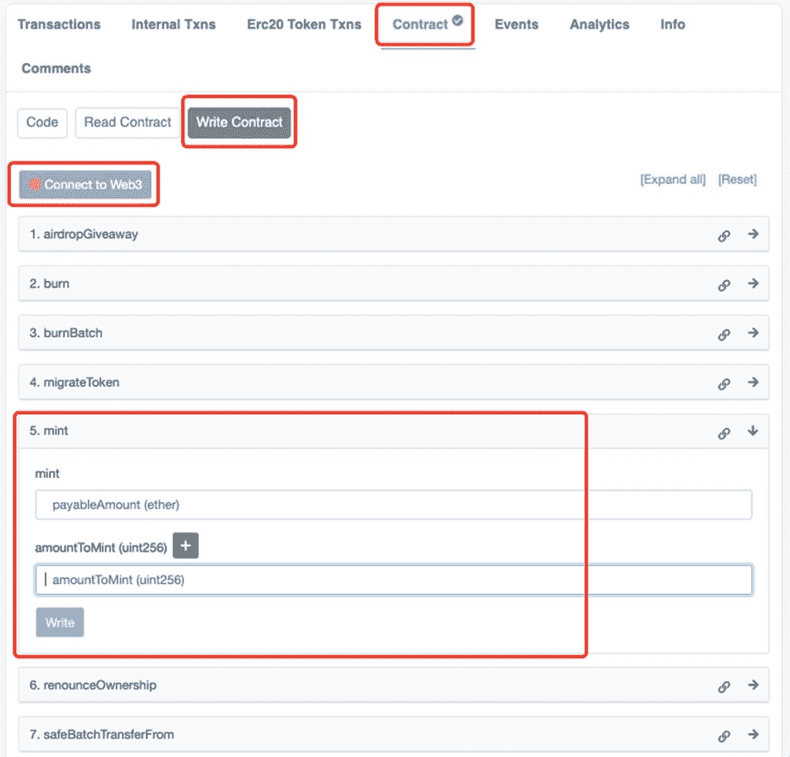

**5。通过钱包聊天**

[http://chat.blockscan.com](https://t.co/IM9UpB3uDX)

搜索地址并点击聊天图标开始聊天。

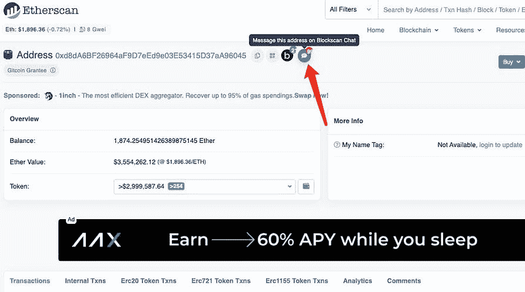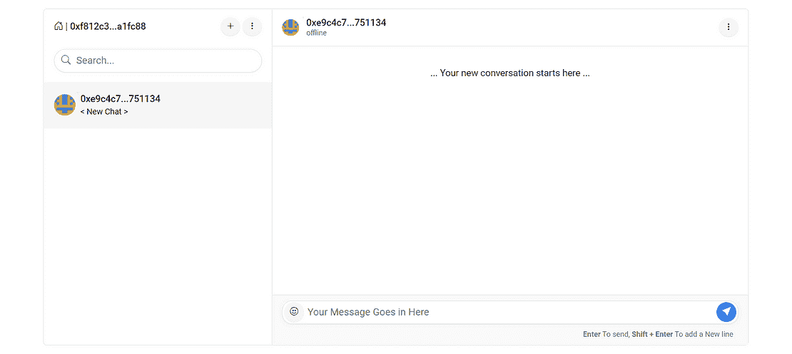

**6。令牌& NFT 信息**

搜索特定的令牌或 NFT，可以获得详细的信息，如合同地址，总供应量，以及前 100 名持有人。

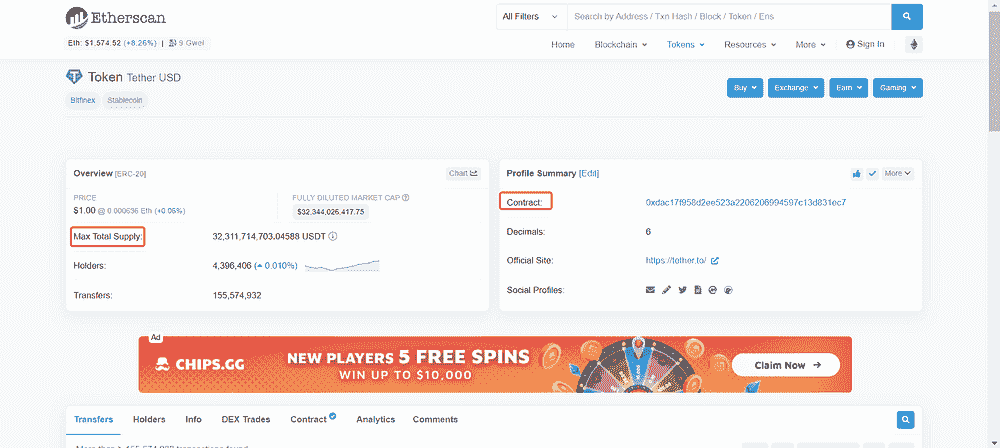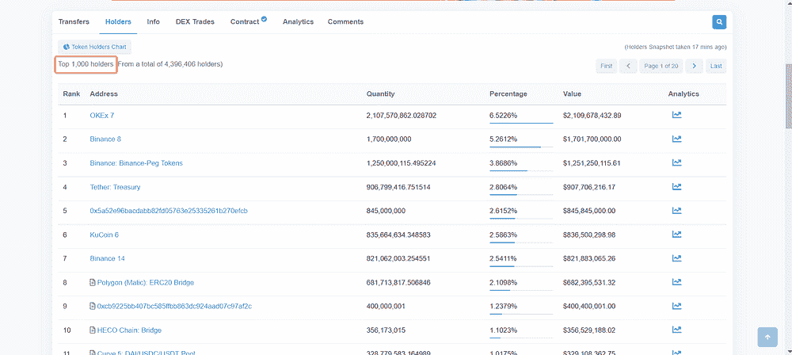

**7。持有者观察列表**

找到持有者后，您可以将他们添加到您的观察列表中，以跟踪他们的最新行动。

要成功创建您的观察列表，您需要先注册一个帐户。一旦你看到的钱包有任何变化，你就会收到一封电子邮件。

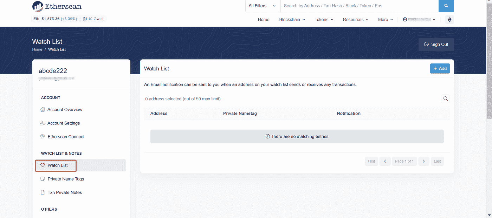

**8。反欺诈功能**

Etherscan 具有标记可疑和网络钓鱼地址的功能。

当您登录到以太网扫描时，您可以看到一个“令牌忽略列表”功能，该功能隐藏了所有被以太网扫描标记为可疑、不安全、垃圾邮件或品牌侵权的令牌交易。您可以在此页面创建自己的忽略列表。

**9。多链搜索**

[https://blockscan.com/](https://blockscan.com/)

除了以太扫描，该团队还开发了其他 20 个区块链浏览器。只要在这个网站上输入一个地址，你就可以在所有支持的 EVM 连锁店上搜索到这个地址。

此外，在 Etherscan 上的地址右侧有一个“b”按钮，你也可以点击它直接进入其他 20 个浏览器。

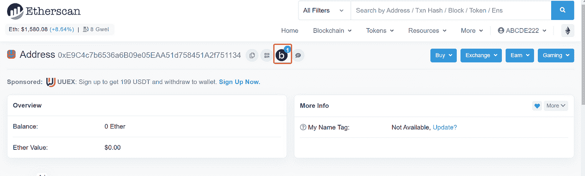

**10。开发者的更多功能**

2021 年开发了两个新功能，分别是智能合同搜索和合同差异检查器。

*智能合约搜索:*用户可以在所有已验证的以太坊智能合约中搜索关键词。

*契约差异检查器:*允许开发者比较两个智能契约之间的差异。

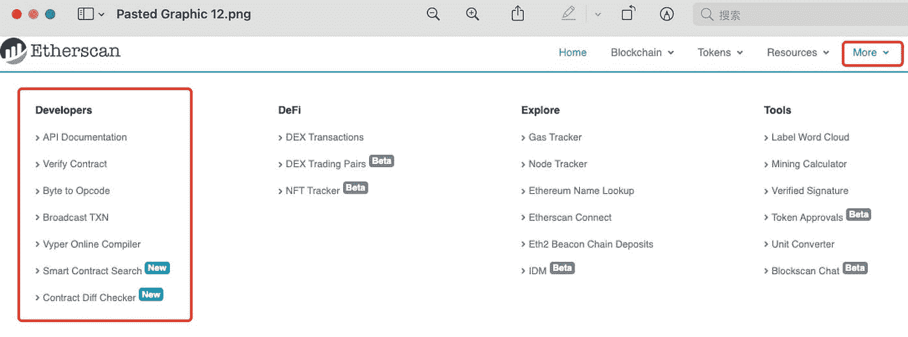

**11。风险提示**

有风险的代币前面会有提醒，交易界面包含有风险的代币。并且提醒也将显示在包含没有更新信息的令牌的 Txn 散列上。

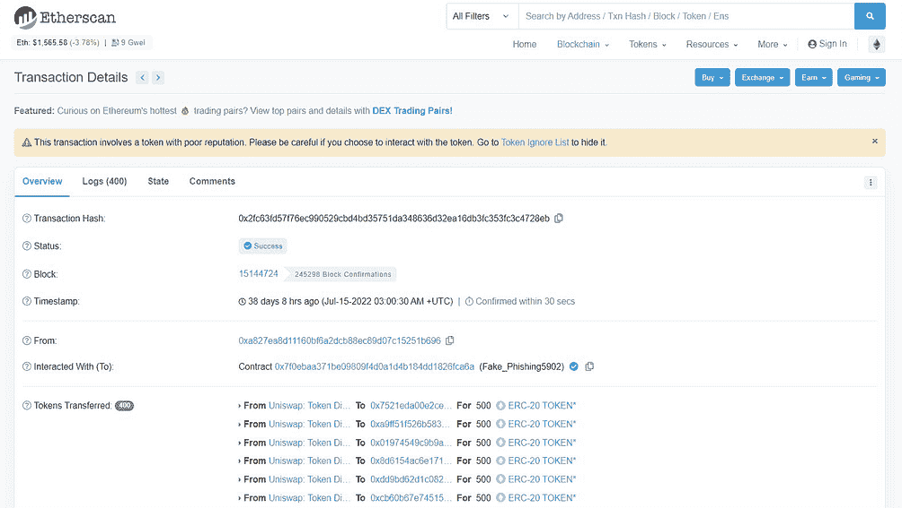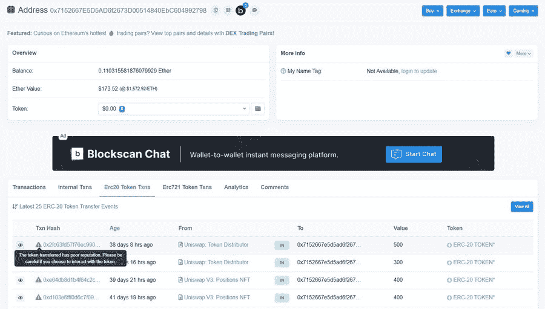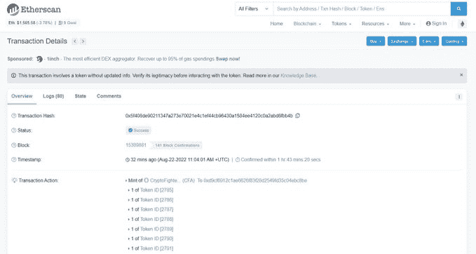

***关注我让自己升职！***

***聚焦#NFT 研究员&#网路搜寻家***

***每日分享关于# web 3 # Crypto # NFT #比特币的真实玩意儿***

[***碎碎念***](https://twitter.com/TheCryptoKK)***|***[***中等***](/@TheCryptoKK)

*欢迎关注我，有什么问题尽管问*

> 交易新手？尝试[加密交易机器人](/coinmonks/crypto-trading-bot-c2ffce8acb2a)或[复制交易](/coinmonks/top-10-crypto-copy-trading-platforms-for-beginners-d0c37c7d698c)