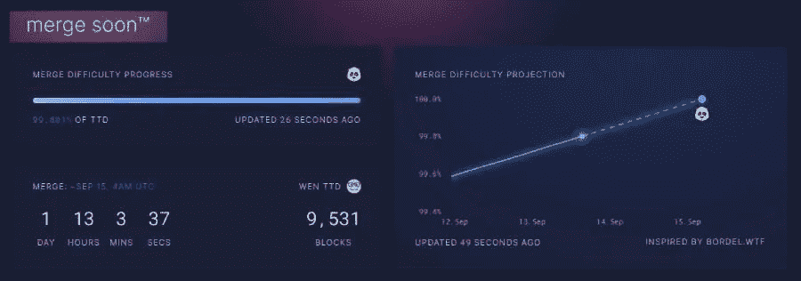

# 随着联邦理工学院的通货膨胀率变为零，联邦理工学院的令牌经济学也随之改变

> 原文：<https://medium.com/coinmonks/eths-tokenomics-changes-with-the-merge-with-eth-s-inflation-rate-becoming-zero-25626f6979a2?source=collection_archive---------18----------------------->

From [ultrasoundmoney](https://ultrasound.money/)

# 以太坊的合并季特辑，包含与以太坊的灯塔链相关的故事

From [ultrasoundmoney](https://ultrasound.money/). Celebrating the coundown to Ethereum’s Merge Baby!!

因此，合并日期就在前面一天，以太坊很快就不再是工作链的证明，因为它很快就开始了。这是一个非常特殊的场合，这就是为什么从上周开始，我一直在写以太坊信标链相关的文章来庆祝合并的倒计时。

今天将是我第四篇也是最后一篇庆祝合并的文章，因为在这篇文章之后以太坊合并实际上已经发生了。

***你可以在这里阅读我的庆祝以太坊合并系列文章-***

*   [分析以太坊信标链当前形式的去中心化水平](/coinmonks/analyzing-ethereum-beacon-chains-level-of-decentralization-in-its-current-form-e162e80924e)
*   [以太坊本月将举行盛大活动，合并即将开始，它将转变为一个销售点连锁店！！](/coinmonks/grand-event-this-month-for-ethereum-with-the-merge-happening-soon-transitioning-it-into-a-pos-chain-9683d86ad89b)
*   [庆祝以太坊与 stETH 的合并，因为这一资产成为今年的头条新闻！！](/coinmonks/celebrating-the-ethereum-merge-with-a-steth-story-as-this-asset-made-headlines-this-year-8251338ddc75)

# 合并后通货膨胀率大大降低！！

在这里，我的重点将是以太坊现在正在成为一种通货紧缩的加密货币。到目前为止，ETH 的通货膨胀率为 4.62%。

目前， [ETH 的发行](https://ethereum.org/en/upgrades/merge/issuance/)以两种方式发生，导致这种通货膨胀，以太坊执行层(即以太坊当前功率状态链)的 ETH 发行导致 4.13%的通货膨胀，以太坊共识层(以太坊的信标链)的 ETH 发行导致 0.49%的通货膨胀，总计 4.62%的通货膨胀。

合并当然会将这两个链结合起来，以太坊过渡到一个证据链，验证和块创建都将发生在信标链上。

因此，合并后以太坊的执行层不会发布任何新的 ETH，执行层中发生的所有活动都将包含在信标链块中。

ETH 发行将在以太坊的共识层以 0.49%的相同利率发生，完全消除以太坊 4.62%的通胀率。

## 以太网处于通电状态时执行层以太网发布

以太坊作为一个电力链，必须充分奖励矿工，因为采矿是一项能源密集型活动，矿工在采矿设备和电力上花费很多。以太坊作为一个 POS 链，对验证者来说没有巨大的能源成本开销，所以他们得到的奖励较少。

From [ultrasoundmoney](https://ultrasound.money/). Ohh, costly memories of Ethereum Network with its high gas fees in Proof of Work State!!

在以太坊的异能状态链中，一名矿工成功挖掘一个[规范区块](https://ethereum.org/en/upgrades/merge/issuance/)赢得 2 ETH 作为区块奖励。此外，矿工还因开采 [ommer 区块](https://ethereum.org/en/upgrades/merge/issuance/)获得 0.08 ETH，因此 ETH 的发放量为每 13.3 秒 2.08 ETH。

***每天发行 ETH = 13000 ETH***

## 以太网在其功率状态下在共识层以太网发布

自 2020 年 12 月以来，以太坊的共识层一直在向证明信标链状态的验证者发放 ETH 奖励，信标链由各种验证者赌注池的赌注组成。

对验证者存款的赌注奖励一直在累积。

***每天发放的 ETH 作为共识层的赌注奖励已经是 1600 ETH。***

## 合并后 ETH 的发行减少了 90%,降低了 ETH 的通货膨胀率

合并后，ETH 发布将只发生在以太坊共识层，验证者因证明链的状态和提出块而获得奖励。他们会受到惩罚，还会因为停机或旨在窃取资金或破坏供应链安全的恶意行为而受到惩罚。

这些基于表现的奖励和惩罚将在每个时间段分配，耗时 6.4 分钟。

灯塔链每天发放的 ETH 将保持在 1600 ETH，相当于 0.49%的通货膨胀率。

因此，合并后的 ETH 发行利率下降了 90%,消除了以太坊的 POW 状态链产生的 4.13%的通货膨胀。

## 由于烧伤技工取消了 ETH 的供应，ETH 的通货膨胀率降至零

From [ultrasoundmoney](https://ultrasound.money/)

现在，即使是这个 0.49%的通货膨胀在合并后也被消除了，因为以太坊的燃烧机制在起作用。每当一笔 ETH 交易发生时，其中一部分会作为费用被烧掉并从流通中移除。

***因此，每天发放 1600 个 ETH，但每天也有相同数量的 ETH 被烧掉。***

***这相当于 ETH 的通胀率为 0%，发行利率被 burn 机制*** 否定。最终，ETH 的发行利率将为负，随着流通中的 ETH 供应减少，但对 ETH 的需求持续，ETH 应该会出现通缩。

你可以在[https://ultrasound.money/](https://ultrasound.money/)中想象所有这些场景，这表明所有这些动态都在影响 ETH 的供应，合并后以太坊将成为通货紧缩的加密货币。

# 新发布的 ETH post 合并被锁定，直到上海升级被交付！！

嗯，这就是 ETH 现在成为通缩资产的原因。你可以参考这里的[文章自己算算](https://ethereum.org/en/upgrades/merge/issuance/) -

https://ethereum.org/en/upgrades/merge/issuance/

请记住，合并后，在上海升级完成之前，累积的赌注奖励不能提取。所有新发行的 ETH 将作为验证者奖励发行，并锁定在验证者余额中，直到上海升级允许从验证者账户中提取 ETH。

所以，在那之前，无论什么 ETH 在流通都是来自以太坊能量，所以在那之前 ETH 供应应该会减少很多。让我们看看这对 ETH 的价格有什么影响！！

***就是这样，伙计们，合并就要到了…！！***

> 交易新手？尝试[加密交易机器人](/coinmonks/crypto-trading-bot-c2ffce8acb2a)或[复制交易](/coinmonks/top-10-crypto-copy-trading-platforms-for-beginners-d0c37c7d698c)