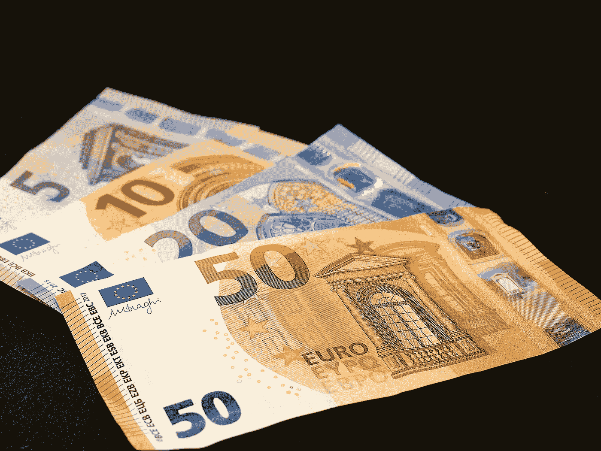

# 欧元 20 年来首次与美元等值

> 原文：<https://medium.com/coinmonks/euro-equal-to-the-us-dollar-for-first-time-in-20-years-8722121f9d1e?source=collection_archive---------26----------------------->

周二，欧元与美元的汇率 20 年来首次持平。

截至希腊时间周二上午，一欧元正好等于一美元，这意味着欧元的价值比年初下降了 12%以上。