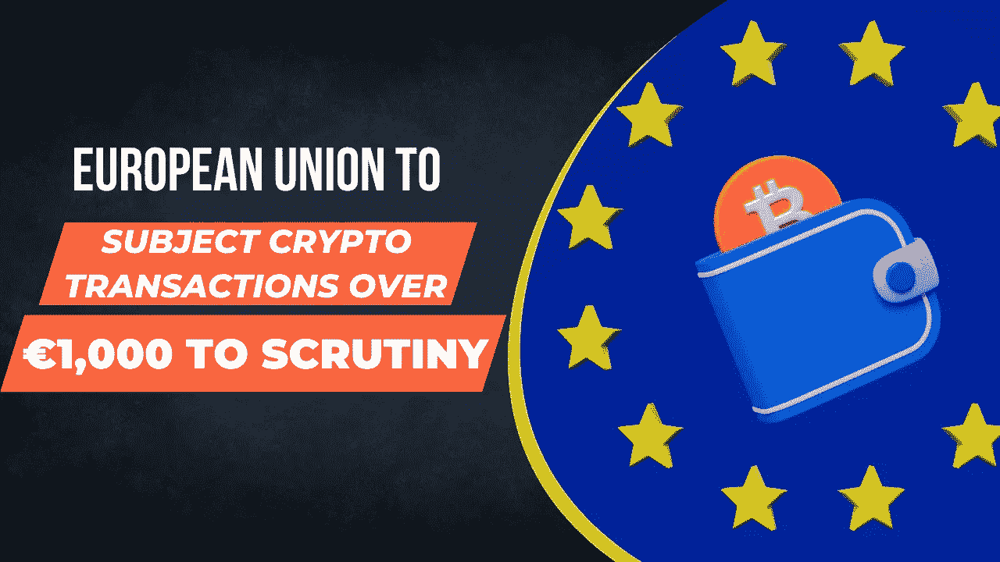

# 欧盟将对€1000 英镑以上的加密交易进行审查，并限制对€10000 英镑的现金支付

> 原文：<https://medium.com/coinmonks/european-union-to-subject-crypto-transactions-over-1-000-to-scrutiny-and-limited-cash-payments-to-79f9981e0431?source=collection_archive---------4----------------------->

European Union to Subject Crypto Transactions Over €1,000 to Scrutiny

11 月 6 日，欧盟提议对现金支付实行 1 万€的限额。此举旨在遏制洗钱和恐怖融资活动。

该提案是第五号反洗钱指令的一部分，由欧盟的执行机构欧盟委员会提交。根据该提案，所有超过 1 万€的付款必须通过银行转账或其他数字方式进行。

该提案还要求，比特币等虚拟货币超过 1000€的交易必须接受“强化尽职调查”。这意味着处理虚拟货币的实体必须收集和核实其客户的身份，并向有关当局报告可疑交易。

 [## 欧盟打击€1000 英镑的加密交易&限制向€10000 英镑支付现金

### 对现金支付设限:欧盟设定 10，000 欧元的上限，并对加密交易进行限制…

youtube.com](https://youtube.com/shorts/No0xNys_ejY) 

此外，该提案还要求成员国保存超过 1 万€的所有跨境转账记录。这是为了使当局能够追踪用于犯罪活动的资金来源。

该提议受到了反腐败和反洗钱活动人士的欢迎。他们表示，为了解决欧洲的洗钱和恐怖融资问题，这些措施是必要的。

然而，该提案遭到了一些人的批评，他们认为这可能会对小企业和非正规经济产生负面影响。他们认为，该提议可能会导致在欧洲做生意的成本增加，个人用现金支付的自由度下降。

此外，也有人认为，如果人们无法使用数字支付方式或银行服务，拟议的限制可能会使他们更难获得金融服务。

总体而言，新法规是欧盟为打击金融犯罪和洗钱而迈出的可喜一步。通过限制现金支付和加强对加密货币交易的审查，欧盟正在采取措施确保所有支付都是安全、可靠和透明的。

> 交易新手？试试[加密交易机器人](/coinmonks/crypto-trading-bot-c2ffce8acb2a)或者[复制交易](/coinmonks/top-10-crypto-copy-trading-platforms-for-beginners-d0c37c7d698c)