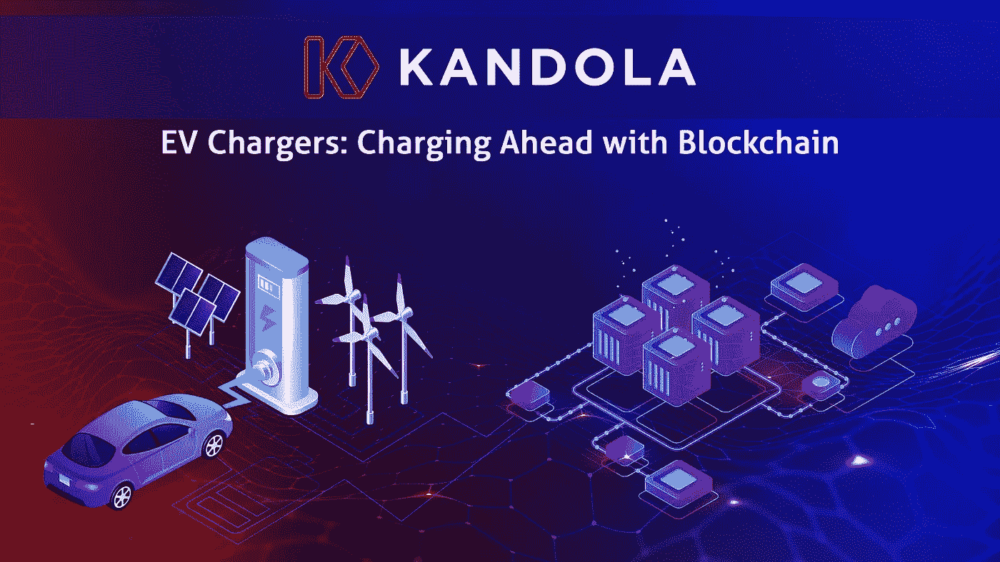

# 电动汽车充电器:用区块链充电

> 原文：<https://medium.com/coinmonks/ev-chargers-charging-ahead-with-blockchain-3dd424b9293b?source=collection_archive---------28----------------------->

~Smita Selot，坎多拉网络

随着化石燃料的枯竭，绿色交通无疑正在稳步发展。

然而，缺乏足够的充电基础设施可能会很快成为电动汽车采用的瓶颈。高速公路和人口稠密地区对快速 DC 充电器的需求是公共充电站增长的驱动因素。随着公共充电站需求的增长，公共充电站运营商将面临预测电力和停车需求等挑战。保持电动汽车充电站的连接、良好维护和防故障是进一步的挑战。区块链可以为充电站带来优势，如更好的连接性、安全快速的计费和智能激励，同时减少对中介的需求和运营成本。本文探讨了电动汽车充电站使用区块链的优势和挑战。

## **保护电动汽车驾驶员的数据隐私**

缺乏数据隐私保护会导致代价高昂的诉讼、业务损失以及企业形象受损。典型的商业交易要求用户共享个人身份信息(PII ),如姓名、电子邮件 id、电话号码、地理位置和财务数据，如银行账号和借记卡/信用卡号。充电站使用的能源电网基础设施通常缺乏保护，无法保证 PII 的安全。 [ZDNet 发现](https://www.zdnet.com/article/off-the-grid-thousands-exposed-after-database-leak/)由危地马拉能源初创公司 Kingo 运营的数据库已经暴露了超过 18800 名客户的个人信息。区块链实现了人类、企业和机器之间完全隐私的商业交易。双方使用各自的区块链账户直接进行商业交易，无需访问 PII。

> 交易新手？试试[密码交易机器人](/coinmonks/crypto-trading-bot-c2ffce8acb2a)或[复制交易](/coinmonks/top-10-crypto-copy-trading-platforms-for-beginners-d0c37c7d698c)

## 更好地抵御网络攻击

充电站使用的电网是网络攻击和恐怖分子非常有利可图的目标，特别是因为攻击的影响是巨大的。最近对阿姆斯特丹-鹿特丹-安特卫普(ARA)的网络攻击影响了商业运作，进而影响了整个欧洲的经济。区块链网络是分散的，因此可以防止单点故障。此外，由于需要大量的资源，黑客无法篡改区块链中的用户数据。即使他们以某种方式成功了，他们也只能破坏数据的一个副本。

## **降低运营成本**

典型的商业交易要求付款人和收款人信任第三方，如银行。第三方对每笔交易收取费用。区块链实现了不涉及第三方的商业和金融交易。消除对第三方的需求降低了交易费用，并降低了电动汽车司机和充电站的成本。另一个优势是电动汽车充电生态系统中的中介数量较少，因此充电站服务提供商的运营利润更高。

## 接触更多客户

由于区块链不需要支付者持有银行账户，充电站服务提供商可以接触到更多的客户。根据世界银行的数据，估计有 17 亿成年人没有银行账户或任何储存财富的手段。尽管没有银行账户，客户还是有能力为基于使用的服务付费。

## **更好地规划电力和停车需求**

充电站运营商可以激励电动汽车司机遵守推荐的充电时间。根据在 IFAC 进行的[研究，如果电动汽车司机遵守时间表，充电运营商可以计划一天中更均匀的负载分布。均匀的负载分布避免了由于重负载而导致的电涌和设备故障。这些激励措施还可以激励电动汽车驾驶员更加努力地遵循充电建议。基于区块链的解决方案可以让充电站运营商和电动汽车司机运行智能合同，以促进激励措施。](https://www.sciencedirect.com/science/article/pii/S2405896320311241)

## **安全的电动汽车充电软件维护和升级**

与普通加油站不同，电动汽车充电站总是需要启动和运行。电动汽车充电器的常规和关键软件升级必须可靠。软件升级引入了新功能和错误修复。软件升级过程容易受到恶意攻击，例如回滚和重放消息攻击。区块链可以使软件升级的分发变得安全、高度可用且具有成本效益。因为多个区块链节点安全地备份收费数据，降低了这些升级过程中数据丢失/损坏的风险。

## **采用区块链的挑战**

尽管有众多优势，区块链就像任何新技术一样，也有其挑战。考虑采用区块链的企业需要警惕这些挑战，并投资于最适合他们的解决方案，尽管存在挑战。有许多区块链第一层协议可用。选择合适的区块链协议的一些关键考虑因素是可扩展性、可用性、数据安全性、数据隐私和吞吐量。以下各节详细探讨了其中的一些关键挑战。

## **对安全和隐私的威胁**

区块链本来就是去中心化的；因此，没有中央系统容易受到攻击。然而，即使是分布式架构也需要考虑 DDoS、恶意行为和系统故障等威胁。与集中式架构中 Web 服务器上的 DDoS 攻击不同，区块链网络中的 DDoS 攻击不会导致整个系统瘫痪。然而，攻击者可以通过用非法交易淹没区块链网络来降低一些节点的可用性。最终，这些攻击会影响区块链网络的性能，从而给企业带来运营损失。因此，充电站提供商必须选择区块链网络来识别受影响的节点，并迅速采取纠正措施。

## **实时交易处理性能**

现有共识机制的实施限制了区块链的表现。它需要大量的计算资源，并且在事务数量较多时速度会变慢。旧的无权限区块链每秒只支持 15 个事务。甚至更新的无许可区块链支持每秒不到 100 个事务。这种性能甚至不足以满足只有五个停车位的 100 个充电站的小型充电站网络。电动汽车充电站服务提供商必须选择支持每秒大量交易的区块链网络。

## **数据库访问延迟**

网络延迟会影响事务吞吐量(TPS ),并对数据访问产生影响。高效的数据存储可以实现更快的访问时间，并减少客户体验到的延迟。电动汽车充电站服务提供商使用存储的数据来计算实时电力和停车位需求。除了电力和停车数据，还需要定期访问和分析与充电设备相关的数据，以计划维修、维护和停机时间。超过 10 秒的应用程序响应时间不利于用户体验。因此，区块链数据库访问延迟是一个必不可少的选择标准。

## **坎多拉网络能帮上什么忙？**

Kandola 的区块链是一种可靠、安全、高性能的区块链第一层协议。网络使用多重验证来防范 DDoS、恶意攻击和系统故障。此外，当验证测试失败时，网络隔离表现不佳的节点。第 1 层协议旨在支持每秒大量的事务，并能满足未来大量事务的需求。区块链使用本地技术来存储数据，从而允许高数据访问速率来实现所需的低延迟。Kandola 的区块链生态系统有其原生令牌 EKAH，可以实现区块链商业交易。

Kandola 的区块链数据库存储了所有的实时数据，供以后检索。数据格式是标准化的，并带有时间戳。外部第三方系统可以在这些数据集上构建他们的分析模型。这些分析可以帮助充电站实时预测电力需求。预测电力需求可以帮助运营商更好地服务他们的客户。该分析还可以帮助预测设备故障的早期预警信号，操作员可以提前计划此类突发事件。

如果您在此期间还有其他问题，请不要犹豫，给我们发电子邮件，地址是 [hello@kandola.network](mailto:hello@kandola.network) 。