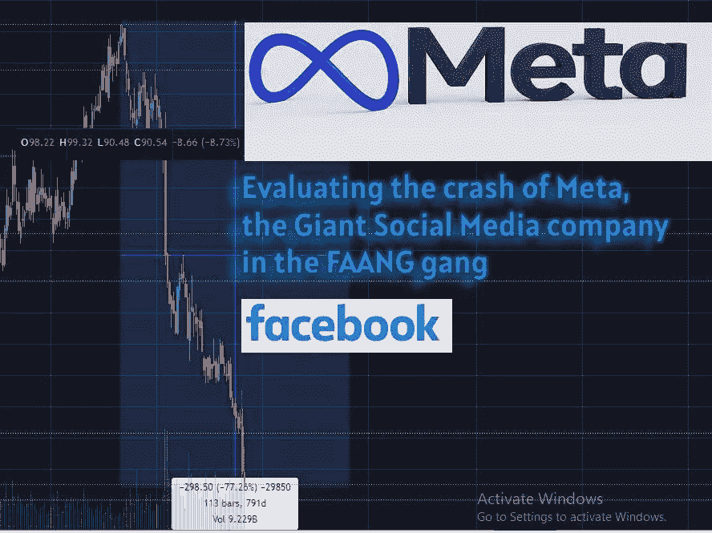
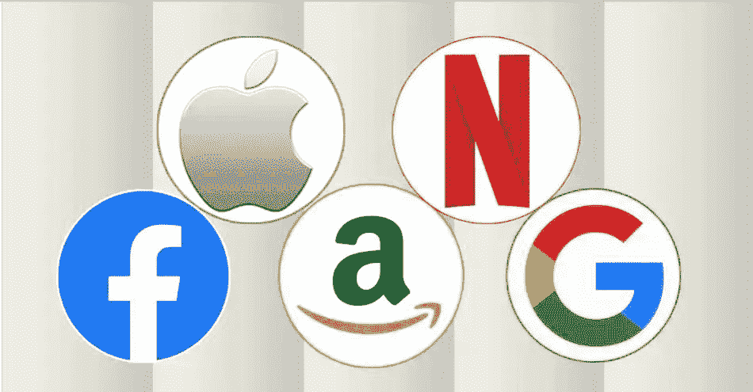
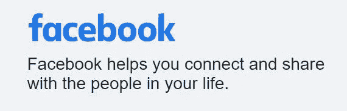
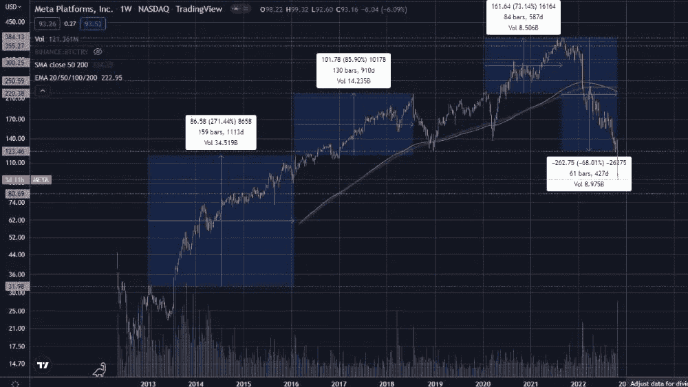
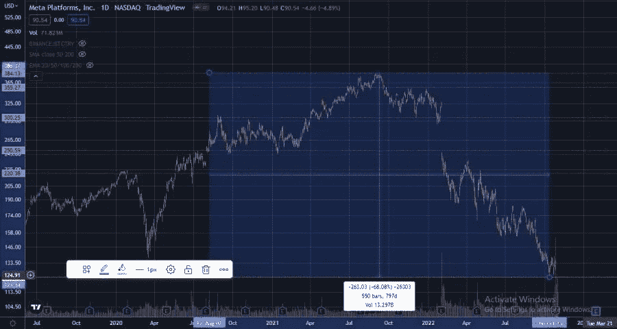
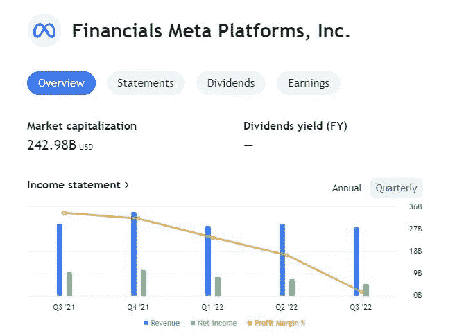
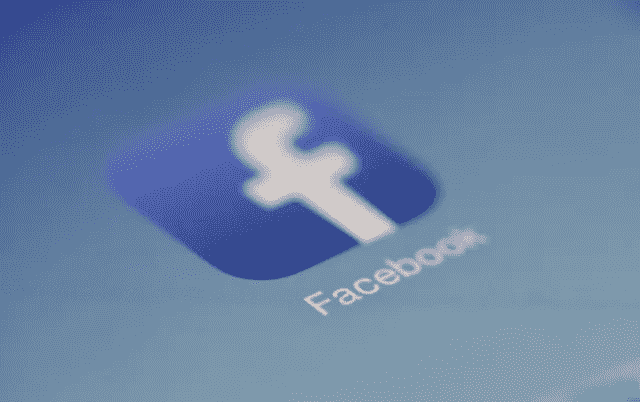
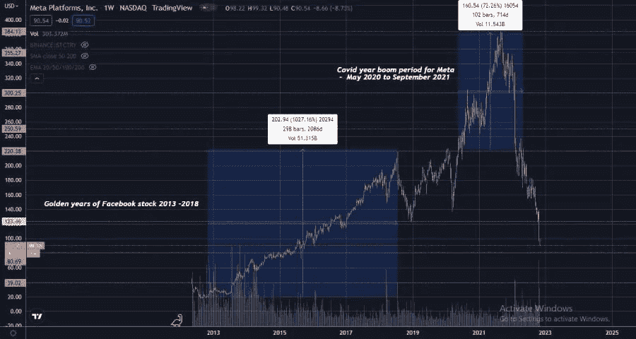

# 评估著名的 Web2 社交媒体巨头 Meta 股票的崩溃

> 原文：<https://medium.com/coinmonks/evaluating-the-crash-of-the-famed-web2-social-media-giants-meta-stock-a4a9dd3cfbc?source=collection_archive---------22----------------------->

# Meta 是 21 世纪早期领先技术公司的大 FAANG 帮之一！！

## 在 21 世纪的大部分时间里，FAANG 公司的股票都获得了高回报

监测经济市场脉搏的方法之一是观察主要科技股的表现。过去十年，我们有杰出的技术巨头引领市场。FAANG 是一组技术公司，其股票在最近十年中表现出色，因为它们是处于高增长阶段的领先技术公司。

是的，FAANG 代表脸书(现在是 Meta)、亚马逊(Amazon)、苹果(Apple)、网飞(NFLX)和谷歌(Google now Alphabet)。这些股票在过去的十年里带来了丰厚的回报，因为它们在业务、销售、采用等方面都经历了增长，这显然导致了收入和净利润的增加。

[Image Source](https://www.businesstoday.in/markets/top-story/story/here-is-everything-you-need-to-know-about-faang-stocks-303722-2021-08-09)

所有这些公司都利用 21 世纪初出现的前沿技术制造终端产品或提供服务。

然而，时过境迁，现在有明显的迹象表明，这些 FAANG 公司的牛市时代已经结束。

# 解析脸书 FAANG 公司——全球最大的社交媒体巨头

*Logo of FB from* [*https://www.facebook.com/*](https://www.facebook.com/) *. I must say the slogan is badly drafted here!!*

## 早期的积极因素是脸书是一个有效的社交网络平台

众所周知，脸书是领先的社交媒体公司，因此其股票大幅上涨。我记得 FB 在 2005 年我大学毕业时就存在了，因为我的朋友告诉我要通过脸书保持联系。然后有人给我发了一个好友请求，让我开了我的第一个 FB 账户。

这一切都很好，因为 FB 使用先进的算法分析我们的数据，并将我们与我们可能认识的人联系起来(如我们在同一所大学、学校学习的同学等)。同样，FB 分析我们的喜好和偏好，并将我们与城市中发生的可能让我们感兴趣的事件联系起来。

因此，FB 作为一个社交网络平台做得不错。我们中的许多人与老朋友取得了联系，并加入了各种团体和活动，扩大了我们的社交网络，使我们的时间在社交上得到充分利用。

## Meta 变成了一个支持强大的邪恶势力和剥削用户的实体

***Meta 作为一个中央化实体协助政客并侵犯用户数据隐私的负面影响***

FB 最终被证明是腐败的，因为我们意识到马克·扎克伯格(Mark Zuckerberg)领导下的公司向政客和公司出售我们的数据，包括我们喜欢和偏好的信息，并向我们提供广告，以使这些强大的资本主义实体获利，将利润置于用户的利益之上。

如今，由于 Hive、Steem 和 Publish0x 等区块链驱动的社交媒体平台提供的读者受众，我停止了使用 FB。我们加密人非常反对像脸书这样出售我们的个人和隐私数据(定义我们)的中央实体，我们试图避免使用这样的平台。

现在 Meta 有更多的内容，它在新闻中指责批评政府行动、政策或使用 FB 传播抗议和运动信息的用户的内容，FB 通过不删除促进违反社区准则的仇恨言论的攻击性帖子来支持政治家。

现在，Meta 已经失去了往日的吸引力，因为它获得了一个反面角色的负面形象，出售用户数据以获取利润，并帮助像政治家这样的强大分子在他们不值得的权力饥渴运动中受益，传播他们的宣传，污染和洗脑用户的思想。通过这些脸书，现在 Meta 也对这个世界造成了很多伤害。

## Meta 的强大之处在于它拥有大量人口的信息(数据)

Meta 仍然很强大，它已经收购了 Whatsapp 和 instagram，因此它仍然是这个地球上最大、最受欢迎的社交媒体平台。这意味着，这个实体拥有大量关于地球上数十亿人的信息和数据。

Meta 的优势在于拥有如此多的用户，任何以其品牌推出的产品显然都会有巨大的市场。

最近，FB 更名为 Meta，因为他们接受了元宇宙，尽管我并不了解所有的新闻。我听说在它的 Meta avatar 里，事情已经失败了。

# 脸书一直在努力发展加密领域以及支付提供商！！

我知道 Meta 正试图通过其他方式增加收入，比如通过支付。例如，现在可以通过 Whatsapp 进行支付。

脸书试图进入加密领域，引入某种支付功能，Diem 是该平台的原生加密，但随着脸书获得不尊重用户隐私的声誉，它与法院发生了纠纷，Diem 从未出现。无论如何…

# 元股票的技术分析

***现在来分析一下元股的表现！！***

Meta 在纳斯达克上市，这张价格图是 META 在纳斯达克证券交易所追踪的价格。

[Source](https://www.tradingview.com/x/OikMC9I0/)

## 自一年前以来，元股价一直在暴跌！！

Meta 在 2021 年 8 月达到目前的 ATH 价格 385 美元，然后在 2021 年 9 月 10 日开始了暴跌之旅。

[Meta Daily Time Frame Chart](https://www.tradingview.com/x/CcHrLnYx/)

META 股票的当前价格是 93 美元，Meta 的股票价值从 ATH 下跌了 68%以上！！

很明显，元股遭到了大量抛售，因为即使在每周的时间框架内，也有巨大的红烛柱。最近几个月，元股票也出现了大规模抛售，跌幅高达 50%!！一年以来，这只股票一直在下跌。

目前，Meta 已经突破了 120 美元的支持价格区间。这个价格区间是该股在 2019 年 12 月的历史最低价。现在，该股票的价格已经进入了 2016 年 9 月的价格区间，当时 95 美元是 META 的 ATH 价格。

现在，随着 Meta 的价格低于 95 美元，该股 5 年的价格收益已经化为乌有！！这意味着 2017 年以来所有没有提前卖出的 META 股东都是红色的。

# 导致 Meta 最近价格暴跌的主要原因！！

**Meta 在最近的 Q2 财报中利润下降**

在股市领域，任何低于 40-50%的跌幅都是一个很好的平均区间，但在 META 的案例中，股票已经远远低于这个百分比。这太严重了！！

***META 最近价格下跌的直接原因之一可能是其最新的财报。***

[Source](https://www.tradingview.com/chart/jCWaxKNy/?symbol=NASDAQ%3AMETA)

*Meta 2022 年第三季度的业绩显示，其收入、净收入和利润率均较 Q2 2022 年上一季度有所下降。随着收入、收益和净利润的减少，Meta 今年的增长每季度都在下降。*

投资者对 Meta 未来增长前景的信心似乎很低，这意味着市场认为 Meta 股票的价格不再有上涨的保证。

# 是时候结束脸书/Meta 统治的时代了！！

有可能另一家公司会取代 Meta 领导社交技术领域，Meta 是一家不仅拥有新的创新技术，还拥有不同理念的公司。

Meta 作为科技领域领先公司的时代可能已经结束。该公司通过采用先进的前沿数据分析技术取得了领先地位，这种技术可能曾经是最前沿的，但现在时代已经发生了变化。

今天的新时代社交媒体需要去中心化、抵制审查和用户控制他们的数据，这是我们知道 Meta 所缺乏的，所以我预计 Meta 的领先时代会褪色，并(希望)在某个时候结束。(游戏 over Meta！！)

今天是这样一个时代，当观众喜欢他们的帖子或创作时，用户就可以为他们的内容付费。这与脸书相反，在那里我们的内容让广告商、公司、政客受益，我们甚至对自己创造的内容没有所有权！！

然而，让我们倒回到 Meta 的时代，即 FaceBook 的黄金时代，先睹为快，看看它的价格走势，它一直保持繁荣，直到一年前开始下跌。

## 脸书股票投资者的黄金时代是在 2013 年到 2018 年之间！！

回到 2012 年，脸书的股价是 17 美元。去年，元股票达到了 385 美元的 ATH 价格，价格上涨了 1900%！！！

【交易视图图表】([)。*价格](https://www.tradingview.com/x/Vi2EOtCe/).*Price)FB 股票的繁荣期肯定是在 2013-1018 年之间。*

可以看出，在 2012 年至 2018 年期间，脸书股票表现非常好。每当股价下跌时，该股似乎都会被买入，跌幅在 15%至 30%之间。2019 年，脸书股票经历了一个熊市阶段，该股下跌了 44%。价格阻力水平在 223 美元，这是 META 在 2018 年达到的 ATH 范围，仅在 Covid year 2020 年 5 月被越过。

那一次，META 的价格上涨可能是因为美联储通过财政刺激措施造成的货币供应过剩最终支撑了资产市场。

可以说，从 2013 年到 2018 年，脸书股票经历了一个更自然的牛市阶段。一个投资者在此期间将获得超过 1000%的收益。在此之后，META 的价格在 Covid 期间上涨，在 2021 年 9 月达到 385 美元的 ATH 价格区间，使 META 股票投资者又获得了 70%的收益。

当然，现在元价格已经低于 95 美元，我不知道这家公司是否还能再次成为社交媒体领域的市场领导者。我觉得是时候让一个没有 META 那么邪恶的新公司取而代之了…耸耸肩！！

# 这里要吸取的一个教训是利用趋势，它们是变化的！！

最后我要说，投资不是一件简单的事情。

显然，你投资是为了获得改变生活的收益，然后套现，作为一个更富有的人享受生活。因此，当趋势出现时，你必须抓住它，否则就没用了。显然，META 现在可能不像 2012 年那样是一只基本面良好的投资股票。现在出现了其他新兴的社交媒体，一个不同的时代正在展开。我们永远不知道哪个实体会像 FAANG 公司那样被广泛采用…

然而，我们的教训是创造改变生活的利润，然后套现，然后看看其他有潜力在此期间领先的公司。不要和一只股票结婚，尤其是像 META 这样的股票，因为它不再像以前那样是一家知名的公司了…

下一篇文章，我将谈论 FAANG 帮的下一个公司——亚马逊 AMZ，小心点。

***感谢阅读！！***

> 交易新手？试试[密码交易机器人](/coinmonks/crypto-trading-bot-c2ffce8acb2a)或[复制交易](/coinmonks/top-10-crypto-copy-trading-platforms-for-beginners-d0c37c7d698c)