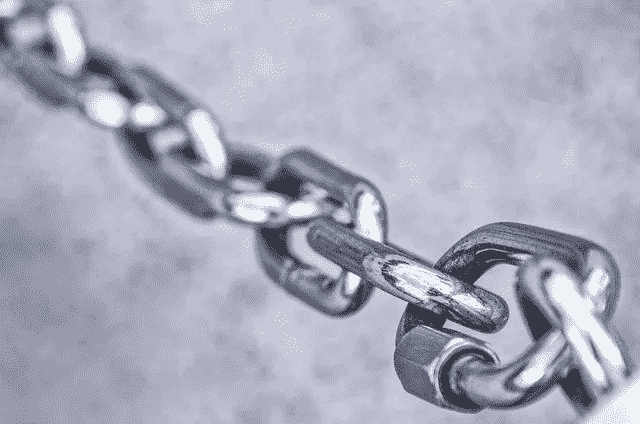
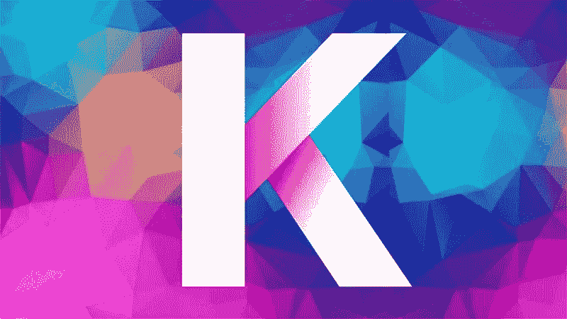
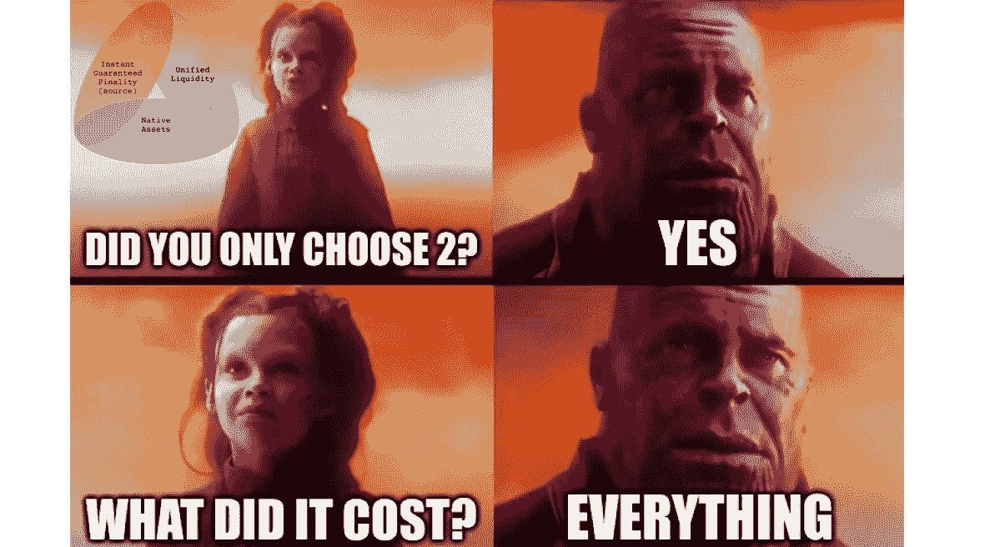
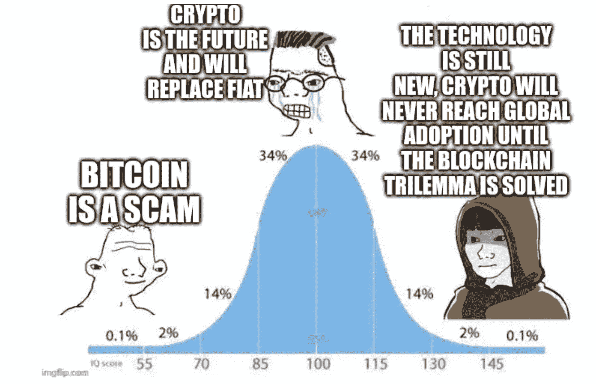
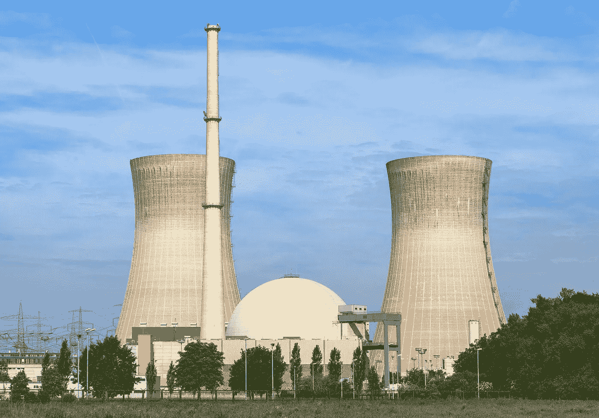

# 甚至比特币 Maxis 也可能睡在区块链技术上

> 原文：<https://medium.com/coinmonks/even-bitcoin-maxis-could-be-sleeping-on-blockchain-technology-9a85077c0b5b?source=collection_archive---------26----------------------->

不久前，我还认为比特币是一种奇怪的时尚，注定会消亡，因为它在这个世界上没有任何用处。显然，我的世界观发生了变化。到底是什么？可能是一系列事情，从宣布 COVID 疫情，政府强制封锁和戴口罩的要求，到 Trump 是 POTUS 和 Stonks 在我周围飙升，突然一个新的理解袭来:我什么都不懂。我的内在预测推理能力出了问题，而且似乎出了问题——我开始相信这是相当准确的。从 2016 年到现在的这几年让我明白，我需要对光天化日之下，就在我面前发生的难以置信甚至不可能的事情保持开放的态度。好像杰瑞·宋飞给我的建议和他给乔治的一样，“如果你的每一个本能都是错的，那么相反的才是对的。”2014 年初，比特币热感觉像是 16 世纪丹麦郁金香热的重演，围绕着一种无用的商品郁金香花，一个双曲线市场突然发展起来，这一切对后期投资者来说都非常糟糕。我忽略了一种文化上的转变，这种转变是关于对一个人的自我和他们在世界上的位置的信念，以及他们是如何比任何上一代普通人所相信的更有价值。我认为我们通过媒体进行调节，看到富人并了解他们与你没有任何真正的不同，看到好莱坞故事赋予“小人物”权力，与企业霸主对抗，以改变普通人如何融入社会的文化信仰。越来越多的人认为他们应该接近或处于顶端，其他人也知道这一点，这使得更多的人仍然对被忽视感到愤怒，因为他们不知道如何操作财富创造机器。也许就是这样。嗯，我在推测。我真的不知道为什么事情会发生，但我坚信比特币和朋友们现在已经到了没有回头路的阶段。这些硬币和代币将继续收到更多的全球货币注入其中，作为价值储存手段，即使价格仍然波动，在最坏的情况下，将继续有一个 24/7/365 全球“赌场”开放，以接受你一周的法定采矿工资。

工作证明(PoW)中有一个强有力的论点，即被挖掘出来的东西之所以有价值，仅仅是因为*工作*(计算成本往往会随着时间的推移而上升)被投入到它的创造中。比特币是唯一的叙述，仅此而已，我认为这对比特币未来的价值主张有好处，“数字黄金”是一个很好的类比，可以经受住时间的考验(不管这到底意味着什么)。

Kadena 是一个经过检验的区块链，就像比特币一样，它使用“多链”操作来解决市场上所有加密货币都面临的常见“三难困境”:

1.  技术是分散的吗？
2.  技术安全吗？
3.  这项技术可以扩展吗？

股权证明(PoS)在去中心化方面通常被认为是薄弱的，因为大型赌注玩家控制了大部分硬币，并且还可以在现在或未来通过任何方式进行合作。PoS 不使用矿工将资产投入使用，因此有人认为 PoS 是未来加密技术的明显赢家，因为它的生产会减少大气中的碳排放。有道理，维塔利克打得很好。

工作证明链具有设定的挖掘限制，当绘制时，会给挖掘图带来困难。图稳步上升代表“真正的”加密，因为这是 Satoshi 设想和实现的模型。它比 PoS 或其他通货膨胀和劳动强度较低的权力链(例如:Litecoin，Dogecoin)更好地模拟了价值储存论点。理由很简单:开采区块链的成本充当了设定供应 PoWs 的价格底线，并且时间和用电的成本在不断上升，因此价格也应该上涨。

但是等等，Moonie，如果比特币是目前为止最受欢迎的有固定供应的战俘链，那么你为什么不为你的价值游戏商店购买比特币呢？这是一个概念的起源，迄今为止，它是全球所有加密货币中知名度最高的，它是一个价值发电站，不断证明加密的内在数字整体价值上升。

Crypto 还很年轻。crypto 是一种价值储存手段，还是一个不断发展的技术群体，它将开辟新天地，以一些有意义的方式改善人类的生活，这还不得而知。比特币本质上是停滞的。它无法改变，试图让它看起来拥有比现在更好的网络(例如: [Lightning Network](https://lightning.network/) )已经突显出，在某些方面，扰乱比特币对比特币是有害的。[另一方面，嘉手纳](http://kadena.io)正在提供[比特币](https://bitcoin.org/en/)的一切(一套供应 PoW 区块链，使价值储存的论点对投资者来说更强有力)加上一种易于阅读的智能合约编程语言，称为 Pact，嘉手纳通过引入一个几乎无限的多链网络来解决 PoW 可扩展性问题，该网络基本上允许嘉手纳转变为一个“新鲜的”低流量链。此外，以太坊和索拉纳(或任何其他现有的连锁店)也不能说他们能够像嘉手纳连锁店一样分散和安全。

但是穆尼，这些区块链对环境有多糟糕呢？！每隔几年，创造一个无用的数字黄金供人们互相抽取和倾倒所消耗的能量(许多人会说是“浪费的”)正在对气候变化做出巨大贡献，这将杀死地球上的一切，我们都将因为比特币和朋友而死亡！

这是一些讽刺，但这与大部分公众意见相去不远，他们对人类是什么以及我们对我们最终共享的共同资源地球做了什么持悲观看法。二十多年来，解决我们的能源/碳排放问题仍然是我的首要任务。我已经对地球上每一个政府在关闭(并且经常妖魔化)核电厂时对他们声称关心的问题缺乏理解和采取合理行动感到恶心，核电厂是人类在很长一段时间内可以获得的最安全和最清洁的可靠能源。关于核电站危险的误解和谎言源于过去的熔毁(在使用核电的历史上有 4 次被认为对人有害，计算后造成的总死亡率低得惊人),通过媒体和我们的文化迷因传播，使普通公民害怕使用或接近自己的人，害怕辐射泄漏和土壤和水的污染。太阳能和风能是燃烧天然气或煤炭的很好的替代品，但它们无论如何都不可靠，并且需要大得难以想象的电池存储来作为天然气、核能或煤炭的替代品为人们服务。此外，中国目前的太阳能电池板制造行为看起来更像是一场尚未完全暴露的人权道德暴行，但已知的情况已经超出了其范围。我不想支持在西方精心策划的气候行动计划中像对待一次性垃圾一样对待人们。关于“拯救核武器”前线，最近有一些积极的消息。德国已经被迫重新考虑关闭核电站，并选择让它们重新上线，美国也签署了一项法案，增加了比很长一段时间以来更多的核支出。

人是宇宙中最重要的东西。好了，我说了。没有什么比帮助别人成功更值得做的了，你首先应该帮助的是你自己。对于一个人来说，最简单的成功之道就是赚足够的钱来达到一个可接受的生活水平:拥有现代化的供暖和制冷系统、管道、电力、定期供应平价肉类的屠夫，以及没有浪费的可靠清洁水系统的住房是激励大规模合作的绝佳方式，这种合作创造了创新，随着全球生活水平提高的每一项成就，全球的欢乐都会增加。我想用上面的话来说明这一点:加密不是敌人，沮丧的人失去了人性，他们认为人性是敌人。当我们开始只关心我们自己，这个单一的人类，我们将永远胜利。每个人都喜欢生活在一个温度可以忍受、空气清新、土地和水资源充足的环境中。没有一个心智健全的人会为污染或为享乐而污染的权利而战。秘密采矿为某人提供了收入来源，在某个地方可以支持某个地方的某个团体。能源向核能和可再生能源的转化取决于我们，自学成才的公众，通过我们的集体知识传播，在线和离线引导到我们的地方投票箱，我们可以确保政治家知道什么会让他们当选，从而对证明的积极进展抱有合理的期望。当我们教育自己，让政客成为我们的傀儡，反对只需要公众参与就能生效的反对派游说团体时，这个系统实际上运作得很好，如果我们需要，游说者可以支持核能，支持任何事情。它实际上可以这样工作。民主化政治中的大多数人都是为了更好而努力的正派人，你这个公民能说同样的话吗？

哦耶，嘉手纳！我把你忘得一干二净！好吧，那么 Kadena 的编码语言 Pact 是为了在程序员的地球村中更容易传播而故意设计的最容易阅读的语言之一。更多的应用程序、dapps 和智能合约部署在一个链上，通常会使它更受欢迎，随之而来的是，硬币的价值通常会上升。即使未来几年网络使用量激增，链式网络也能在低拥塞的情况下实现无限扩展。只有这么多 Kadena 的 PoW 将需要大量的计算工作才能解锁，这给了它稀有的外观和作为财富商品储存库的潜在价格下限(它对黄金有效！).最初的开发者在华尔街银行业也很有名，他们是来自 JP 摩根的斯图尔特·波普霍伊和威尔·马蒂诺，以及嘉手纳的顾问斯图尔特·哈伯，他在区块链出现之前就已经在探索区块链的技术了！你可以在这里查看让我对嘉手纳非常感兴趣的炉边聊天。

如果你喜欢这篇文章，请“鼓掌”并与任何你认为可能对其内容感兴趣的人分享。

“把好的东西变得更好。”—穆尼·穆恩斯坦

> 交易新手？试试[密码交易机器人](/coinmonks/crypto-trading-bot-c2ffce8acb2a)或者[复制交易](/coinmonks/top-10-crypto-copy-trading-platforms-for-beginners-d0c37c7d698c)