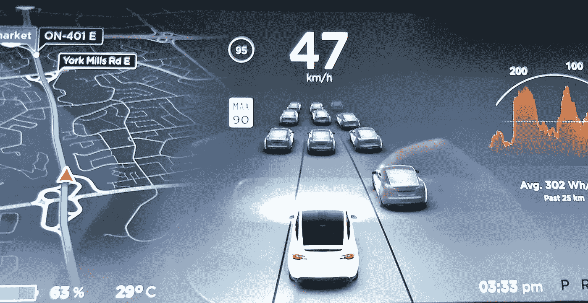

# 即使是亚洲人创造的机器也是针对亚洲人的种族主义者。

> 原文：<https://medium.com/coinmonks/even-machines-created-by-asians-are-racists-towards-asians-c4bbf9d792df?source=collection_archive---------19----------------------->

Heard of Xpeng the EV car maker from China?

好吧，看看这个。

我们都知道人工智能变得多么强大和成熟。

我是说，看看 Dall.e 和特斯拉的自动驾驶仪就知道了。

人工智能，先进的机器学习，眼睛识别相机技术已经发展到可以检测你是否在自己的车里睡着了！

几年前，当我参观新加坡港务局的加速器项目时，我第一次有了这个想法。

他们正在测试安装在叉车和原动机内部的一种新型摄像机。

这意味着不断监测和扫描司机的眼睛，看看他们是否昏昏欲睡或分心。

在那个时候，这是早期，听起来真的很聪明。

司机长时间工作，如果司机困倦并容易出错，对每个人都是不安全的。

事后看来，也许应该首先实施更好的时间安排、更多的休息时间和强制适当的休息。

Make no mistake, AI tech will be huge in the auto industry in time to come.

无论如何，这个应用，姑且称之为 tech，正在中国的现代汽车上使用。

基本上，如果你有一辆 XPeng 汽车，它会监控你的“睡意”并给你扣分。

“这很像驾驶执照，只是没有法律后果，XPeng 每 12 个月将分数重置为 100 分，尽管如果司机的分数降至零，他们必须参加安全测试才能恢复 100 分。”

太好了。

现在，即使你的汽车也能监测你是否困倦，并据此对你进行处罚。

这是有意义的，司机被追究责任，道路更安全，更少的事故发生，每个人都很高兴。

Some Chinese drivers find their eyes too small to be detected by the DMS system.

但有趣的是，中国司机抱怨摄像头技术没有针对“亚洲人的眼睛”进行优化。

因为亚洲人通常眼睛的开口很小，所以电脑会误认为他们是闭着的，并记录为困倦/昏昏欲睡，错误地惩罚了他们。

这太搞笑了。

即使是亚洲人创造的机器也是针对亚洲人的种族主义者。

尽管如此，这很酷，但是让电脑或汽车惩罚你的错误的想法很有趣。

嗯，至少它很有趣，直到你开始意识到它实际上是相当可怕和专制的。

我们现在是监视状态的一部分吗？

Tesla did a fantastic job with their Autopilot, but it still isnt fully “auto” yet.

你的父母看不到你，但埃隆、政府和汽车可以！

从本质上讲，计算机知道你的驾驶倾向、习惯、里程、位置历史、你对室内气候控制的喜欢程度，甚至你的身体有多放松。

这是我们生活中强有力的一部分，我确信这是出于好意。

如果它有助于使道路更安全，我完全赞成。

也许埃隆是对的，未来人类最大的危险是 AI。

让我们只希望我们知道在哪里画这条线，当我们面对这个决定时，我们能够采取行动。

-

未来 AI 会统治世界吗？

-

#创业#商业# startupx #成长#成功#社交媒体#文化#创业#战略# ai # elonmusk #特斯拉# xpeng #汽车#瞌睡虫#相机#亚洲人#搞笑

> 交易新手？试试[加密交易机器人](/coinmonks/crypto-trading-bot-c2ffce8acb2a)或者[复制交易](/coinmonks/top-10-crypto-copy-trading-platforms-for-beginners-d0c37c7d698c)