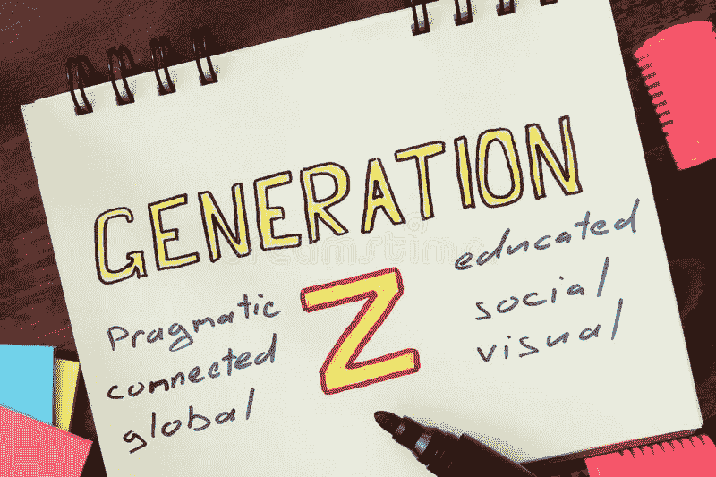

# Z 世代及以后的普通人

> 原文：<https://medium.com/coinmonks/everyday-people-gen-z-and-beyond-6c302b12ef20?source=collection_archive---------33----------------------->

Dreamstime

研究表明，许多年轻的美国人正转向风险更高的投资，希望早点退休(60 岁前)。目前，23%的 Gen Zers 拥有 crypto，而 10%拥有不可替换令牌(NFT)。考虑到年龄最大的 Zer 大约 25 岁，这些是令人印象深刻的统计数字。

或许不那么独特的是，你们转向社交媒体来教你们如何投资。