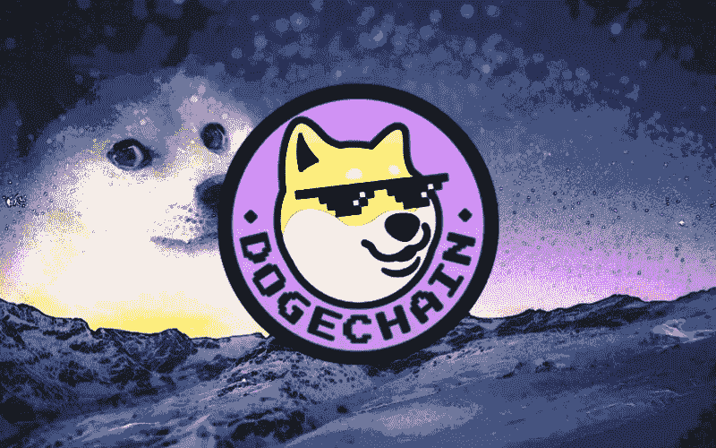

# 关于 doge 的一切都在第二层网络中

> 原文：<https://medium.com/coinmonks/everything-about-dogechain-the-layer-2-network-f95209776813?source=collection_archive---------14----------------------->

Dogechain

由于对新成立的名为 Dogechain 的区块链的热情，最大的迷因硬币 Dogecoin (DOGE)已经在加密货币市场当前的大屠杀和厄运中航行。

致力于提供游戏和 NFT 的新区块链继续频繁出现。不过 Dogechain，尤其是迎合 Dogecoin 持有者的，似乎也有转一些头的可能。

Dogechain 的推出和 Dogecoin 价格的上涨主要是围绕以太坊升级的兴奋情绪和加密货币领域的持续势头的结果。

Dogechain 团队表示，他们对 Dogechain 的接待感到震惊，自网络一周前开通以来，已有超过 58，000 个钱包注册，总交易量超过 480，000 笔。

# Dogechain 是什么？

Dogechain 是一个 EVM 兼容的股权证明区块链，旨在为 Dogecoin 提供可伸缩性、安全性、健壮性和实用性。换句话说，Dogechain 不是 Dogecoin 的对手。相反，它试图补充 numero uno meme 加密货币，并赋予其智能合约功能。

作为第 2 层扩展解决方案，Dogechain 被宣传为支持 DeFi、NFTs 和游戏。然而，根据其[白皮书](https://dogechain.dog/DogechainWP.pdf?v=20220801)，DogeChain 并不是基于 Dogecoin 网络，而是基于与以太坊兼容的多边形边缘“私有标签”框架。

此外，因为它与以太坊虚拟机兼容，所以它能够执行为以太坊创建的 dapps。这将承担赌博，并努力寻求 DOGE 的用户群和其生态系统的支持者。

# 多哥的原生货币:DC 币

除了 wDOGE 之外，兼容以太坊的区块链还推出了一种本地加密货币 Dogechain 令牌(＄DC)。这个以社区为中心的硬币有几个应用，并作为网络的主要治理令牌。

值得强调的是，在主网启动时，DC 代币的总数将被预先确定。协议将同时创造有限数量的$wDOGE (1000 代币),用作签署初始过渡气费的燃料。

一旦区块链稳定下来，$DC 将成为交易、智能合约和 dApps 的“首选令牌”。

用户将被各种选择宠坏，因为他们将有权在 Dogechain 上有两种不同的支付交易费用的选择——wDOGE 和$DC。

# 这样的社区！很多朋友！礼物多多！

*   拥有$DC 代币的社区成员可以获得专属的“霍德勒专用”优惠和功能，例如 Discord 上私人 Dogechain 联盟俱乐部的会员资格。
*   此外，$DC 持有者将能够凭借代币许可竞争 2023 Dogechain 大会的免费席位。该会议对生态系统的开发者来说是一个重要的吸引，他们希望建立网络并展示他们的工作。
*   $DC 令牌，作为 Dogechain 的官方令牌，允许用户参与股权治理的证明。
*   dogechain 团队还准备通过空投给 Dogecoin 社区数百万美元的 DC 代币。

# Dogechain 的目的

这不是第一次未经授权的项目成为 DOGE 生态系统中的重要元素。Dogechain 的主要目标是通过为 Dogecoin 提供急需的实用程序来增加它的用例。

为了实现这一点，Dogecoin 用户只需将其$DOGE 包装到 Dogechain 智能合约中，即可接收$wDOGE PoS 令牌。用户将能够使用 wDOGE 代币享受 DeFi 产品、NFT 和 GameFi 的生态系统，这些代币基于区块链，并间接由其原始的＄DOGE 代币推动。

此外，蛋糕上的樱桃是 Dogechain 用户可以使用$DOGE 的汽油费。Dogechain 因此为厌倦了简单地手持$DOGE 的 Dogecoin 用户带来了效用！

# 潜在的使用案例

*   铸造和交易 NFT，同时用$DOGE 购买天然气，以参与 NFT 市场。
*   参与不断扩大的区块链游戏社区和产生利润的 GameFi 前景。
*   参与分散的交换以交易代币并进行价值预测。
*   能够使用尖端的金融工具，如流动性挖掘、贷款和赌注。
*   通过基于 Dogechain 的 NFTs 参与元宇宙革命。
*   为 Dao 做贡献并为整个社区提供资金。

不过 Dogechain 网站上有承诺。这将是一个全新的区块链，由用户驱动。没有风投，也没有公司无法保持的崇高主张，比如由改变游戏规则的共识算法驱动的每秒 1 万亿次交易。该计划的总体目标是让 Dogecoin 用户访问区块链应用程序。

# Dogechain 的主要特点

真正使其与众不同的一些高级功能如下:

*   **EVM 兼容:**以太坊现有的智能合约可以轻松转移到 Dogechain，无需任何额外的修改。
*   **跨链兼容性:**Dogechain 网络只需通过 Dogechain 桥将其打包，并在需要时将其发送回 doge chain 网络，即可使用 doge chain。
*   **IBFT 利益相关证明(PoS)共识:**该网络允许社区用户参与，确保了区块链的无许可和去中心化。
*   **分散治理:**社区成员(令牌持有者)可以提出想法、分配权力、对区块链相关问题&活动进行投票，并对治理决策拥有发言权。

尽管有这么多的用例，也有这么多被谈论的特性，Dogechain 并不是一个“官方”的 doge chain 计划。Dogecoin 基金会声称，它和这枚硬币的最初创造者杰克逊·帕尔默和比利·马库斯都不属于 Dogechain。

一个名为@cb_doge 的 Dogecoin 开发者表示，Dogechain 是“另一个山寨令牌”,并告知 doge 持有人支持该项目的影响者。

让我们继续讨论流行的 Dogechain，因为它已经在线运行，允许用户发送和接收 DOGE 并与分散的交换机通信。

# Dogechain 上的应用程序

Dogechain 授予 Doge 持有者超能力，如 DeFi，NFTs，游戏等等！是时候拥抱 Doge 社区的全部光辉和可能性了。

*   **NFTs**

Dogechain 将使用 ERC721 协议，使用户能够发布自己的 NFT。Dogechain NFT 所有者将能够将其 NFT 整合到当前的 NFT 环境中，因为这一经过测试的 NFT 标准得到了市场和 metaverses 的广泛认可。

*   **DeFi**

$wDOGE 和$DC 是具有 DeFi 能力的加密货币，可以锁定在各种流动性池中，并向其持有者提供回报。作为 EVM 兼容的区块链，Uniswap 和 SushiSwap 等 DeFi 协议可以与 Dogechain 无缝集成。

此外，多边形边缘架构的许多第 2 层解决方案，如 ZK 汇总和乐观汇总，将允许 Dogechain 提高其当前的 DeFi 交易速度，并处理一些隐私问题。

*   **GameFi**

在 Dogechain 智能合约平台上，开发者将能够创建完整的虚拟世界和区块链游戏。因此,$wDOGE 和$DC 硬币将允许用户以他们喜欢的虚拟方式转移数字资源，并参与虚拟游戏经济。

# **清盘**

“Dogechain 促进所有人的平等和机会。我们的目标是建立一个公众真正拥有的区块链。”

新 Dogechain 推出后，Dogecoin 可能不再被认为是恶搞。现在，迷因币很可能会成为进入更大的密码市场的“门户”。

另一方面，其他人对有机会在一个具有 Dogecoin 主题的链上试验应用程序和代币感到兴奋，并对听起来很傻的代币进行预测。

只有时间才能证明这一论断有多少是正确的。观察这些承诺最终能否兑现将是一件有趣的事情。社交媒体用户对 Dogechain 保持警惕是可以理解的，因为有人声称 doge chain 的创始人和核心开发人员没有参与进来。

> 交易新手？试试[加密交易机器人](/coinmonks/crypto-trading-bot-c2ffce8acb2a)或者[复制交易](/coinmonks/top-10-crypto-copy-trading-platforms-for-beginners-d0c37c7d698c)