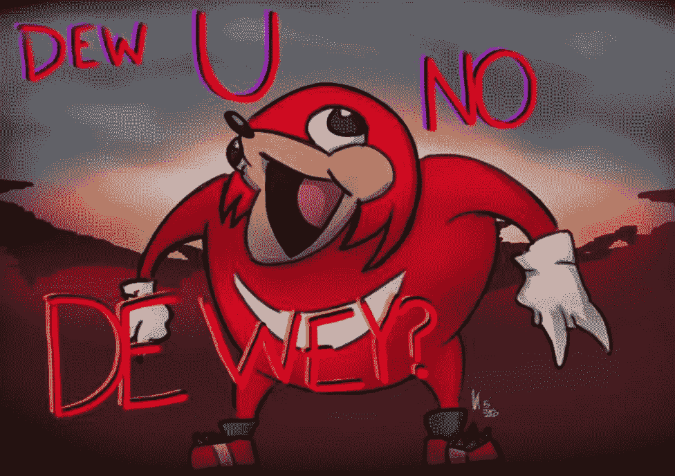

# 成为生态系统开发者所需的一切 2022

> 原文：<https://medium.com/coinmonks/everything-you-need-to-become-an-ecosystem-dev-2022-7b513fa03675?source=collection_archive---------14----------------------->

首先，我有什么资格告诉你完成这个目标需要什么？

我叫 Jonny，是一名自学成才的区块链/NFT 开发者。我花了一年多的时间，尽我所能学习关于区块链的一切&今天我将回顾一下我所涵盖的内容&我会建议你做些什么来从零到英雄。

1.  加密僵尸—[https://cryptozombies.io/](https://cryptozombies.io/)
    当我在学习的时候，我将本课程的前 6 部分复习了 5 遍(大约),以将其植入我的人类硬盘
2.  Uniswap V2
    工厂& LP 对—【https://github.com/Uniswap/v2-core】T4
    路由器—[https://github.com/Uniswap/v2-periphery](https://github.com/Uniswap/v2-periphery)
    这个我现在已经学了两遍了。第一次是当我打出每个库合同中的所有代码时，这样我至少可以完成两件事，比如习惯于键入代码，掌握行业标准编码实践。
3.  找人帮忙当我在学习的早期阶段，我就发现帮助别人学习我已经学过的东西是一种很好的方式，可以从实践的角度加强我的学习，同时还是一个积极的人，因此成立了:D 学习小组
4.  ERC 721 a—[https://github.com/chiru-labs/ERC721A/tree/main/contracts](https://github.com/chiru-labs/ERC721A/tree/main/contracts)
    ERC 721 a 是 openzeppelin ERC721 标准的高能效版本。你可以在一次交易中创造出像 10k NFTs 这样疯狂的东西。
5.  尽情发挥吧
    拥抱多年从众后你压抑的混乱&随便编些东西，即使你做的 90%都是垃圾，你也只做了 10%可以引以为豪的东西。
6.  在研究了成功人士之后，我把成功分成了三个主要部分。我发现只要我每天做到其中的一个或者两个，我就在朝着正确的方向前进。

NFT·明特、赌注合同、DEX 架构&你的生态系统中的多种集成是你在这条路上可能会学到的一些东西。

如果你有兴趣看看一个生态系统会是什么样子，那么看看这两个&让我知道你的想法！
第一部分—[https://medium.com/p/28a8bb064e86](/p/28a8bb064e86)
第二部分—[https://medium.com/p/cd06bca5e541](/p/cd06bca5e541)

坚实发展研究小组—[https://discord.gg/KzbcGmrnfN](https://discord.gg/KzbcGmrnfN)

-多边形联盟—[https://www.polygonalliance.com/](https://www.polygonalliance.com/)

-多边形联盟不和——【https://discord.gg/kJKPCGQu66 

下次见，和平。

你喜欢这篇文章吗？
想给我买杯咖啡吗？
Polygon/Eth/Bsc—0x4a 581 E0 EAF 6b 71d 05905 e8e 6014 DC 0277 a1 b 10 ad

> *交易新手？试试* [*加密交易机器人*](/coinmonks/crypto-trading-bot-c2ffce8acb2a) *或* [*复制交易*](/coinmonks/top-10-crypto-copy-trading-platforms-for-beginners-d0c37c7d698c) *上* [*最好的加密交易*](/coinmonks/crypto-exchange-dd2f9d6f3769)

> 加入 Coinmonks [电报频道](https://t.me/coincodecap)和 [Youtube 频道](https://www.youtube.com/c/coinmonks/videos)获取每日[加密新闻](http://coincodecap.com/)

# 另外，阅读

*   [免费加密信号](/coinmonks/free-crypto-signals-48b25e61a8da) | [加密交易机器人](/coinmonks/crypto-trading-bot-c2ffce8acb2a)
*   [杠杆代币的终极指南](/coinmonks/leveraged-token-3f5257808b22)
*   [16 款最佳折叠电动自行车](/coinmonks/top-17-folding-electric-bikes-5e296f0918cb)
*   [28 款最佳电动自行车点评](/coinmonks/the-28-best-electric-bikes-review-and-buying-guide-in-2023-7bb3146cb403)
*   前三名[币安期货交易机器人](/coinmonks/top-3-binance-futures-trading-bots-e6031f84b3f9)