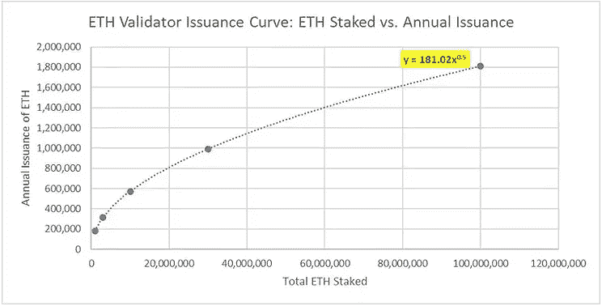
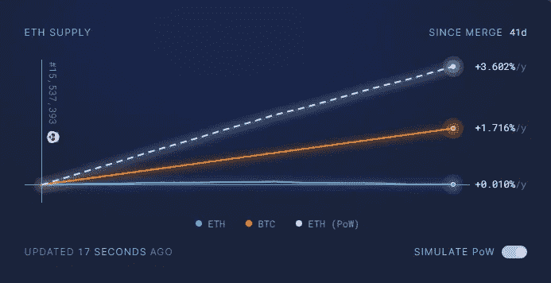

# 关于以太坊的货币政策，你需要知道的一切

> 原文：<https://medium.com/coinmonks/everything-you-need-to-know-about-ethereums-monetary-policy-952b1643bc40?source=collection_archive---------0----------------------->

此次合并是加密货币历史上第三大重要事件，仅次于分别于 2015 年和 2009 年推出的以太坊和比特币。现在已经顺利敲定，以太坊的发行率正在引来大量的关注、困惑和 fud。如果你对“总发行量”、“净发行量”和“燃烧的以太”等术语感到困惑，或者为什么以太坊的通货膨胀率会波动，那么这篇文章将提供你正在寻找的答案。

## 什么是“合并”？

合并发生在 2022 年 9 月 15 日，它标志着以太坊从 PoW(依赖采矿的工作证明)向 PoS(利益证明)的转变。挖掘被停止，取而代之的是“staking ”,它要求用户锁定 32 ether，以便运行一个定期处理一批事务的验证器。

PoS 的一个优点是网络不再依赖昂贵的设备和高耗电。利害关系证明利用加密技术和以太网的价值来建立信任冗余。这是一个根本性的变化，同时影响了以太坊的安全模式和货币政策。本文将重点讨论后者，我们将简要探讨发行的目的、以太坊货币体系的历史变迁和现状。

## 以太坊货币模型简史

*   以太坊于 2015 年推出，预开采供应量为 7200 万以太。
*   随着采矿的继续发行，到 2022 年又发行了约 5000 万以太，这意味着开采前约占以太坊当前流通供应量的 59%。
*   货币政策的第一次变化发生在 2017 年，当时区块奖励从每区块 5 以太降至 3 以太。( [EIP-649](https://github.com/ethereum/EIPs/blob/master/EIPS/eip-649.md) )
*   第二次发行减少发生在 2019 年，将区块奖励降至每区块 2 以太。( [EIP-1234](https://github.com/ethereum/EIPs/blob/master/EIPS/eip-1234.md)
*   “烧钱”机制于 2022 年 6 月推出，影响了净发行。( [EIP-1559](https://github.com/ethereum/EIPs/blob/master/EIPS/eip-1559.md) )
*   合并将以太坊转变为 PoS，随之而来的是货币政策的第三次变化。它再次减少了发行，但是确切的数量是根据参与赌注的验证器的数量动态调整的。然而，最高发行利率已经确定，上限约为 1.7%。

以太坊自 2015 年网络上线以来，发行利率已经发生了三次变化。具有讽刺意味的是，它与比特币的发行利率被改变的次数相匹配。值得注意的是，货币政策的所有变化都降低了以太的通货膨胀率。这解释了为什么它们得到了压倒性的支持，并很容易被社会共识所接受。

以太坊能够在不影响安全性的情况下减少发行，原因有二:

1.  由于块空间的加速采用和需求，交易费收入大幅增加。
2.  PoS 将利益相关者的利益与用户的利益结合起来，同时消除了资产折旧(采矿设备)和运营成本(电力消耗)方面的资本支出需求。这种动态允许在不损害网络安全性的情况下降低财务激励和运营成本，这也是合并能够实现以太坊历史上最大规模发行削减的原因。

我们将更详细地探讨这些事情之间的联系，但首先我们需要了解加密货币背景下的发行目的。当与 PoW 结合使用时，发行作为一种分发机制，但是它也补贴了使用 PoW 或 PoS 的网络的安全性。

## 发放是启动供应分配的一种方法

在 PoW 中，矿工通过公布计算工作的加密收据直接从网络购买硬币，这些收据证明了以折旧设备和电力消耗的形式发生的资本支出。以一种非常古怪的方式，矿业作为一个分散的交易所运作，发行保证了最低水平的流动性。由于这个原因，发行在使用 PoW 的硬币的初始分配期间发挥了关键作用，因为它使任何能够访问互联网的人都能够参与未经许可的拍卖，以获得等同于初级销售的硬币。这在早期的加密技术中非常重要，因为拥有这些硬币的人很少，而且交易也不存在。

这种作为一级销售分散变体的功能，现在在已建立的网络中几乎完全无关紧要，因为大部分供应已经发行，大部分流动性是通过全球无数交易所提供的。根据 Messari 的说法，过去一年比特币的实际交易量(不包括清洗交易)平均每天约为 61 亿美元，而每天的采矿奖励不到 0.5%。数字不会说谎，全球流动性充足，PoW 仍是硬币发行的重要手段的说法显然与现实不符。

## 发行是一种安全补贴

这就给我们留下了第二个，但仍然是非常关键的发行目的，即补贴网络的安全性。简而言之，加密网络就像分散的中央银行，它们印刷自己的货币，并用新印刷的货币支付由被称为“矿工”和“赌注者”的自由职业者提供的安全服务。

> *有趣的事实:检索每个区块要铸造的新比特币数量的函数的名称是“getblocksubstance”。*

采矿通常被描绘成创造新币的活动，但这绝对是错误的。矿工只是处理批量交易，别无其他。矿工参与类似彩票的系统，其中奖励是处理一批交易的权利，并且在该系统中，有权要求新铸造的硬币以及交易被包括在该批中的用户支付的费用，也称为“块”。

“赢得”处理块的权利所花费的平均成本可以被认为是用于维护网络的无许可和不可变属性的安全预算。在 PoW 网络中，这是最终确定“51%攻击”的成本的因素，也是保护交易不被任意逆转和/或平衡不被任意冻结的因素。

这些概念也适用于 PoS 网络中的赌注。赌注者负责处理成批的交易，他们因提供服务而获得新铸造的乙醚和一部分交易费。参与 PoS 验证的成本从采矿的资本支出转移到锁定以太资本的赌注成本。在实践中，以太获得了类似于债券的属性，因为它要求资本在一段时间内锁定在合同中以换取收益，但不是为中央政府的运营融资，在以太坊框架中下注是为分散网络的运营服务的行为。

## 发行总额

由该协议创造的新硬币的原始数量被称为“发行总量”。作为一种补贴形式，需要铸造多少硬币的决定主要由两个因素驱动:

1.  网络中“存储”的资产价值越高，不良行为者试图攻击或破坏它的动机就越强，保护网络免受其害所需的安全性就越高。
2.  有两种方式为网络的安全提供资金:发行费和交易费。理论上，随着交易费收入的增加，债券发行应该会减少。如果发行过度，那么将导致网络固有资产的贬值(通货膨胀)。如果发行不充分，那么网络可能会暴露于能够审查和/或撤销交易的攻击。

Gross Issuance Curve (source Vantica Trading)

将安全预算与“存储”资产的价值一起调整的一种方法是，指定一个以网络本地货币命名的“最低可行发行额”。这是以太坊货币模型的一部分，这个概念被用来推导发行曲线。

以太坊的发行模式相当于一个受赌注验证者数量影响的可调整最低工资。验证器越少，就越容易受到攻击，就越需要经济上的鼓励来鼓励更多的用户成为验证器。在这种情况下，“最低工资”，又名最低产量，增加了。活跃的验证者越多，需要的经济激励就越少，因为安全目标已经达到，并且最低收益率降低。

更多的验证者总是会导致更高的整体发行率，但对收益率的调整会导致对数发行曲线。这些调整基于在协议中直接固定和定义的数学公式。动态发放现在是“代码法”的一部分，它旨在自动调整安全补贴以适应不同的情况，并确保不再需要手动更改。

## 燃醚与净发行

在写这篇文章的时候，以太坊每年生产大约 600，000 以太。这意味着它应该有 0.5%的年通货膨胀率，然而自合并生效以来，实际通货膨胀率为 0.01%。这怎么可能呢？

这就是 EIP-1559 引入的“燃烧的以太”的效应。它到底是做什么的？它摧毁了很大一部分交易费用，而不是支付给验证者。这意味着，当以太坊的总发行量正在铸造新硬币时，EIP-1559 正在让它们退出流通，这两股力量之间的净结果决定了最终的通货膨胀率，也就是净发行量或货币通货膨胀。

## 以太坊的通货膨胀率为什么会波动？

以太坊的通货膨胀率是通过从发行总额中减去“烧掉”(销毁)的费用总额(新铸造的以太将用作验证者奖励)来确定的。如果发行总额大于消耗的费用，那么净发行是积极的，以太币是通货膨胀。如果总发行低于烧掉的费用，那么净发行是负的，以太币是通货紧缩的。

预测通货膨胀率有些困难，因为它受活动验证器数量和用户对以太坊块空间需求的综合影响。虽然验证器的数量不会快速变化，但是用户对块空间的需求会快速变化。这导致交易费用的短期波动，从而影响燃烧的乙醚量，最终影响通货膨胀率。

## 翻转心智模型

费用燃烧机制是一个混乱的来源，但是我们可以通过对会计的简单改变来绕过它。理论上，发行应根据交易费产生的收入金额进行动态调整。收费产生的钱越多，需要的补贴就越少，这意味着应该铸造更少的硬币。这其实就是以太坊的行为方式。

人们更容易认为，交易费实际上是支付给验证者的，它们从来没有被烧掉。在这种会计模式下，只有当费用低于确定的“最低工资”(由总发行曲线保证的收益率)时，才引入发行。如果费用超过最低工资会怎么样？在这种情况下，网络对超出部分征税。

征税的收入保存在以太坊的金库里，这个金库的唯一目的是为了补贴安全，以备将来可能需要。简而言之，费用永远不会被销毁，它们要么直接分配给验证者，要么由网络征税，只有当费用不足并且之前征税的费用耗尽时才会发行。

这是对会计视角的一种改变，但这是一种更容易理解的经济上合理的解释。当货币发行者在自己的国库中持有余额时，这种余额在实际的经济术语中就不复存在了，就像被“烧掉”了一样。这是因为原始发行者国库中的钱实际上已经退出了流通。只有当这些钱被应用或分配时，它才变得经济活跃，并且对于最初的发行者来说，它是来自他们的国库还是凭空创造出来的都没有区别。

## 结论

以太坊设计了一个优雅的货币模型，可以适应网络环境。发行曲线和烧费相结合，保证以后不再需要人工干预。这种方法优先考虑安全性，而不是强制实施供应上限。以太坊的动态模型保证了安全性，而像比特币这样的固定发行时间表保证了可预测性。

Supply Since Merge (source ultrasound.money)

从长远来看，比特币将继续每四年将其发行量削减一半。比特币还需要 4 个半便士才能接近以太坊目前的发行量，再需要 4 个半便士才能稍微低一点。每次发行减半，都可能危及网络的安全，因为这些削减减少了安全补贴，而没有考虑来自交易费用的现金流的实际进展。当你把提供给以太坊赌注者的收益计算在内时，这在比特币中是不存在的，那么以太坊在经济上是无可争议的赢家。

## 支持此内容

如果你喜欢这篇文章或你欣赏，那么请查看[以太坊艺术日报 NFT 收藏](https://foundation.app/collection/ethart-2c59?sortOrder=DEFAULT)。

[以太坊艺术日报](https://www.ethereumartdaily.com/)是每日 1/1 NFT 集，以以太坊为主题的艺术自我记录 AI 图像生成的演变！最棒的是，部分收益直接汇入以太坊基金会！

EAD.39 “Raw Ether”

如果你喜欢 NFTs，但你不想买一个，你也可以通过关注 [@EthArtDaily](https://twitter.com/EthArtDaily) 并喜欢或转发你喜欢的作品来支持我。

> 交易新手？尝试[加密交易机器人](/coinmonks/crypto-trading-bot-c2ffce8acb2a)或[复制交易](/coinmonks/top-10-crypto-copy-trading-platforms-for-beginners-d0c37c7d698c)