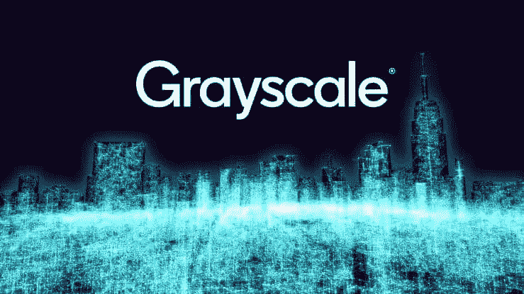
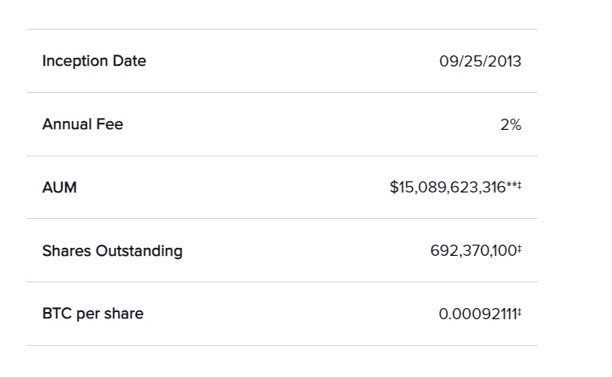
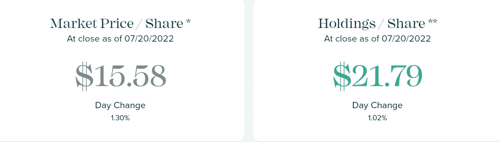
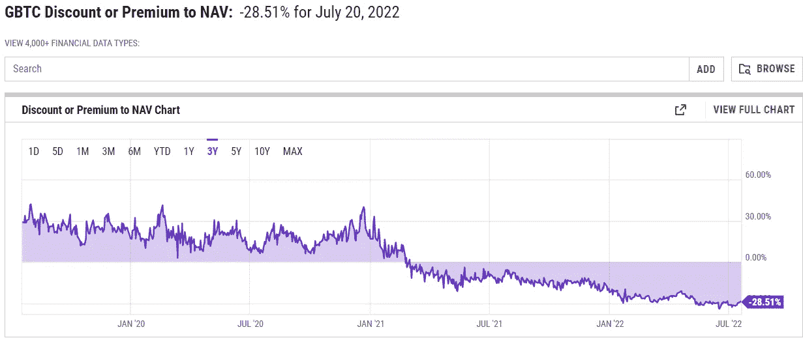
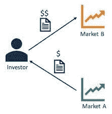
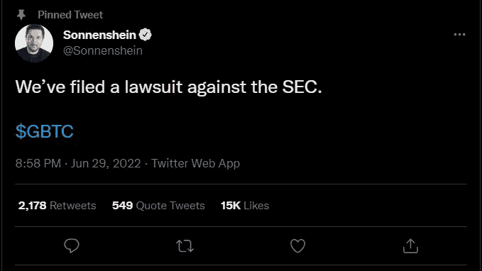
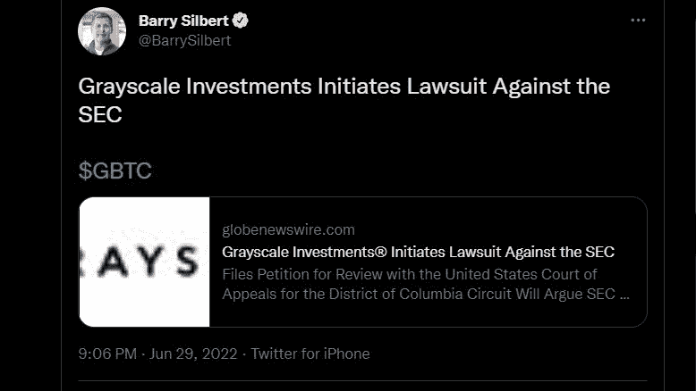

# 关于 2022 年灰度比特币信托(GBTC)你需要知道的一切

> 原文：<https://medium.com/coinmonks/everything-you-need-to-know-about-grayscale-bitcoin-trust-gbtc-in-2022-2fcb2260b7?source=collection_archive---------10----------------------->

所以你可能听说过 GBTC 有一段时间了，但是到现在为止，你真的不太了解它。你很可能知道这是一种在你的经纪账户中获得比特币敞口的方式，这就是你所知道的。幸运的是我掩护了你。

**什么是灰度比特币信任？**

灰度本身是数字货币集团旗下的公司，是全球最大的数字资产管理公司。灰度比特币信托(GBTC)只是灰度提供的众多投资产品之一。灰度产品包括 ETH、LINK、SOL 等其他加密资产的信托，以及包括 ATOM、DOT、MATIC 和 AVAX 等资产的多样化分配的基金。灰度管理着数十亿资产(AUM)，其最大的产品是比特币信托。

**了解资产净值与市场价格**

当谈到理解 GBTC 股价时，重要的是要理解 GBTC 有两种不同的价格。有一个价格描述了信托价值的价格，还有一个价格代表了人们愿意在公开市场上支付的每股价格。让我来解释一下。

根据灰度最近的文件，大约有 64 万 BTC 信托。目前 BTC 价格约为 2.3 万美元，信托中比特币的总价值约为 150 亿美元。692，370，100 股 GBTC 流通股，净资产值(NAV)意味着每股应为 21.79 美元(15，000，000，000/692，370，100 股= 21.79 美元/股)。然而，目前每股的市场价格是 15.58 美元。这个价格意味着市场对 BTC 的估价仅为 108 亿美元，而不是 150 亿美元(15.58 * 692，370，100 = 108 亿美元)。那么，为什么信托公司拥有的价值和它的感知价值会有 40 亿美元的差异呢？

Grey=Price per share retail investors are buying and selling on the open market

**信托如何运作**

要理解为什么会有两种价格，你需要知道 GBTC 的运作机制。比特币信托是机构投资者和散户投资者投资 BTC 的一种方式，他们无需购买真正的比特币。散户投资者可以用他们 401Ks 和 IRA 中的钱，通过购买代表 640k BTC 一小部分的 GBTC 股票来获得 BTC 风险敞口。这种投资选择对那些不愿意在加密交易所开设账户或不愿意存储自己的 BTC 的人来说非常有吸引力。

就机构投资者和合格投资者而言，由于监管原因，他们可能被禁止直接购买现货 BTC，迫使他们通过股票获得敞口。有了 GBTC，鲸鱼现在可以把他们的钱委托给信托公司，信托公司拿着这些钱去购买现货比特币。灰度将这些比特币加入信托，作为回报，灰度将给予这些机构和合格投资者代表等量比特币的股份。如果你给信托基金 10 万美元，GBTC 会以资产净值的价格给你价值 10 万美元的股票(后面会有更多的介绍)。然而，这些股票有一个警告，因为需要 6 个月的锁定期。股份也要交 2%的管理费。一旦 6 个月的锁定期结束，投资者就可以自由地以市价而不是资产净值出售股票。

**溢价与折价**

GBTC 通常以溢价或折价交易，这意味着公开市场上的股票价格要么高于要么低于比特币的真实价值。当溢价交易时，这表明投资者愿意支付高于资产净值的价格，因为他们希望获得 BTC 敞口，可能没有其他途径获得它。当折价交易时，它表明投资者正在寻求购买比特币的其他选择，对股票的需求较低。这是一个衡量对 GBTC 股票需求的指标，而不是衡量投资比特币的意愿。

当 BTC 股票溢价交易时，资产净值可能是 18 美元/股，但 GBTC 股票价格可能是 20 美元/股。当 BTC 折价交易时，每股资产净值可能是 18 美元，但 GBTC 的股价是 13 美元。自 2021 年初以来，GBTC 股票一直在折价交易，尽管比特币正处于牛市周期，对比特币的需求极高。对 GBTC 缺乏兴趣可能有多种原因。

首先，像 GBTC 这样的投资工具对不熟悉交易所或者不允许购买现货比特币的投资者很有吸引力，迫使他们购买证券。在很长一段时间里，GBTC 是唯一/主要的选择。随着 BTC 敞口的选择越来越多，越来越多的加密投资者对直接购买比特币感到放心，投资者开始通过其他投资工具寻求敞口。更糟糕的是，GBTC 收取了高得令人难以置信的 2%的管理费，这对鲸鱼来说是一个巨大的因素。

下跌的另一个原因是，当 GBTC 溢价交易时，合格投资者通过套利轻松赚钱。随着许多投资者涌入这一行业，抛售压力变得太大，溢价就像一颗垂死的恒星一样自行崩溃。让我们看看这种套利交易，以及为什么它在 GBTC 价格中扮演着重要角色。

**套利交易**

Buy asset X for 5$, sell asset X for 10$ elsewhere

对于那些不熟悉的人来说，套利就是以较低的价格购买一项资产，然后在其他地方以较高的价格出售相同的资产。在许多市场，尤其是在加密领域，相同资产的价格差异为相对“容易”的资金提供了机会。这种交易被许多机构采用，尤其是现在名誉扫地的风险投资公司三箭资本(3AC)。其运作方式是，当合格投资者买入该信托时，他们将以资产净值的价格获得股份。一旦禁售期结束，这些投资者可以按市价出售他们的股票。如果市场价格高于资产净值，投资者就能从溢价中“轻松”赚钱。例如，假设 3AC 以 20 美元/股的价格买入 GBTC 股票，而 GBTC 股票在公开市场上的交易溢价为 25 美元/股。在这个例子中，我们还将假设比特币的价格没有变化。在锁定期结束时，股票在公开市场上的交易价格为 25 美元。当 3AC 以 20 美元买入他们的股票时，他们现在可以以 25 美元卖出，将 5 美元(25%)的差价收入囊中。

问题是，当投资者套现并锁定这种套利交易的利润时，它对公开市场的股票提供了抛售压力。随着无数机构涌入这一行业，加上公开市场买家转向其他投资工具，抛售压力在 GBTC 变得势不可挡。这种压力导致 GBTC 股价如此之低，以至于这些股票的价值低于所持有的比特币，也就是折价。一旦它转为折价，套利交易就不再存在，因为 NAV 股票现在比公开市场股票更值钱。如果 3AC 购买打折的 GBTC 股票，他们可以以 20 美元的价格获得股票，但当他们在公开市场上出售时，股票价格是 15 美元。不管比特币的价格表现如何，这相当于在 2%的管理费之外损失 20%。由于公开市场上缺乏买家，GBTC 股价已跌至 30%的折让，永远不会回到溢价水平。灰度现在正致力于通过向现货 ETF 过渡来消除折扣，从而让人们重新对他们的产品感兴趣。

**寻求现货 ETF**

那么灰度为什么要现货 ETF 呢？就目前的情况来看，他们每年收取 2%的管理费，每年的收入超过 2 亿美元。如果 GBTC 转换为现货 ETF，管理费将大幅降低，因为 ETF 费用通常低于 1%。

主要的动机可能来自他们目前面临的问题。目前的折价为 28%，在熊市中，在 BTC 整体价格下跌的基础上，溢价买入的 GBTC 投资者至少又损失了 28%。此外，28%的折扣相当高，就目前的情况来看，GBTC 回归溢价几乎是不可能的。当你把高费用和大幅折扣结合在一起时，你就会看到投资者不想参与他们产品的现状。为了挽回投资者，灰度公司希望抹去大幅折价。

修复折价的一个选择是通过公开赎回。这是 gray 在 2016 年 SEC 裁决之前提供的东西。赎回将允许那些在公开市场上以低于资产净值的价格购买股票的人以资产净值的价格赎回这些股票。例如，如果资产净值是 20 美元，而你在公开市场上以 15 美元买入股票，你可以以 20 美元的价格将这 15 美元的股票卖回灰度市场。然而，美国证券交易委员会阻止了这一行为，称灰度违反了 M 条例，该条例禁止它们在发行新股的同时回购股票。为了再次被允许，灰度将需要 SEC 主席加里·詹斯勒的批准(为什么达斯·维德死亡进行曲刚刚开始播放？).不要对这个选项抱太大希望。

另一个选择是转投现货 ETF，许多人认为这是最有可能的选择。转投现货 ETF 将抹去 GBTC 的折价，使其更接近资产净值。这样做的原因是，现货 ETF 将允许根据需求创建/销毁股票，这是它目前无法做到的。该信托是一只封闭式基金，这意味着它过去一直能够发行股票，以满足大幅溢价的需求。然而，随着需求下降，灰度被禁止破坏份额，导致需求较低的固定供应。对于现货 ETF，如果需求较低，股票可能会被烧掉。如果需求高，可以创造更多的股份。信托不能这样做！如果一只现货 ETF 获得批准，股票将被烧到市价等于资产净值的程度。这将缓解投资者对大幅折价加剧亏损的担忧。

**SEC 现货 ETF 拒绝**

随着 SEC 像大多数人预期的那样拒绝现货 ETF，这种情况有多种可能发生。据 Group[首席执行官 Michael Sonnenshein](https://medium.com/u/72b472dcec82?source=post_page-----2fcb2260b7--------------------------------) 和 Group 母公司 Digital Currency Group 首席执行官@BarrySilbert 称，grassy 立即向 SEC 提起诉讼。

随着诉讼的临近，许多人都在观望法院将如何裁决。如果获得批准，所有投资产品的灰度资产将增加约 60 亿美元，无论数字资产价格如何变动。这是因为目前所有的产品都有折扣，所有的折扣都滞后于它们的真实价值。如果获胜，目前的投资者将获得 GBTC 28%的收益，因为他们不再需要担心 GBTC 的溢价和折价。有了 30%的折扣和 2%的管理费，如果你觉得 GBTC 信托基金将在未来 15 年内变成 ETF，GBTC 可能是你考虑投资比特币的地方。

* *激动人心的新闻预警！！**

嘿大家好！我很自豪地宣布，我在 6 月份正式接受了一份内容作家的工作。是的，没错，你的真的不再像[www . creed thoughts . gov . www \ creed thoughts](http://www.creedthoughts.gov.www\creedthought)s 那样写在空虚的虚空中了。由于我的大部分内容都在那里发表，我没有太多时间在这里发表。如果你有兴趣阅读我的一些内容，请查看 NewsCrypto Reddit 页面(下面的链接)。在那里，我发布了两个主要系列，分别叫做“认识生态系统”和“加密教室”。meet the ecologies 重点介绍顶级加密货币生态系统的基本运行情况，如以太坊、索拉纳、宇宙、雪崩等。Crypto Classroom 专注于谈论流行话题，如 3AC、Celsius 和 Voyager 破产，以及任何您需要知道的市场动态。我还在他们的基本面分析部分发布研究报告，为那些寻求更深入的报告，关注关键指标的人服务。最后，请考虑关注他们的 Twitter 页面(100，000 名关注者),因为我会偶尔发布一些突发新闻。请注册新闻加密，因为它有很多免费的教育内容！如果你喜欢这篇文章，请在这里和 Twitter 上关注我，我会努力实现我的目标！

**个人社交**

中页:[https://medium.com/@ZKcrypto](/@ZKcrypto)

中等追随者:37

年底目标:100

推特:[https://twitter.com/WarrenFeldman3](https://twitter.com/WarrenFeldman3)

推特追随者:231 人

年底目标:1000

**新闻加密链接**

新闻加密网站:[https://newscrypto.io/](https://newscrypto.io/)

https://www.reddit.com/r/NWC_official/

新闻加密推特:【https://twitter.com/NwcPublic 

> 交易新手？试试[密码交易机器人](/coinmonks/crypto-trading-bot-c2ffce8acb2a)或[复制交易](/coinmonks/top-10-crypto-copy-trading-platforms-for-beginners-d0c37c7d698c)