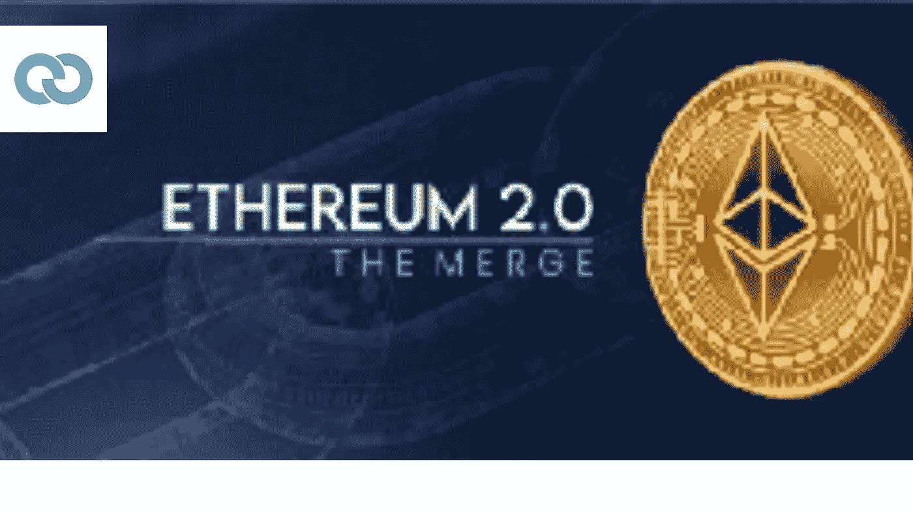

# 关于以太坊合并你需要知道的一切

> 原文：<https://medium.com/coinmonks/everything-you-need-to-know-about-the-ethereum-merge-4b8b6871c1a1?source=collection_archive---------56----------------------->

以太坊是发展最快的加密项目之一，也是仅次于比特币的第二大最有价值的项目。

它的开发团队不知疲倦地引入新功能和改进，以满足用户群不断增长的需求。从家园到大都会再到第二层，这个领域正在为另一次大规模的增强做准备。

以太坊即将进行重大升级，从“工作证明”有效过渡到“利益证明”共识系统，这涉及到一种完全不同的网络交易验证方式。

在本文中，我们将解释这意味着什么，以及为什么它对以太坊的未来如此重要。

但首先，让我们深入了解一些基础知识。

# 什么是工作证明？

以太坊目前分两个链运行。遗留系统依赖于工作证明(PoW)系统，依赖于分散和分散的矿工社区。

本质上，工作证明是以太坊和其他区块链(如比特币和莱特币)用来验证交易和创建新块的协议。工作证明的主要目标是防止网络攻击，如拒绝服务(DoS)或甚至 51%的攻击，此时一个恶意参与者控制了网络一半以上的挖掘能力。

在 PoW 系统中，矿工使用计算机解决复杂的难题，以验证交易并在区块链上创建新的区块。第一个解决难题并验证区块的矿工将获得新创造的加密货币形式的奖励。

该系统激励矿工参与网络，并公平透明地验证交易。然而，PoW 有一些明显的缺点，包括高能耗和对矿工集中化的日益担忧。此外，该系统无法扩展，改进依赖于采矿设备，这对矿工来说是一件昂贵的事情，对整个图形行业来说也是一个压力。

在过去的几年中，更广泛的以太坊和加密社区已经倾向于将赌注系统(及其迭代)作为保护其各自网络和确认交易的可持续和节能的手段。

# 以太坊 PoS 是好是坏？

在所有这一切中，以太坊开发者可以说是利益证明(PoS)挖掘系统最突出的支持者之一，它有效地取代了当前的工作证明挖掘系统。

以太坊早就计划从 PoW 过渡到 PoS。在 2018 年 11 月的敌无双会议期间，该团队宣布，这一转变将在未来几个月内发生。

PoS 采矿的支持者认为，该系统比 PoW 更有效，消耗的能源更少。鉴于采矿已成为包括中国在内的许多国家的重要环境污染源，这一点尤为重要，因为全球大部分采矿活动都发生在中国。

然而，PoS 挖掘的批评者指出，该系统允许更大程度的集中化，进一步认为一旦实施了赌注系统，以太坊将不会那么安全。

即便如此，支持者声称该网络不仅相对安全和分散，而且通过升级，将有可能集成链上扩展解决方案，如分片，同时确保网络节能。

# 合并

这就是合并的由来。

那么，“合并”和以太坊向高效和可持续发展的过渡计划到底是什么？

对于初学者来说，“合并”只不过是一个技术阶段，是以太坊开发者使用的一个里程碑。这一事件定于 2022 年 9 月中旬，届时以太坊将正式合并信标链，以太坊股权证明网络，以及在 PoW 下运行的传统区块链。

当这种情况发生时，以太坊中高能耗、低效率的工作证明系统将被停止，协议将被移植到一个利害关系共识证明系统，在该系统中，以太坊将由验证者而不是矿工来保护和驱动。随着这一转变，网络将“重生”，变得更加绿色，比特币将成为工作依赖型网络中最耗电的证明之一

由于以太坊将依赖于一个验证者社区，这些验证者只需投入至少 32 个以太网并操作节点，就有机会验证大宗交易并赢得大宗奖励，据估计，以太坊的总能源需求将大幅下降 99.95%。

升级之前的问题是:普通的 ETH 持有者会怎么样？根据以太坊基金会的说法，代币持有者不需要做任何事情。如果有的话，因为升级得到了大多数加密公司和基础设施提供商的支持，包括顶级交易所和 DeFi 协议，他们不得不继续将硬币放在 MetaMask 等热钱包或 Ledger 等冷钱包中。无论哪种情况，他们的资产都是安全的。

唯一需要做出调整的利益相关者是节点运营商和矿工。希望确保网络安全的验证人员可以在这次重大升级之前进行调整。与此同时，以太坊矿商意识到网络将改变其共识风格，将不得不将其哈希速率专用于兼容网络，如以太坊经典和其他支持 Ethash 的网络，包括新兴的 forks。

然而，坏消息/好消息是，包括 Chainlink、Aave 和 FTX 在内的领先和有影响力的协议都表示，合并后他们将只支持以太坊，而不支持它的分支。合并后出现的任何硬分叉将意味着现有的以太网持有者将持有更多令牌，因为硬分叉将只不过是原始以太网。

与此同时，以太坊基金会透露，即使在合并后，在 2020 年底信标链激活期间锁定资产的赌注者也不会转移他们的硬币。相反，他们将不得不等待以太坊启动另一项名为 Shanghai 的升级，暂定于 2023 年在 H1 举行。

# 对以太网价格的影响

合并后，ETH 价格可能会上涨。这是因为，由于 EIP-1559，考虑到燃烧的 ETH 数量，以及矿工造成的清算压力的减少，预计 ETH 将是通缩的。

一旦以太坊过渡到由验证器驱动的赌注系统，每天的通货膨胀将从每天 15，000 ETH 减少到每天 1.5，000 ETH，这意味着排放减少了 90%。反过来，由于排放量的大幅下降，以目前的速度计算，每年的通货膨胀率约为 3.2%，以太坊的通货膨胀率将下降约 1%，使以太坊成为一种通缩资产，或者像支持者所说的那样，提供比比特币更好的价值储存的超声波货币。

在以前的特许经营中，矿商必须出售他们的 ETH，以满足与设备改进和电力成本相关的运营成本。如前所述，在打桩系统中，电力成本将下降 99.95%，并且无需为采矿优势购买新设备。相反，验证器所要做的就是确保它们的节点有 100%的高正常运行时间。

最重要的是，在合并后，验证者奖励很可能会上升到两位数。验证者奖励的增加将激励自由流通的 ETH 的锁定。再加上 ETH 被 DeFi 协议锁定、每日排放量较低、ETH 已经在信标链中占有一席之地，以及硬币存放在冷库中，将会出现市场范围的供应冲击，推高价格。

# 以太坊对可伸缩性的需求

除了转移到一个赌注系统，社区期望在未来的几个月和几年以太坊有更好的吞吐量和处理能力。

虽然期望值很高，但应该注意的是以太坊的处理能力将几乎保持在当前范围内，并且块空间需求将很高。因为吞吐量没有预期的变化，交易费用将很可能保持在目前的水平，直到有具体的步骤来解决链上扩展。

Uniswap 等主动 DeFi 协议向 optimission、Arbitrum 等第二层协议或 Coinex Smart Chain 等侧链协议的转变有助于降低天然气费用。问题是，尽管第二层解决方案被广泛采用，但它们始终比 Solana 等竞争网络高出几倍。

根据 Vitalik Buterin 的说法，激增是迈向理想以太坊 2.0 的下一个关键阶段。在此阶段，现有的第 2 层选项将与称为分片的链上扩展解决方案相结合。在这里，以太坊开发者将把区块链分割成称为碎片的小型互联网络。结合起来，所有这些增强将导致更高的处理速度，更低的费用，并大大改善用户体验。这些多阶段、多年的优化以挥霍告终，标志着以太坊 2.0 的结束，网络的处理速度将超过 100k TPS。

以太坊对于 crypto 及其解决方案(包括 DeFi 和 NFTs)的成功至关重要。然而，合并是开发人员考虑的许多未来改进之一。对能源效率和可持续性的驱动使以太坊成为绿色，这一发展可能会吸引一些机构。随着更多扩展解决方案的实施，该平台将继续巩固其作为 DeFi、NFTs 等平台的地位

# CSC 是什么？

CoinEx 智能链(CSC)是由 CoinEx 团队为分散式金融创建的分散式高效公共链。公共链与以太坊生态系统完全兼容，具有高效率、低费用以及无许可验证器的特点。所有开发人员都可以基于 CSC 轻松构建他们自己的分布式应用程序，或者在 CSC 上快速部署他们的 EVM 应用程序。

官方资源

关注我们的[推特
访问我们的](https://twitter.com/CoinEx_CSC)[网站](http://www.coinex.org/)加入我们的[电报](https://t.me/CoinExChain)

> 交易新手？尝试[加密交易机器人](/coinmonks/crypto-trading-bot-c2ffce8acb2a)或[复制交易](/coinmonks/top-10-crypto-copy-trading-platforms-for-beginners-d0c37c7d698c)