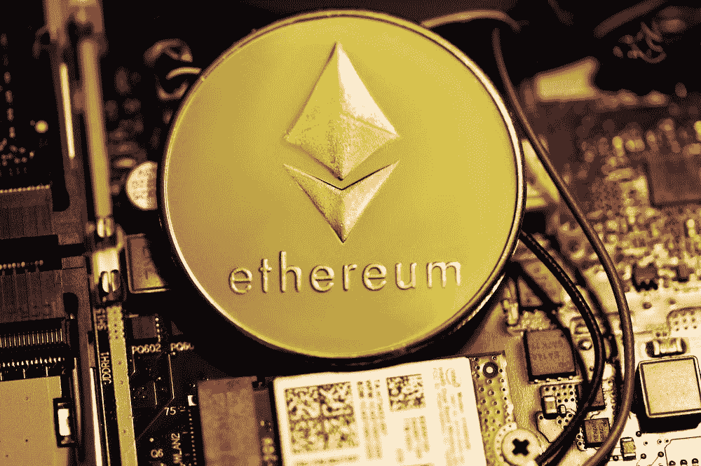

# 关于以太坊的“合并”你需要知道的一切

> 原文：<https://medium.com/coinmonks/everything-you-need-to-know-about-the-merge-49fb2f5f9597?source=collection_archive---------7----------------------->

## 以下是以太坊过渡到 PoS 的最新消息和事件

Photo by [Kanchanara](https://unsplash.com/@kanchanara?utm_source=unsplash&utm_medium=referral&utm_content=creditCopyText) on [Unsplash](https://unsplash.com/s/photos/ethereum?utm_source=unsplash&utm_medium=referral&utm_content=creditCopyText)

随着以太坊最受期待的升级即将到来，eth 持有者和一些观众都在座位的边缘。他们想知道这次升级会给世界第二大加密货币以太坊的未来带来什么。这会有助于推翻比特币还是会导致其垮台？

没有人能肯定地说，但这里是这个领域的最新进展，所以你可以得出自己的结论。

# 什么是合并？

这次合并是以太坊从工作证明共识机制到利益证明机制最令人期待的转变。

这一举措将大幅削减以太坊的功耗，因为工作证明机制是一种电力密集型操作，旨在奖励工作最多的矿工。

目前，为了确保区块链的安全，矿工们每年要花费高达 112 TWh 的电力，这相当于新加坡这样一个小国的耗电量。

然而，升级后，这一数字下降到每年 0.01 TWh，即功耗降低了 99.95%。

以太坊在过去几年里一直致力于合并，并被推迟和推迟了很多次，但最终，它现在被确认将于 9 月 15 日[发布。](https://ethereum.org/en/upgrades/merge/)

# 集中交易暂停提款和交易

由于系统升级固有的系统风险，[比特币基地](https://blog.coinbase.com/the-ethereum-merge-is-coming-heres-what-you-need-to-know-5f3b3045aab2)和[币安](https://cointelegraph.com/news/binance-to-suspend-eth-and-erc-20-deposits-and-withdrawals-during-merge)将在合并期间暂停 Eth 和 ERC20 提款，以避免系统拥塞。

这一举措在集中交易中并不罕见，因为交易量异常高，集中交易通常会暂停提取密码。

币安将于 2022 年 9 月 6 日停止所有 Eth 和 ERC20 代币存款和取款。而比特币基地将在 2022 年 9 月 15 日合并之日暂停撤军。

# Eth 2.0 命名约定

今年早些时候，以太坊基金会正在逐步淘汰 Eth 2.0 这个术语，因为它给用户造成了一些困惑。

升级后的系统不会进行更名，仍将被称为以太坊。此外，该基金会警告 eth 的持有者要小心骗子告诉他们“升级”或交换他们的令牌。

如果您目前持有一些 eth，您不需要为合并做任何事情，也不需要交换或发送您的令牌到任何地方进行升级。

> 作为 ETH 或以太坊上任何其他数字资产的用户或持有人，以及非节点运营的股东，在合并之前，您不需要对您的资金或钱包做任何事情。以太坊基金会

# 价格行为

尽管几周前以太坊的价格呈上升趋势，但 Eth 的价格未能突破 2000 美元的阻力，并回到 1500 美元左右的支撑位交易。

合并期间大规模抛售的风险仍然存在，但鉴于合并前一周价格没有显著上涨，这表明风险很小。

Eth 似乎终于有了一些动力，价格上涨了 4-5%。这一迹象可能是 Eth 价格测试 2000 美元阻力的指标，该价格上月未能突破 2000 美元阻力。

小心“买谣言，卖新闻”事件，在这种事件中，合并后 Eth 的价格会大幅上涨，随后价格会下跌。

# 谣言:Eth PoW 硬叉

尽管很多人对 Eth 过渡到 PoS 机制感到兴奋，但一些 Eth 矿工对此并不兴奋，目前正在推动 Eth 工作验证硬分叉。

如果请愿成功，将会有一个独立的以太坊区块链继续使用 PoW 共识机制。这个事件类似于几年前 Eth Classic (ETC)创建时发生的硬分叉。

# Eth 电源支持

即使没有关于战俘硬分叉的官方声明，一些交易所，即比特币基地、币安、OKX、Poloniex、BitMEX、MEXC Global 和 Gate.io 已经表达了他们对 Eth 战俘币上市的[兴趣](https://forkast.news/ethereum-pow-fork-gaining-crypto-exchange-backings/)。

然而，这种兴趣并不一定意味着这些交易所看好硬分叉。事实上，对分叉硬币上市感兴趣的交易所之一 Bitmex 表示，它预测硬币最终会失败，因为其生态系统中缺乏 DeFi 应用程序。

# Eth 天然气费

大多数以太网用户希望并期待合并后以太坊的煤气费会下降，但遗憾的是事实并非如此。据 defi 研究员 Vivek Raman 称，合并不一定会影响天然气费用。

据他称，燃气费的降低将发生在[以太坊的分片更新](https://ethereum.org/en/upgrades/sharding/)之后，该更新计划于明年某个时候进行。

> 交易新手？尝试[加密交易机器人](/coinmonks/crypto-trading-bot-c2ffce8acb2a)或[复制交易](/coinmonks/top-10-crypto-copy-trading-platforms-for-beginners-d0c37c7d698c)