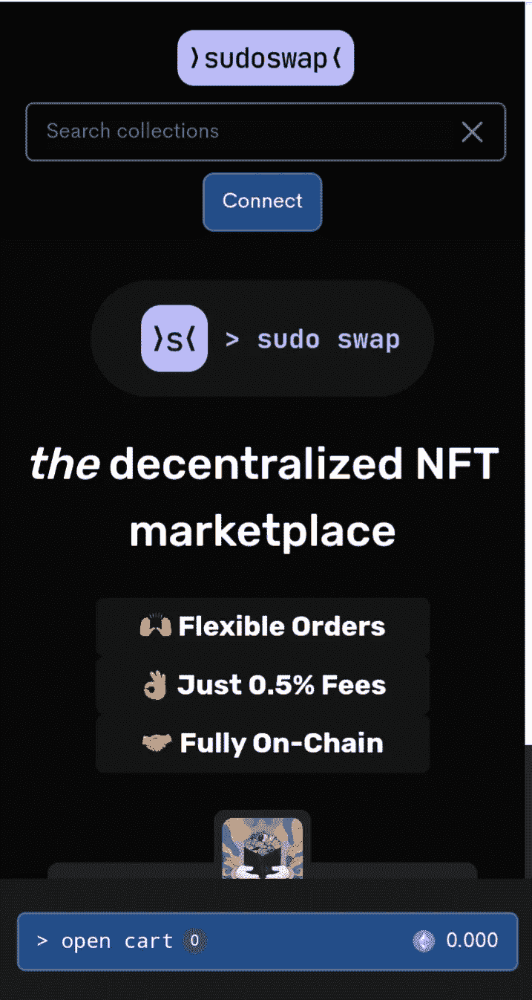
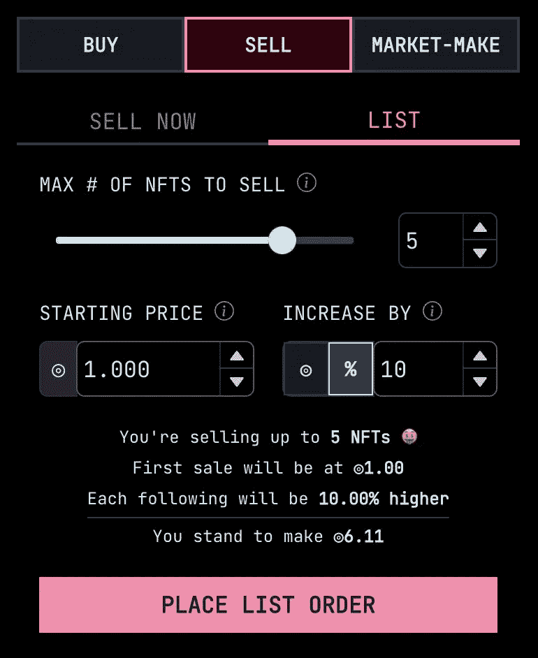
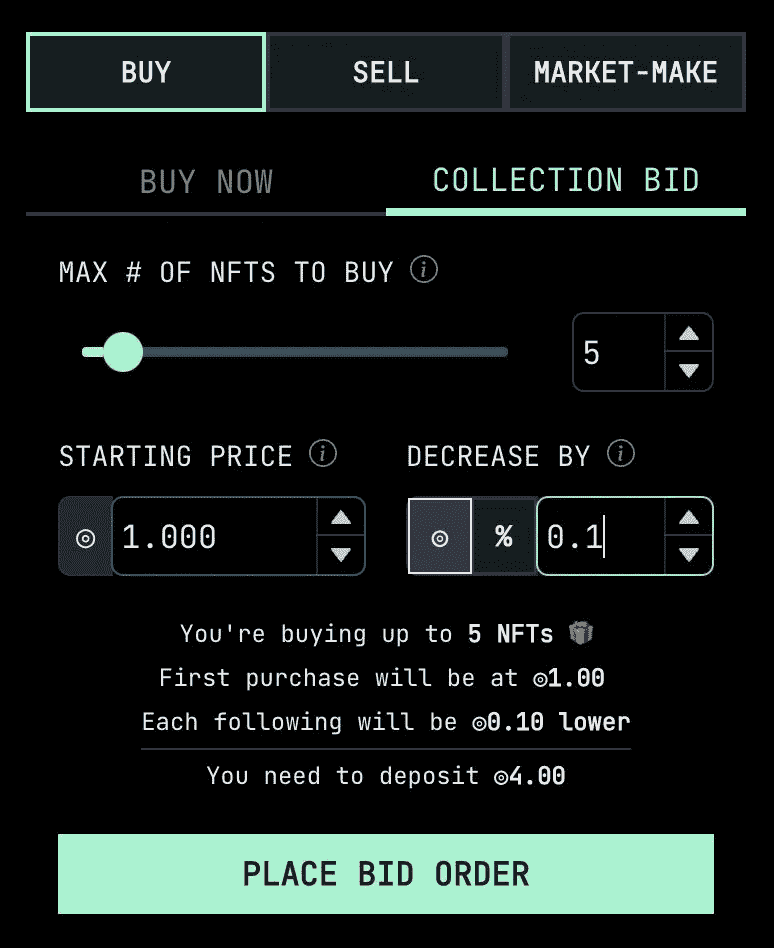
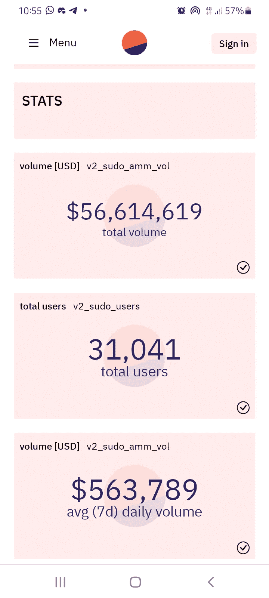
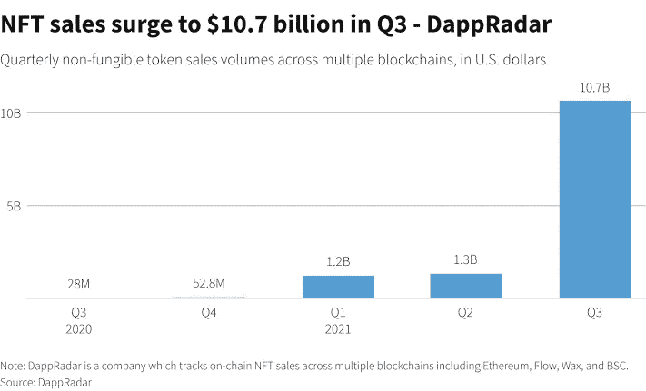

# 关于在自动做市商(AMM)中交易 NFT 你需要知道的一切

> 原文：<https://medium.com/coinmonks/everything-you-need-to-know-about-trading-nfts-in-an-automated-market-maker-amm-aab5895b3f3e?source=collection_archive---------4----------------------->

自动做市商(AMM)对 cyrptocurrency 来说并不陌生，尤其是在分散金融领域(Defi)。分散式交易所(Dex)在其业务中使用它。然而，这个概念对于 NFTs 来说仍然是相对较新的，已经出现了许多产品来帮助创建这种采用，例如 [UniclyNFT、](http://unic.ly) [bridgesplit](http://bridgesplit,com) 、 [Frakt](http://frakt.xyz) 、 [NFTx](http://nftx.io) 、 [Solvent Protocol](http://app.solvent.xyz) 、 [Tensorswap](http://tensor.trade/swap) 等。创建这些非金融交易的自动化市场是为了帮助交易者提供流动性。

虽然它们在操作方面可能是成功的，但是大量的 NFT 交易者并不使用它们，有些人甚至不知道存在这样的应用程序或操作，对于非常熟悉这个概念的 Defi 交易者来说，这是非常不可能的。

随后，在以太坊区块链上有一个新的 AMM 被引入 NFT， [Sudoswap](http://sudoswap.xyz) ，而 Sudoswap 仍然落后于领先的以太坊 NFT 市场 Opensea，报告显示以太坊 NFT 交易商对 Sudoswap 的使用值得肯定。这可能导致其他著名的 NFT 区块链如索拉纳的类似创新，这包括最近推出的， [Hadeswap](http://hadeswap.com) ，以及已经在计划中的 AMM，Elixir。

# **什么是 AMM** ？

如果你曾经使用过分散的交易所，如 Uniswap、Curve、Pancakeswap 或 Raydium，你就是在自动做市商上交易。如果你从未这样做过，不要担心，AMM 只是在一个只允许一方参与交易的市场中交易。

与币安、比特币基地等集中交易所(Cex)不同，在 AMM，交易是点对点进行的，需要一个额外的参与方，交易者唯一的交互是与智能合约进行交易。

# **自动做市商如何运作？**

需要向交易资产或代币的交易者提供流动性。在 AMM 中，流动性池被用来代表另一方的角色，该另一方提供流动性作为在人力或集中市场中使用的代币的交换。

流动性池是由被称为流动性提供者的人提供或供应资金，以便为 AMM 交易提供足够的流动性。这些流动性提供者从利用资金池的每笔交易中赚取费用，具体比例由 AMM 决定。在任何利用 AMM 的指数中为您提供的已到位流动性是从流动性提供者的资金中获得的池的结果。由于流动性已经可用，因此完全不需要额外的一方来提供流动性，因为已经承担了该方的角色。

在没有另一方来确定代币或资产应该定价或交换多少的情况下，自动做市商利用数学公式来确定价格。公式可能因不同的 AMM 而异，例如 uniswap 使用 x*y =k

要在 AMM 上进行交易，必须有一对资产，这意味着用一种资产交换或交易另一种资产，例如 ETH/DAI 或 SOL/DUST。x 是该对中一个代币的数量，y 是该对中另一个代币的数量，k 是固定常数。固定常数(k)是应该保持不变的池的总流动性。

# 如何在自动做市商系统中进行非金融交易？

NFT 是代表数字或虚拟资产的唯一令牌，其理念一直是 NFT 的交易只能由双方完成，就像实物资产的交易一样。市场的建立是为了帮助买卖双方进行交易。

这些市场是托管的，在 NFT 的交易中，NFT 把卖家的钱包留给市场，直到买家购买它。市场场所对 NFT 的这种临时占有赋予了它们对 NFT 的完全权力，这种权力的行使可能会引起资产所有者的反感。集权和不当的人为干预是 AMMs 最初被创建的原因。

这带来了 AMMs 交易非金融交易的创新，NFT 所有者不仅在交易结束前完全保管他们的非金融交易，而且可以在没有买方的情况下交易非金融交易。NFT 交易的自动做市商也利用来自流动性提供者提供的资金的流动性池。这消除了对买方或卖方等另一方的需要，因为流动性已经存在。

此外，人们注意到，非金融交易中的流动性较低，可能是由于某一特定 NFT 的交易量较低或炒作。然而，系统内和交易者手中都需要流动性，以创造一个更高效、表现更好的市场。因此，创造了一个自动化市场，交易者不需要等待卖家对他们的资产感兴趣才能获得流动性作为回报，他们可以简单地根据可用的流动性池进行交易。

NFT 的卖家或买家只需连接他们的钱包，搜索他们想要出售或购买的 NFT，并将其与他们选择的任何其他令牌或货币进行交易，前提是市场上有其流动性池。NFT 也可以互相交换，而不是在 AMM 上交换流动性。

[Sudoswap interface](http://sudoswap.xyz)

AMMs 可能会为交易者创造一个非常高效的交易平台，而不像在集中交易市场中，卖家必须一个接一个地列出 NFT。在 AMM 中，卖家可以创建一个列表订单，以某个价格或不同的价格列出自己想要的所有 NFT。在列出 NFT 时，卖方可以在出售一个 NFT 时输入列出的 NFT 的价格的某个百分比的增加。

例如，卖方以 10%的提价列出 10 个 1 ETH 的 NFT，在卖出第一个时，下一个 NFT 的价格变成 1.1ETH。这样，一个人可以最大限度地和有效地退出 NFT，而不是不断检查集中市场的底价和调整挂牌价。

[Tensor trading interface](http://tensor.trade/swap)

这也类似于买方的情况，一旦你已经输入了你选择的范围或百分比，你就可以有效地购买 NFTs，因为价格降低了。这样你就能以更好的价格有效地积累 NFT。例如，购买者在 1E 购买 10 个 NFT 时输入 10%的降价，在购买第一个之后，下一个的价格变成 0.9E，并且降价相应地继续，直到购买最后的 NFT。

应该注意的是，为了参与这种购买和销售，交易中使用的全部金额应该已经存入。

虽然这是一项值得称赞的创新，进一步使交易更加无缝，更重要的是更加分散，但在 AMM 中交易非金融交易仍然存在一些风险。

作为最近的创新，流动性池可能没有足够的流动性来满足每天的 NFTs 交易量。Opensea 和 Magic Eden 每天的平均 NFTs 交易量连续。让流动性提供者为资金池提供这么多资金可能需要一些时间，在此之前，交易 NFT 可能会很慢，并可能导致[滑点](https://academy.shrimpy.io/post/what-is-slippage-how-to-avoid-slippage-on-defi-exchanges)，交易者可能会因此亏损。

Trading volume of sudoswap

Trading volume of Opensea

并非所有自动市场交易系统都支持所有种类的非功能性交易，试图在特定的自动市场上交易不受支持的 NFT 可能会导致交易者的资金损失。一些 AMM 比其他的收取更多的费用，交易者对此的忽视也可能导致资金损失。

DeFi 中的自动做市商在 Defi 交易者中变得非常受欢迎，而在 NFTs 中，集中市场占据主导地位。交易者是否会完全适应 AMMs 而不是集中市场还不能确定，因为一些 NFT 交易者甚至从未使用过 DeFi 协议。

无论如何，这是一个非常好的创新，可以提高交易效率，增加流动性，从而吸引更多人进入非金融交易市场。除此之外，它给社区留下了一个选择，决定他们是愿意与另一方交易他们的资产，还是在流动性池中交换，这是 web 3 的本质。Web 3 的创立是为了给社区自己决定和做出选择的权力。

> 交易新手？试试[加密交易机器人](/coinmonks/crypto-trading-bot-c2ffce8acb2a)或者[复制交易](/coinmonks/top-10-crypto-copy-trading-platforms-for-beginners-d0c37c7d698c)