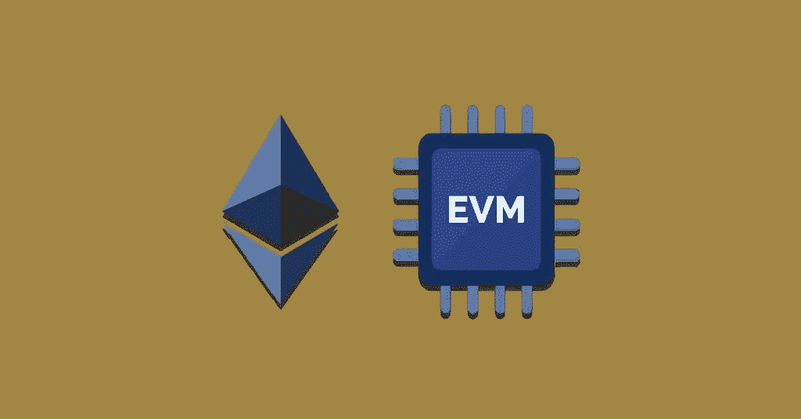

# EVM 谜题解决方案

> 原文：<https://medium.com/coinmonks/evm-puzzles-solutions-939f31a9c362?source=collection_archive---------7----------------------->



[Evm 拼图](https://github.com/fvictorio/evm-puzzles)由 [Franco Victorio](https://twitter.com/fvictorio_nan) 创作。对于那些想了解 EVM 如何运作的人或者任何想测试他们对 EVM 的了解的人来说，这是一个很好的资源。

如果你刚到 EVM，我推荐[打开齐柏林的博客](https://blog.openzeppelin.com/deconstructing-a-solidity-contract-part-i-introduction-832efd2d7737/)去更深层次地了解引擎盖下正在发生的事情。

# 怎么玩

> https://github.com/fvictorio/evm-puzzles
> 
> CD EVM-拼图
> 
> npm 安装
> 
> npx 安全帽游戏

我已经解开了这些谜题，你可以在这里找到它们。

来看看是怎么解决的吧！

# 谜题 1

> 字节码:3456FDFDFDFDFDFD5B00

`[evm.codes](https://www.evm.codes/)`是使用操作码的绝佳资源。将 puzzle 1 的字节码[粘贴到这里](https://www.evm.codes/playground)，你可以看到操作码，可以随意摆弄。

```
00          34          CALLVALUE
01          56          JUMP
02          FD          REVERT
03          FD          REVERT
04          FD          REVERT
05          FD          REVERT
06          FD          REVERT
07          FD          REVERT
08          5B          JUMPDEST
09          00          STOP
```

为了解决这个难题，我们需要`[JUMP](https://www.evm.codes/#56)(01)`到`[JUMPDEST](https://www.evm.codes/#5b)(08)`。

检查所有操作码:`[CALLVALUE](https://www.evm.codes/#34)`、`[JUMP](https://www.evm.codes/#56)`、`[REVERT](https://www.evm.codes/#fd)`、`[JUMPDEST](https://www.evm.codes/#5b)`、`[STOP](https://www.evm.codes/#00)`。

`CALLVALUE`:将读取`msg.value`并压入堆栈。

为了解决这个难题，我们需要将`8`作为`msg.value`到`JUMP`发送到`08`程序计数器。

**解决方案:**

```
{"value":8,"data":"0x"}
```

# 谜题 2

> 字节码:34380356FDFD5B00FDFD

```
00          34          CALLVALUE
01          38          CODESIZE
02          03          SUB
03          56          JUMP
04          FD          REVERT
05          FD          REVERT
06          5B          JUMPDEST
07          00          STOP
08          FD          REVERT
09          FD          REVERT
```

和谜题 1 一样我们需要`[JUMP](https://www.evm.codes/#56)(03)`到`[JUMPDEST](https://www.evm.codes/#5b)**(**06**)**` **。**

检查所有操作码:`[CALLVALUE](https://www.evm.codes/#34)`、`[CODESIZE](https://www.evm.codes/#38)`、`[JUMP](https://www.evm.codes/#56)`、`[REVERT](https://www.evm.codes/#fd)`、`[JUMPDEST](https://www.evm.codes/#5b)`、`[STOP](https://www.evm.codes/#00)`。

在`JUMP`之前，我们需要解决一个部分

1.  `CODESIZE` - `CODEVALUE` = `06`

我们有`10`字节大小的`bytecode`或`CODESIZE`。为了解决这个难题，我们需要将`4`作为`msg.value`发送。

**解决方案:**

```
{"value":4,"data":"0x"}
```

# 谜题 3:

> 字节码:3656FDFD5B00

```
00          36          CALLDATASIZE
01          56          JUMP
02          FD          REVERT
03          FD          REVERT
04          5B          JUMPDEST
05          00          STOP
```

要解决这个难题，我们需要`[JUMP](https://www.evm.codes/#56)(01)`到`[JUMPDEST](https://www.evm.codes/#5b)(04)`。

检查所有操作码:`[CALLDATASIZE](https://www.evm.codes/#36)`

`CALLDATASIZE`将 calldata 的总字节大小推入堆栈。为了解决这个难题，我们需要发送 4 字节大小的 calldata。

**解决方案:**

```
{"data":"0x00000000","value":0}
```

# 谜题 4:

> 字节码:34381856FDFDFDFDFDFD5B00

```
00          34          CALLVALUE
01          38          CODESIZE
02          03          XOR
03          56          JUMP
04          FD          REVERT
05          FD          REVERT
06          5B          REVERT
07          00          REVERT
08          FD          REVERT
09          FD          REVERT
0a          FD          JUMPDEST
0b          FD          STOP
```

要解决这个难题，我们需要`[JUMP](https://www.evm.codes/#56)(03)`到`[JUMPDEST](https://www.evm.codes/#5b)(0a)`。

检查所有操作码:`[CALLVALUE](https://www.evm.codes/#34)`、`[CODESIZE](https://www.evm.codes/#38)`、`[XOR](https://www.evm.codes/#18)`。

我们需要`XOR` 结果为 **1010(二进制数 **0a 的**)**。目前我们有第一个输入值(`CODESIZE` **)** 为**1100**(12 字节的二进制数)，所以我们需要找到第二个值。让我们找到。

异或逻辑很简单。如果两位相同，结果为 0。如果两位不同，则结果为 1。

```
 1111
 ****
-------
 1010
```

在这里，我们可以确定值将是 **0101(二进制值 6)。**

**解决方案:**

```
{"data":"0x","value":6}
```

# 谜题 5:

> 字节码:34800261010014600 c 57 fdfd 5b 00 fdfd

```
00          34          CALLVALUE
01          80          DUP1
02          02          MUL
03          61          PUSH2                     0100
06          14          EQ
07          60          PUSH1                     0C
09          57          JUMPI
0a          FD          REVERT
0b          FD          REVERT
0c          5B          JUMPDEST
0d          00          STOP
0e          FD          REVERT
0f          FD          REVERT
```

为了解决这个难题，我们可以看到我们需要`[JUMPI](https://www.evm.codes/#57)(09)`到`JUMPDEST(0c)`。

`[JUMPI](https://www.evm.codes/#57)`从堆栈中弹出两个值。第一个值将是需要跳转到`to`的值，第二个值将是 0 或 1，以确定是否应该跳转。

检查其他操作码:`[CALLVALUE](https://www.evm.codes/#34)`、`[DUP1](https://www.evm.codes/#80)`、`[MUL](https://www.evm.codes/#02)`、`[PUSH2](https://www.evm.codes/#61)`、`[EQ](https://www.evm.codes/#14)`。

在`JUMPI`之前，我们需要解决一个部分

1.  `CALLVALUE` * `CALLVALUE` = 100

我们将把`16`作为`msg.value`发送，因为这个值将被转换成十六进制的`10`。

**解决方案:**

```
{"data":"0x","value":16}
```

# 谜题 6:

> 字节码:60003556FDFDFDFDFDFD5B00

```
00          60          PUSH1                      00
02          03          CALLDATALOAD
03          55          JUMP
04          6F          REVERT
05          FD          REVERT
06          FD          REVERT
07          FD          REVERT
08          FD          REVERT
09          FD          REVERT
0a          5B          JUMPDEST
0b          00          STOP
```

要解决这个难题，我们需要`JUMP(03)`到`JUMPDEST(0a)`。

结账:`[CALLDATALOAD](https://www.evm.codes/#35)`

这里，`CALLDATALOAD`将加载 32 字节的值字符串，因为这里的偏移量是 00。

**解决方案:**

```
{"data":"0x000000000000000000000000000000000000000000000000000000000000000a","value":0}
```

# 谜题 7:

> 字节码:36600080373660006000 f 03b 600114601357 FD 5b 00

```
00          34          CALLDATASIZE
01          38          PUSH1                     00
03          03          DUP1
04          56          CALLDATACOPY
05          FD          CALLDATASIZE
06          FD          PUSH1                     00
08          5B          PUSH1                     00
0a          00          CREATE
0b          FD          EXTCODESIZE
0c          FD          PUSH1                     01
0e          34          EQ
0f          38          PUSH1
11          03          JUMPI
12          56          REVERT
13          FD          JUMPDEST
14          FD          STOP
```

要解决这个难题，我们需要`JUMPI(03)`到`JUMPDEST(13)`。

**检查所有操作码:**`[CALLDATASIZE](https://www.evm.codes/#36)``[CALLDATACOPY](https://www.evm.codes/#37)``[CREATE](https://www.evm.codes/#f0)``[EXTCODESIZE](https://www.evm.codes/#3b)``[EQ](https://www.evm.codes/#14)`。

这里，`[EQ](https://www.evm.codes/#14)`将比较`[EXTCODESIZE](https://www.evm.codes/#3b)`的结果和`PUSH1`推送的值 1。

`[CREATE](https://www.evm.codes/#f0)`:将部署合同

`[EXTCODESIZE](https://www.evm.codes/#3b)`:将计算部署的合同代码大小

因此，如果部署的代码只有一条指令要遵循，`EXTCODESIZE`将返回 1。

我们将简单地返回 1 个字节。

```
60          PUSH1                      01
60          PUSH1                      00 
F3          RETURN
```

**解决方案:**

```
{"data":"0x60016000F3","value":0}
```

# 谜题 8:

> 字节码:36600080373660006000 f 0600080808080945 af 1600014601 b 57 FD 5b 00

```
00          36          CALLDATASIZE
01          60          PUSH1                     00
03          80          DUP1
04          37          CALLDATACOPY
05          36          CALLDATASIZE
06          60          PUSH1                     00
08          60          PUSH1                     00
0a          F0          CREATE
0b          60          PUSH1                     00
0d          80          DUP1
0e          80          DUP1
0f          80          DUP1
10          80          DUP1
11          94          SWAP5
12          5A          GAS
13          F1          CALL
14          60          PUSH1                     00
16          14          EQ
17          60          PUSH1                     1B
19          57          JUMPI
1a          FD          REVERT
1b          5B          JUMPDEST
1c          00          STOP
```

要解决这个难题，我们需要`[JUMPI](https://www.evm.codes/#57)(19)`到`[JUMPDEST](https://www.evm.codes/#5b)(1b)`。

检查所有操作码:`[CALLDATASIZE](https://www.evm.codes/#36)`、`[PUSH1](https://www.evm.codes/#60)`、`[DUP1](https://www.evm.codes/#80)`、`[CALLDATACOPY](https://www.evm.codes/#37)`、`[CREATE](https://www.evm.codes/#f0)`、`[SWAP5](https://www.evm.codes/#94)`、`[GAS](https://www.evm.codes/#5a)`、`[CALL](https://www.evm.codes/#f1)`、`[EQ](https://www.evm.codes/#14)`。

有两个部分

1.  使用`CREATE`创建合同
2.  `CALL`将调用合同，如果调用成功则返回`1`，如果调用失败则返回`0`。我们需要`0`，因为`EQ`将其结果与`0`进行比较。

因此，作为一个解决方案，我们将推动`revert opcode`并将其存储到内存中。

```
60          PUSH1                      FD
60          PUSH1                      00 
53          MSTORE8
60          PUSH1                      01
60          PUSH1                      00 
F3          RETURN
```

**解决方案:**

```
{"data":"0x60FD60005360016000F3","value":0}
```

# 谜题 9:

> 字节码:36600310600957 fdfd 5b 343602600814601457 fd5b 00

```
00          36          CALLDATASIZE
01          60          PUSH1                     03
03          10          LT
04          60          PUSH1                     09
06          57          JUMPI
07          FD          REVERT
08          FD          REVERT
09          5B          JUMPDEST
0a          34          CALLVALUE
0b          36          CALLDATASIZE
0c          02          MUL
0d          60          PUSH1                     08
0f          14          EQ
10          60          PUSH1                     14
12          57          JUMPI
13          FD          REVERT
14          5B          JUMPDEST
15          00          STOP
```

为了解决这个难题，我们需要`JUMPI(06)`到`[JUMPDEST](https://www.evm.codes/#5b)(09)`和`JUMPI(12)`到`[JUMPDEST](https://www.evm.codes/#5b)(14)`。

检查所有操作码:`[CALLDATASIZE](https://www.evm.codes/#36)`、`[CALLVALUE](https://www.evm.codes/#34)`、`[LT](https://www.evm.codes/#10)`、`[MUL](https://www.evm.codes/#02)`、`[EQ](https://www.evm.codes/#14)`。

我们需要解决两个部分，

1.  `03` < `CALLDATASIZE`
2.  `(CALLVALUE * CALLDATASIZE)`结果等于`08`。

所以，`CALLDATASIZE`应该是`4`，而`CALLVALUE`应该是`2`才能满足这些条件。

**解决方案:**

```
{"data":"0x00000000","value":2}
```

# 谜题 10:

> 字节码:38349011600857 fd5b 3661000390061534600 a 0157 fdfdfd5b 00

```
00          38          CODESIZE
01          34          CALLVALUE
02          90          SWAP1
03          11          GT
04          60          PUSH1                     08
06          57          JUMPI
07          FD          REVERT
08          5B          JUMPDEST
09          36          CALLDATASIZE
0a          61          PUSH2                     0003
0d          90          SWAP1
0e          06          MOD
0f          15          ISZERO
00          34          CALLVALUE
11          60          PUSH1                     0A
13          01          ADD
14          57          JUMPI
15          FD          REVERT
16          FD          REVERT
17          FD          REVERT
18          FD          REVERT
19          5B          JUMPDEST
1a          00          STOP
```

类似于`puzzle #9`，我们需要`JUMPI(06)`到`[JUMPDEST](https://www.evm.codes/#5b)(08)`和`JUMPI(14)`到`[JUMPDEST](https://www.evm.codes/#5b)(19)`。

检查所有操作码:`[CODESIZE](https://www.evm.codes/#38)`，`[CALLVALUE](https://www.evm.codes/#34)`，`[SWAP1](https://www.evm.codes/#90)`，`[GT](https://www.evm.codes/#11)`，`[CALLDATASIZE](https://www.evm.codes/#36)`，`[PUSH2](https://www.evm.codes/#61)`，`[MOD](https://www.evm.codes/#06)`，`[ISZERO](https://www.evm.codes/#15)`，`[ADD](https://www.evm.codes/#01)`。

我们需要解决两个部分，

```
1.
   - CODESIZE > CALLVALUE2.
   - CALLDATASIZE % 0003 == 0
   - CALLVALUE + 0A == 19
```

所以，`CALLDATASIZE`应该是`3`，而`CALLVALUE`应该是`15`才能满足这些条件。

**解决方案:**

```
{"data":"0x000000","value":15}
```

敬请关注或联系我:

*   **推特**:[*@ rajat _ beladiya*](https://twitter.com/rajat_beladiya)
*   **Github***:*[*@ rajatbeladiy*a](https://github.com/rajatbeladiya)
*   不和谐:*rajatbeladiya # 5760*

> 交易新手？尝试[加密交易机器人](/coinmonks/crypto-trading-bot-c2ffce8acb2a)或[复制交易](/coinmonks/top-10-crypto-copy-trading-platforms-for-beginners-d0c37c7d698c)