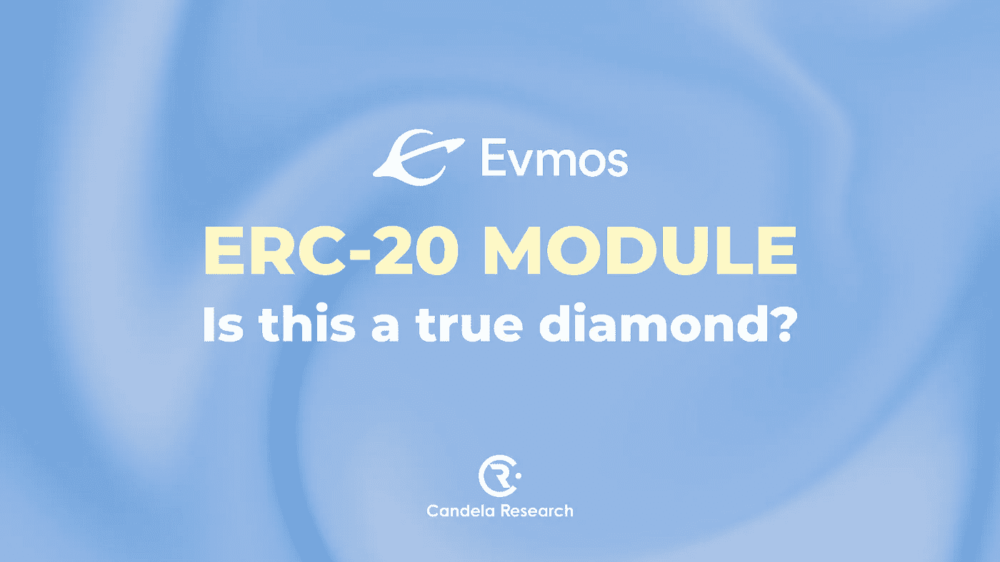

# 埃夫莫斯 ERC-20 模块——这是真钻石吗？

> 原文：<https://medium.com/coinmonks/evmos-erc-20-module-is-this-a-true-diamond-cdd29dcfcd32?source=collection_archive---------37----------------------->

ERC-20 模块是一个工具，帮助 Evmos 转换 IBC 标准令牌到 ERC-20 令牌，反之亦然。设置过程非常简单。该模块将把 ERC-20 号令牌的地址和宇宙号令牌的地址结合在一起，形成一个“令牌对”。

令牌对必须通过 Evmos 上的治理提案来创建。社区将投票决定令牌对是否有效。

# ERC-20 模块能做什么？

由于这个模块，Evmos 上的令牌可以转移到其他以太坊，第 1 层，第 2 层。特别是，当与 IBC 结合时，这些 ERC20 令牌甚至可以用于宇宙生态系统中的其他区块链。

ERC-20 模块的具体优势如下:

1.允许以太坊第一层、第二层的代币在宇宙生态系统中流通。

2.允许宇宙币在以太坊第一层、第二层流通。

3.允许宇宙代币访问 Defi 工具，如 AAVE。

对于 Evmos 来说，这不仅仅是简单的扩展令牌变体。ERC-20 模块带来的真正好处是打开了宇宙和以太坊之间的资金流。当时，埃夫莫斯是这两个巨大生态系统之间的中转站。

正如上一篇文章所分析的，Evmos 的商业模式专注于支持应用程序和 appchain，以吸引更多来自以太坊生态系统的开发者和用户。因此，ERC-20 的角色对于 Evmos 生态系统非常重要。然而，要取得成功，Evmos 还需要其他因素，如外交关系、吸引投资者等。

**坎德拉研究。**

[全球](https://t.me/candelaglobal) l [越南](https://t.me/candelaresearchvn) l [社区](https://t.me/cosmosvncommunity) l [推特](https://twitter.com/candelaresearch)

> 交易新手？尝试[加密交易机器人](/coinmonks/crypto-trading-bot-c2ffce8acb2a)或[复制交易](/coinmonks/top-10-crypto-copy-trading-platforms-for-beginners-d0c37c7d698c)