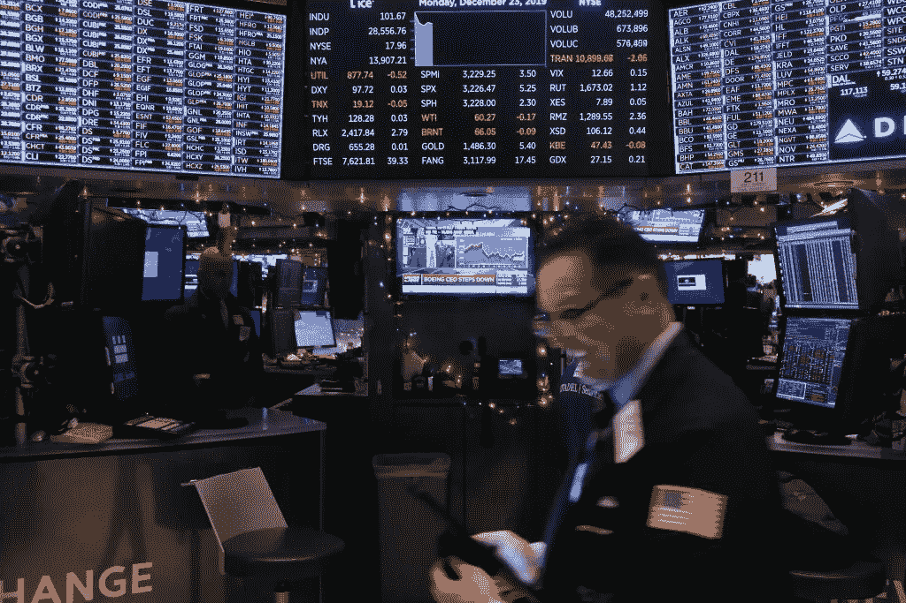
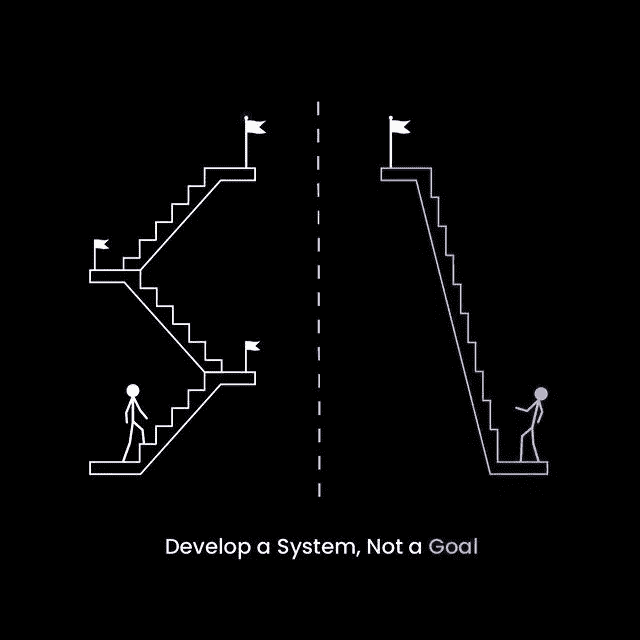
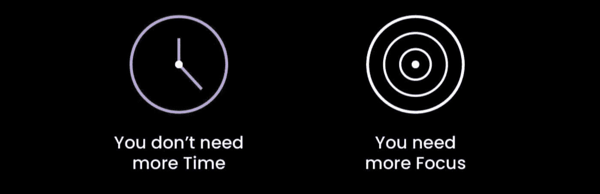
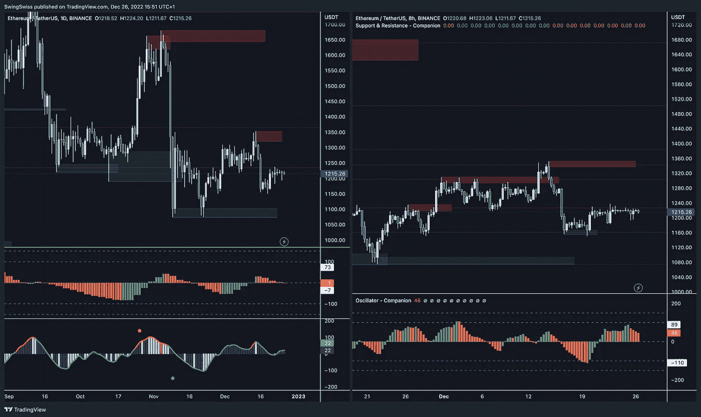
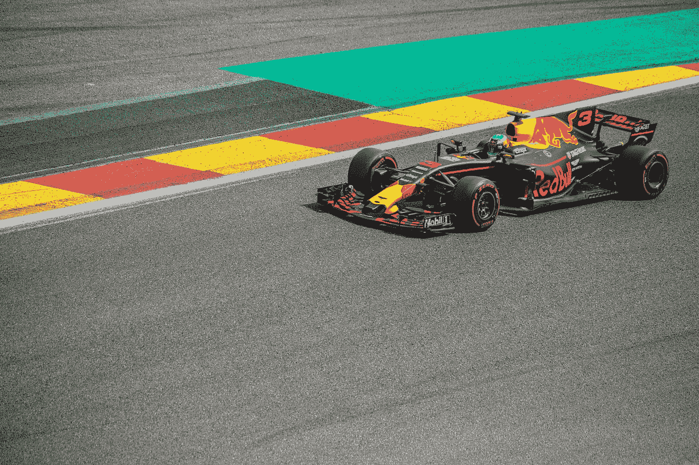
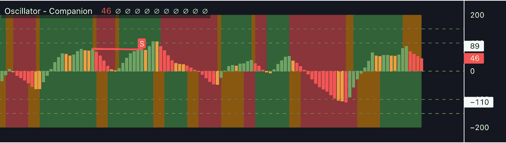

# 2022 年赚了 880%的前交易员解释了他独特的策略。

> 原文：<https://medium.com/coinmonks/ex-deutsch-b-trader-who-made-880-in-crypto-bear-explains-how-you-can-do-it-too-e576261d7d89?source=collection_archive---------0----------------------->

当数十亿美元化为乌有时，我的投资组合在不到一年的时间里从 12 万美元增长到了 100 多万美元。你也可以这样做！

## “开发一个系统，而不是一个目标。”

在两家大银行获得了 20 多年的外汇交易经验后，我决定遵循自己的规则。

我没有模仿狗屎/迷因硬币。

*   **我只交易了$ETH。**

我没有使用 10 倍杠杆。

*   **我没有使用杠杆，说真的，一点也没有。**

我不是每天都交易。

*   我只开了 9 笔交易。

我没有跟踪交易机器人或复制交易平台。

*   他们脑子里没有你的兴趣，只有他们的议程。

我没有投资 NFTs 或加密项目。

*   这不是我的专业领域，当然也不是你的。

交易是先掌握自己，所以我坚持自己的计划，没有感情用事。禅宗交易让你毛健康的利润。我是这样做的:

## 成为专家

听起来很合理，对吧？盈利交易者和赌徒的最大区别是“专业知识”

***资产如旋律；图表就像纸音乐。你怎么能指望看几十个就习惯他们的行为呢？***

现在，当交易者只需要掌握几个图表时，他们缺乏专注。

我已经交易了几十年，但在我的职业生涯中只投机过十几种不同的资产。

自从五年前离职以来，我一直专注于以下四点:

[$ETH/USDT]，[$EUR/USD]，[$BTC/USDT]，[QQQ]和[GOLD]

我不会**交易**其他任何东西。是的，我可能无法从这个小宇宙之外的巨大机遇中获益。但是，你需要战胜自己不理智的大脑，权衡投资自己没有掌握的东西的风险。不这样做将会导致你的进场失败，更重要的是，你的出场失败。离开它；你在那项交易中不会有优势。

长期来看，唯一重要的是你的胜率。专注于掌握一些资产，最重要的是你自己。

## 把日内交易留给影响者和非常有经验的专业交易者。

Photo by [Austin Distel](https://unsplash.com/@austindistel?utm_source=medium&utm_medium=referral) on [Unsplash](https://unsplash.com?utm_source=medium&utm_medium=referral)

## 很可能你两者都不是。

日内交易的费用和基础设施都很昂贵。这是一项耗时的工作，需要对市场状况进行一致而严谨的分析。

日内交易也超级**压力大**。焦虑是交易者最大的敌人。你很容易犯错误，这会影响你的思考过程。

> ***“交易所在影响者的帮助下，正在推广刷单和日内交易策略。他们这样做是因为钱就是这样从你的口袋转移到他们的口袋的。”—wise chief . eth***

你所有的决定都要经过权衡，以最大化你成功的几率。有趣的是，只有 5%的日内交易者盈利，相比之下，10%的日内交易者盈利。虽然这看起来不多，但这是 **盈利的两倍机会！**

智慧是从你的错误中学习；智慧是从别人的错误中学习。明智点。把日间交易留给有影响力的人。

> 如果你是专业交易者，你可能想看看我们的中短期策略线。[阅读:The Line —最先进的交易策略](/coinmonks/the-line-a-super-powered-diy-multiasset-trading-strategy-10b558331ada)

## 热爱你的工作！你会很乐意把时间分配给宏观和基本面。

你需要意识到技术和基本面分析是好朋友。理解宏观经济是摇摆交易最重要的部分。然而，对我来说，这从来不像是工作。几十年来，我一直在做宏观预测。事实上，跟踪宏观事件成了我的激情所在，以至于我现在和我的孩子们一起玩预测游戏！

Photo by [Etienne Girardet](https://unsplash.com/@etiennegirardet?utm_source=medium&utm_medium=referral) on [Unsplash](https://unsplash.com?utm_source=medium&utm_medium=referral)

以下是我的交易流程:

*   不断发展的宏观预测和情绪分析(我的“愿景”)
*   跟随经济日历和新闻来调整我的视野(每日)
*   技术指标指向我的愿景
*   技术分析让我进入一个位置

听起来很难？不是的！为什么？因为我们是无杠杆的摇摆交易者！只有几个数据点引起了我们的兴趣。其他的都是噪音。

**非详尽清单:**你的资产 newsfeed，CPI(美国通胀数据)，央行利率，失业率，消费者信心指数，贸易平衡，恐惧&贪婪指数，失业率，消费者信心指数，VIX，主要指数(SP500 等。).

我喜欢阅读 [finimize](https://medium.com/u/2ac0beaedb0?source=post_page-----e576261d7d89--------------------------------) 时事通讯。虽然我获得了高级订阅，免费版本仍然提供了大量的价值。我还订阅了彭博新闻。我养成了每天看他们帖子的习惯。他们让我每天在不到 15 分钟的时间里掌握宏观层面的一切。

## 自动化减少了偏见，为你节省了大量时间。

> “坏消息是时间过得很快。好消息是你是飞行员。”迈克尔·阿特舒勒

我保持我的图表非常干净——情况并不总是如此*但是 ***我最终意识到数据是一把双刃剑。我需要减少他们。****

**

*1) Displays s/r lines automatically with high accuracy 2) Oscillator displays the trend with exhaustion/reversal points.*

*在摇摆交易中，**支撑和**是必不可少的。我们用它们来确定图表上的价格点，那里的概率有利于主流趋势的暂停或反转。它们帮助交易者抓住时机，进入/退出仓位，做出更好的预测。我曾经画了几十年的我的。*

*虽然有经验的交易者不需要工具来画它们，但我从 T2 swing Swiss 的 Companion 开发了 Sup/Res 指标。它已经在我的排行榜上放了大约一年，为我节省了 ***一吨*** 的时间。*

**

*Photo by [Ferhat Deniz Fors](https://unsplash.com/@ferhat?utm_source=medium&utm_medium=referral) on [Unsplash](https://unsplash.com?utm_source=medium&utm_medium=referral)*

*最后，我决定把我的交易经验打包成一个紧凑的工具。所以我自学了 Pine Script 并开发了我自己的指示器。*

*为什么？因为我们不可能永远做最好的自己。*

*看着我图表上的所有数据很麻烦，即使我掌握了它们，也很难快速地从中挤出汁来。大概一个星期的时间，我把自己用$ETH 作为规则和条件的交易经验写了出来。我还分析了多年的图表和模式，以找到具体的新闻相关的规则。几个月来，我一直在更新和调整它。*

*我称之为“振荡器”，现在自动分析市场**作为我自己的最佳版本。它防止我过早进入一个位置，过晚平仓。“振荡器”不会分心！***

******某种意义上，它已经超越了我。******

***如今，你可以在@Youtube 上学习 Pine Script，或者在 [Upwork](https://medium.com/u/b38dba53b069?source=post_page-----e576261d7d89--------------------------------) **【非附属】上雇佣一名开发人员。*****

******

***Neat and simple***

## ***关于我的$ETH 策略。***

***我的策略可以定义为“长期市场中性动量策略”***

******长线:*** 平均每笔交易耗时 58 天。亏钱的交易很快被拒绝，这要归功于“振荡指标”和“支持指标”(15 天)。***

******市场中性:*** 对多头或空头没有偏见。我想在任何市场获利。***

******动量策略:*** 就是找反转而已。简单地说，投资者买入上涨的证券，并在它们看起来已经见顶时卖出(同上做空)。***

***“振荡指标”发现机会，回答何时(进场/出场)和如何(做多/做空)，并对短期上涨或下跌做出反应。***

> ***我接管了 SwingSwiss，在 TradingView 上发表了这个长期战略， [**写了一篇关于它的报道！**](/coinmonks/the-bionic-strategy-or-how-all-algorithmic-trading-strategies-should-be-developed-a0a6b15330a0) **如果你想了解更多关于 strat 的信息，获取权限，或者想聊天，随时联系我** [**电报**](https://t.me/wisechief) **！*****

## ***综上***

*   ***专注于一些资产，获得专业知识***
*   ***热爱你的工作，投入时间去理解宏观经济***
*   ***你不需要杠杆就能赚到真金白银；这是一个乌托邦。摆动交易会感觉像一个阳光假期***
*   ***离开日内交易，胜算在你这边***
*   ***简化您的设置；你没有 Instagram 业务***
*   ***自动化冗余任务。生活是美好的。赢得时间。***

****跟我来；我会写我的交易策略、宏观经济和秘密天使投资。我将回答这样的问题:如何为摆动交易创建完美的交易视图设置？如何在预算内交易？如何管理你的风险？****