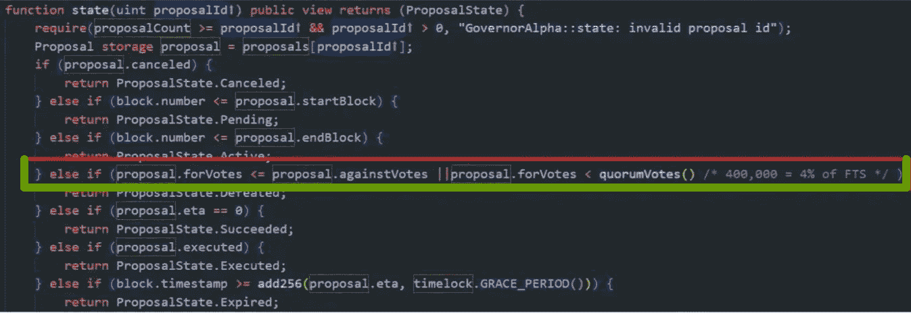
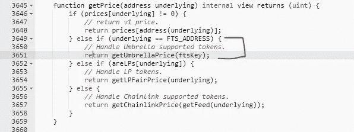
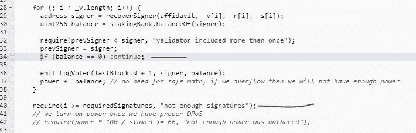
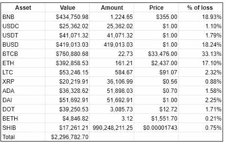

# 对堡垒协议黑客的检查

> 原文：<https://medium.com/coinmonks/examination-of-the-fortress-protocol-hack-e261c96ea450?source=collection_archive---------19----------------------->

5 月 9 日上午 11 点，《堡垒协议》遭到敌意攻击，导致其资金被盗。这是堡垒协议的治理合同的设计缺陷和对伞状网络甲骨文的任意操纵促成了攻击。

5 月 8 日周日，黑客利用保护伞公司的 oracle 智能合约链中的一个缺陷，操纵了一流数据对 MAHA-USD 和 FTS-USD 的价格馈送数据。操纵价格之后，MahaDAO 和 Fortress 都被进一步利用。

攻击者首先利用龙卷风现金在以太坊上购买$FTS 代币。

他买了足够多的票，超过了所需的 400，000 票和担保法定人数。他能够控制治理合同，并最终获得一个提案(提案 ID11)的通过。旨在改变信贷协议中附属条款的一系列行动。

之后，由于贷款安排，攻击者可以轻松获得大量资产。完成后，他们使用 Celer 网络将资金转移到以太坊，然后使用 Tornado Cash 隐藏他们的踪迹。

然而，在以太和戴到达混音器之前，他们在 Uniswap 上切换了几次。然后他们用龙卷风现金进行组合。由于不清楚的原因，像和这样的稳定硬币通过 Uniswap 被换成了稳定硬币 DAI 和包裹乙醚。

袭击者小心翼翼。他利用 Tornado 的隐私协议在开始和结束时执行他的操作。以太坊上发送者和接收者之间可能存在的任何联系都被龙卷风现金混合协议打破，从而创造了理想的掩护。

## 攻击相关信息

这些是攻击堡垒协议中涉及的地址，这是一个基于币安智能链的 DeFi 贷款协议。

攻击者地址:
[https://bscscan . com/Address/0x a6 af 2872176320015 F8 DDB 2 ba 013 b 38 CB 35d 22 ad](https://bscscan.com/address/0xA6AF2872176320015f8ddB2ba013B38Cb35d22Ad)

交易哈希:
[https://bscscan . com/tx/0x 13d 19809 b 19 AC 512 da 6d 110764 caee 75 e 2157 ea 62 CB 70937 c 8d 9471 afcb 061 BF](https://bscscan.com/tx/0x13d19809b19ac512da6d110764caee75e2157ea62cb70937c8d9471afcb061bf)

FTS 令牌合同地址:
[https://bscscan . com/Address/0x 4437743 AC 02957068995 c48e 08465 e0ee 1769 FBE](https://bscscan.com/address/0x4437743ac02957068995c48e08465e0ee1769fbe)

## 深入的分析

攻击者为正式攻击设定了 19 天的准备期。4 月 29 日通过 TornadoCash 获得了总计 20 个 ETH，12.4 个 ETH 通过 cBridge 连接到币安智能链。

《堡垒协议》的治理令牌总供应量为 100 亿 FTS，于 2022 年 4 月 21 日发行。由于$FTS 的低价，以大约 11.4 ETH 购买了大约 400，000 个 FTS 代币，占总供应量的 4%。

正是在 5 月 4 日，攻击者创建了一个恶意的提议合同:

[https://bscscan . com/address/0x 0 db 3 b 68 c 482 b 04 c 49 CD 64728 ad 5d 6d 9 a 7 b 8 e 43 e 6](https://bscscan.com/address/0x0dB3B68c482b04c49cD64728AD5D6d9a7B8E43e6)

在下一步中，提议的合同被添加到提议 11，提议队列。在为期三天的投票中，攻击者在 5 月 7 日投票结束前几个小时，通过使用他们之前购买的 40 万个令牌中的一部分，投票支持该提案。

0xc 368 AFB 2 AFC 499 e 7 ebb 575 ba 3 e 717497385 ef 962 B1 f 1922561 BCB 13 f 85336252；
0x 83 a4 F8 f 52 b 8 f 9 e 6 ff 1 DD 76546 a 772475824d 9 aa 5b 953808 DBC 34 D1 f 39250 f 29d

使用下图，我们可以看到治理契约的成功通过需要满足两个条件:

*   赞成票多于反对票
*   赞成票的数量大于或等于 FTS 代币供应总量的 4%(400，000 FTS)。

投票后，提案获得批准，并在两天的等待期后生效。

2 天后，5 月 9 日，用户创建了攻击合同并开始攻击。

以下是攻击合同在恶意提议执行期间采取的步骤:

为了使 FTS 代币更具杠杆作用，杠杆比率应该从 0 变为 0.7，这将允许攻击者借出杠杆化的 FTS 代币价值的 70%。

担保品价格合同通过堡垒协议接收:[https://bscscan . com/address/0x 00 fcf 33 BFA 9 E3 ff 791 B2 b 819 ab 2446861 a 318285](https://bscscan.com/address/0x00fcF33BFa9e3fF791b2b819Ab2446861a318285)

下图说明了用于估算代币价格的不同预测:

例如，FTS 使用伞状甲骨文来确定其价格:

[https://bscscan . com/address/0xc 11 b 687 CD 6061 a 6516 e 23769 e 4657 b 6 EFA 25d 78 e](https://bscscan.com/address/0xc11B687cd6061A6516E23769E4657b6EfA25d78E)

使用下图，我们可以看到 Oracle 的“提交多重签名价格馈送”功能中的漏洞:

如果签名的数量超过所需的签名数，则无法验证签名者是否拥有正确的提要。这使得攻击者能够使用任何帐户生成签名。

攻击发生后，保护伞公司迅速更新了合同并修复了漏洞:

[https://bscscan . com/address/0x 49d 0d 57 cf 6697 b 6 a 44050872 CDB 760945 b 710 aab](https://bscscan.com/address/0x49D0D57cf6697b6a44050872CDb760945B710Aab)

现在，更新后的提交功能还会检查签名者权限。

至于攻击，攻击者设法操纵甲骨文机器，并为设定了非常高的价格，从而允许他出借所有代币，包括、、、、ETH、LTC、、ADA、DAI、DOT 和 SHIB。

List of Stolen Fortress Assets

通过 Anyswap 和 cBridge，所有这些代币都被桥接到以太坊网络，并兑换成大约三百万 USDT。该 USDT 在被改变成 ETH 和 DAI 之后，随后通过以太坊网络被传送到 TornadoCash。

## 摘要

作为此次攻击的一部分，Oracle 价格操纵协议中的一个缺陷和治理协议中的一个漏洞被利用。

在创建治理契约时，将令牌投票模型的设计逻辑考虑在内是至关重要的，这样可以使有害的攻击难以执行。

检查分散的 Oracle 很重要，但考虑外部 Oracle 是否能与协议一起工作也很重要。

在此之前，还发生了两起引人注目的袭击事件。受影响最严重的网络是 Axie 的 Ronin，损失超过 6 亿美元。同样，逆向金融公司损失了价值超过 1500 万美元的资产。同样是在过去的一个月里，今年的第二大违反事件针对的是 Rari 的保险丝协议。

在加密货币生态系统中，散布恐惧是一种常见的做法，因为漏洞会越来越频繁地影响 DeFi 协议和不和谐服务器。因此，密码领域的安全似乎是今年最大的问题。

> 交易新手？试试[加密交易机器人](/coinmonks/crypto-trading-bot-c2ffce8acb2a)或者[复制交易](/coinmonks/top-10-crypto-copy-trading-platforms-for-beginners-d0c37c7d698c)