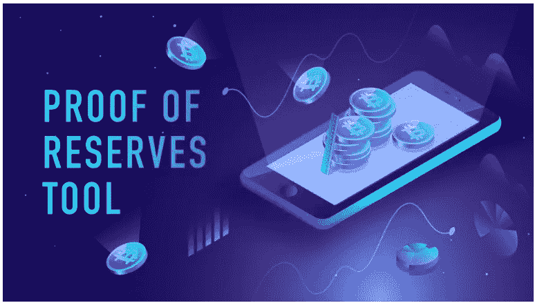

# 外汇储备证明:意味着什么&谁在做？

> 原文：<https://medium.com/coinmonks/exchange-proof-of-reserves-what-it-means-who-is-doing-it-46c06a77d466?source=collection_archive---------15----------------------->

## 加密报告

## 回顾了四个最大的 PoR 和德克斯。

FTX 和阿拉米达研究公司的倒闭让密码持有者想知道其他交易所可能在幕后对他们客户的硬币和代币做什么。

> 为了支持我，你可以 [***请我喝咖啡***](https://medium.com/coinmonks/buymeacoffee.com/saleswallet)**和/或成为* …*