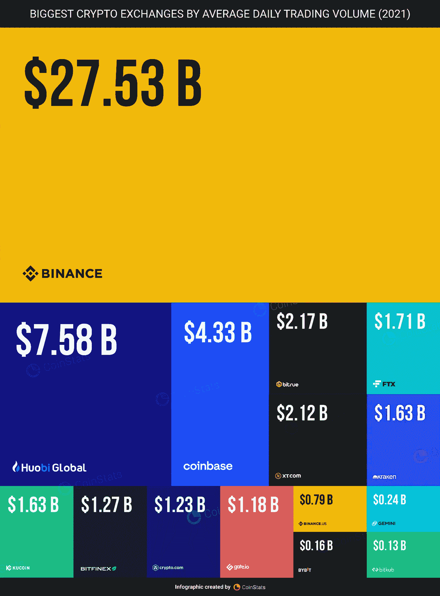
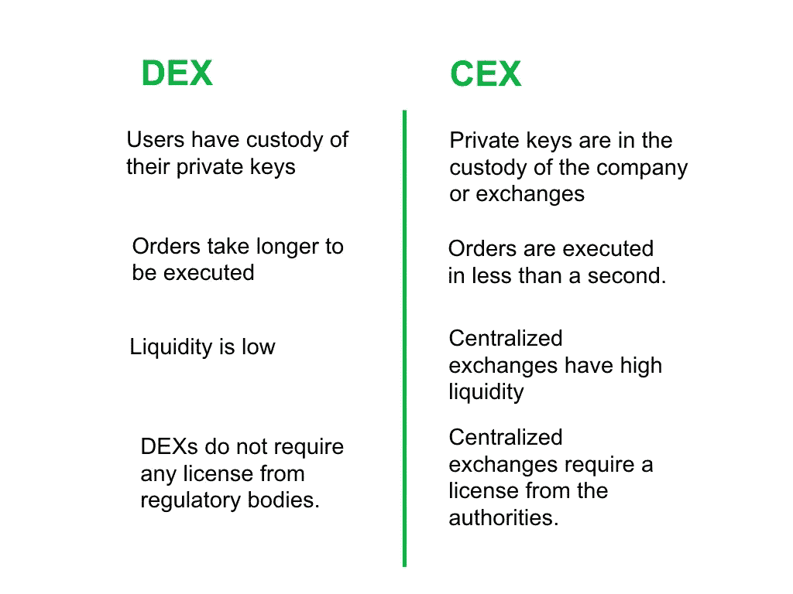

# 交易所比我们意识到的要强大得多

> 原文：<https://medium.com/coinmonks/exchanges-are-way-more-powerful-than-we-realise-e6b50c7bb2c6?source=collection_archive---------42----------------------->

Binance is still the King of Exchanges, especially in terms of trading volume.

2021 年，超过 14 万亿美元的交易量发生在中央加密交易所。

2022 年 9 月 29 日，前五大集中交易所的 24 小时交易量为 3436 亿美元。

这只是一天的交易量。

币安交易了 188.4 亿美元，接近其中的一半。

交流是强大的。

他们是不是太厉害了？

从长远来看，他们会变得过于强大而不利于自身利益吗？

让我描绘几个场景来展示强大的交换。

“币安将三家稳定公司退市，并将余额转入 BUSD

从 9 月 29 日开始，币安将自动将用户帐户和新存款的美元硬币(USDC)、Pax Dollar (USDP)和 TrueUSD (TUSD)一对一转换为币安美元。"

Just look at the amount of crypto exchanging hands daily on CEXes.

你读过吗？

他们基本上是把用户的 stablecoins 转化成自己的，把其他的 coins 摘牌。

用户可以抗议或者反对吗？

不确定这是否重要。

他们可以用用户的密码和钱为所欲为。

就这样。

谁来阻止他们？

它们是否受到任何法律的管制？

当然，如果一个国家放慢了他们的脚步，他们就会离开，迁移到另一个监管更友好的国家。

币安、FTX 和比特币基地转移总部和更换护照的频率比好莱坞间谍还高。

Lately, Dubai has become a hotspot attracting crypto companies like bees to honey.

下一个，加密的集中化。

交易所一直是交易所的一个典型例子。

它们更方便，对用户更友好，在某些方面更快，有客户支持，对你的资金有某种保障。

它们真的比 DeFi 更安全吗？

也许是，但不总是。

在 Defi 中，你信任智能合约，所以你必须学会如何正确地阅读和使用它们。

犯了一个错误，发送到错误的地址，你的整个钱包就没了。

但是 CEX 的轻松和便利意味着更多的用户会很快加入进来。

在市场活动高峰期，大多数交易都是通过交易所完成的。

当 CEXs 下跌时(这种情况经常发生)，用户无法提取资金或进行交易。

因此，cex 很强大，而且越来越集中，但多少才算太多呢？

Simple breakdown between DEX vs CEX

他们持有用户的私钥，所以从技术上讲，他们拥有密码。

他们确实深入了解你的客户(KYC)程序，所以他们拥有你的身份。

他们控制着操作和交易，所以他们拥有你交易的时间和方式。

他们告诉你你能交易多少，强加限制，执行规则，并作为你密码的实际主人。

我们所能希望的是他们能守规矩，不滥用权力。

好吧，看看 Celsius 发生了什么，虽然他们不是 CEX，但他们有很多相同的能力。

想知道交易所有多强大吗？

几乎所有顶级交易所的创始人都是亿万富翁的好几倍。

他们已经成为个人崇拜，在社交媒体上拥有大量追随者，无论他们去哪里，市场都会跟随。

我并不是说 DeFi 是一个更好的选择，但是有制衡总是好的。

在任何市场，拥有选择和竞争总是健康的。

-

加密集中式交换是否过于强大？

-

# startups # business # startupx # growth # success # social media # culture # entrepreneurs # strategy # eth # BTC # crypto # coin base # ftx # celsius #币安# markets # bear market # NFT # cexs # trades

> 交易新手？试试[加密交易机器人](/coinmonks/crypto-trading-bot-c2ffce8acb2a)或者[复制交易](/coinmonks/top-10-crypto-copy-trading-platforms-for-beginners-d0c37c7d698c)