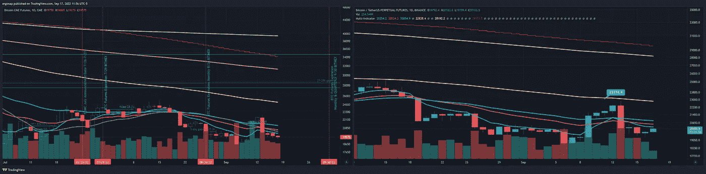
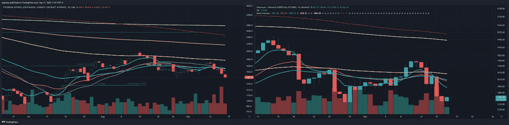
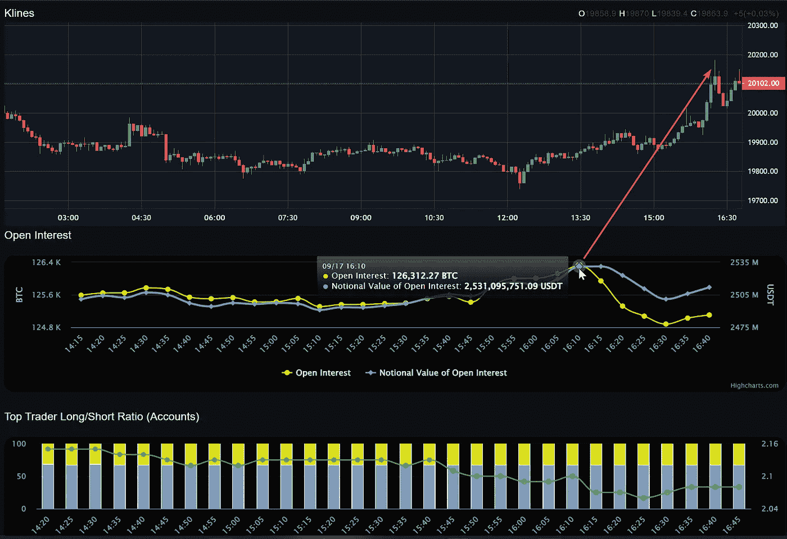
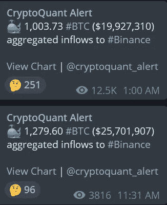
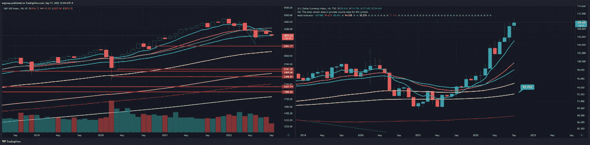
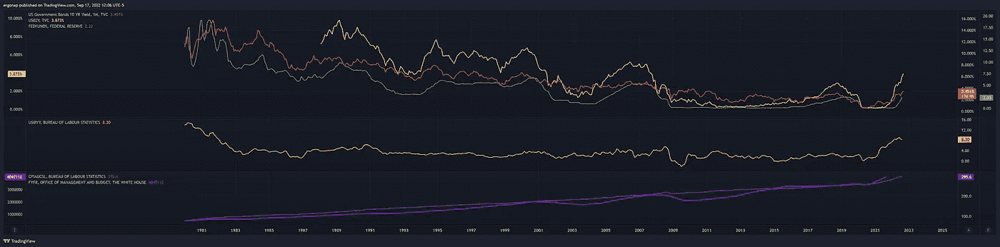
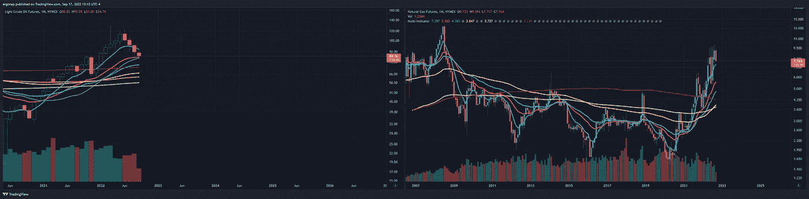
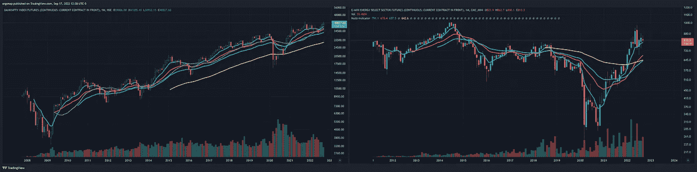

# 扩展宏观——一篇关于我所见的论文

> 原文：<https://medium.com/coinmonks/expanding-the-macro-a-treatise-on-what-i-see-1a7b84cde4c6?source=collection_archive---------14----------------------->

## 宏观市场分析 9/17

所以我想指出的第一件事，是一厢情愿的[@币安](http://twitter.com/Binance) BTC 周末价格和 CME 价格之间的差异。为了快速破解密码，这是周末的分歧。

[https://www.tradingview.com/x/usR93lCv/](https://www.tradingview.com/x/usR93lCv/)

有三种方式，但是按照可能性递减的顺序。1:我们回到缺口，然后选择一个方向，2:我们在明天开盘时(18 小时后)点击它一秒钟，然后继续向上，或 3:我们留下一个缺口，我们在 9 月 21 日 FOMC 会议上填补。

ETH 也是一条船上的吗？你打赌。所以这是周末的秘密，对任何人来说。这里可以应用许多警告来增加额外的分析

[https://www.tradingview.com/x/ipsp0FQs/](https://www.tradingview.com/x/ipsp0FQs/)

例如，OI(未平仓合约)已经在 BTC 这个骗局中消失了，因为这是当然的。当我打这封信的时候，BTC 正被转到交易所，因为它当然是。OI 褪色:

[https://imgur.com/a/T3XWZZF](https://imgur.com/a/T3XWZZF)

同样，毫无疑问，巧合的是，人们已经开始在交易所抛售股票了，即使数量很少(可能是因为周末)。

shocker. [https://imgur.com/Gz6J34N](https://imgur.com/Gz6J34N)

如果你看过我的分析，我肯定这也是你的脸。这就是密码。假打气，几乎没理由看涨，晚点叫醒我。

I’d hope people can read the room on this one.

DXY 继续上涨，股市缓慢下跌，尽管周五出现了几十年来的最大缺口。我们现在必须提高利率。

[https://www.tradingview.com/x/lHP91yHJ/](https://www.tradingview.com/x/lHP91yHJ/)

宏观数据显示，目前预算与 CPI 相当，这是我使用的一个指标。称之为遍历预算，这是我为了好玩编造的一个术语。

red 10y yellow 2y. [https://www.tradingview.com/x/nB7GSz1n/](https://www.tradingview.com/x/nB7GSz1n/)

与此同时，看到 2y 和 10y 反转，以及美联储的当前利率都低于它们吗？这意味着……如果我们不希望美联储不得不降低利率，他们将不得不提高利率——这将大幅提高 2y 和 10y。对于拥有美元银行账户的人来说是好事，但是……对于那些认为世界上任何资产都不会崩溃的人来说是可怕的，因为我们正面临着来自银行账户的比来自股票市场更安全的回报。没有人会幸存。根据定义，2 年的上涨速度将快于 10 年，如果美联储超过 10 年，你需要 100%的现金或至少在一年内做空一切。我们还没到那一步，但这是有可能的。天然气和石油正在接近形成 H&S 下降，但它可能需要几个月到明年。

had to slide the oil chart over due to the oil collapse when it started. [https://www.tradingview.com/x/7L3WmFTw/](https://www.tradingview.com/x/7L3WmFTw/)

在他们登陆 H&S 后，那里的问题就出现了。因此，我们有一两年的熊市，然后我们重复 1980 年的相关政策，然后价格爆炸。石油比天然气可能性小，因为石油需求正在消失。

 [## 尽管价格猛跌，但汽油需求破坏加速:1997 年 8 月消费量下降…

### 截至 9 月 9 日的四周内，汽油消费量比 2019 年同期下降了 11.7%…

wolfstreet.com](https://wolfstreet.com/2022/09/14/gasoline-demand-destruction-accelerates-despite-plunge-in-gasoline-prices-consumption-drops-to-august-1997-level/) 

这被称为俄国崩溃——因为石油是俄国的主要力量，石油输出国组织是次要力量。只是需要时间。有趣的是，[美国要求他们增加产量，他们说不。](https://www.forbes.com/sites/rrapier/2021/11/06/the-double-irony-of-asking-opec-to-increase-oil-production/?sh=9befa8c45e09)我预计俄罗斯将不再是一个全球大国或国家——非此即彼。我不认为普京的退出是必然的，或者会改变这一轨迹，即使是在十年后。

能源呢？即使我们不摆脱比特币，能源也可能会爆炸，但如果我们摆脱了，它也会下降。对整个行业来说是坏消息还是好消息，要看情况而定。能源可能会爆炸，而银行会做得很好。

what a surprise, banks seem just fine don’t they? [https://www.tradingview.com/x/haKMX7Ib/](https://www.tradingview.com/x/haKMX7Ib/)

所以抓紧你的帽子，这将是一个地狱般的旅程。

> 交易新手？试试[密码交易机器人](/coinmonks/crypto-trading-bot-c2ffce8acb2a)或者[复制交易](/coinmonks/top-10-crypto-copy-trading-platforms-for-beginners-d0c37c7d698c)