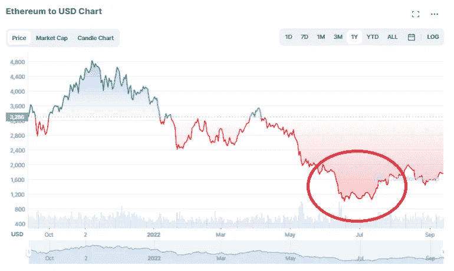
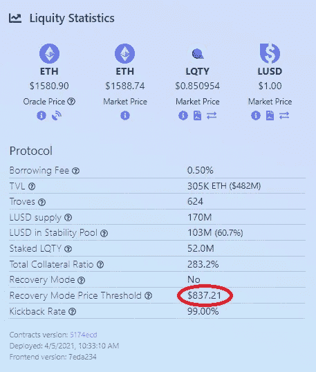

# 预期市场低迷？为什么使用 Liquity 可能是你大赚一笔的最佳选择

> 原文：<https://medium.com/coinmonks/expecting-a-market-downturn-why-using-liquity-might-be-your-best-bet-to-profit-big-6316363488a6?source=collection_archive---------8----------------------->

鉴于我们从最新的 CPI 报告中看到的所有波动性，我怀疑在合并发生后不久，我们可能会看到更大的波动性，总体而言，我们可能会看到不仅整个加密市场，而且股票和证券市场都将大幅下滑。你可以说我是怀疑论者，但我知道市场总是从超卖走向抛售，我认为我们看到更多重大的市场修正只是时间问题。此外，在过去一个月左右的时间里，市场已经对合并进行了定价，所以一旦合并结束，我认为这是很快看到另一次市场调整的足够好的理由。

预计价格可能会下跌 30%左右，我转向 [Liquity](https://www.liquity.org/) 看看我是否可以玩市场的另一面，从人们的清算中获利。我以前写过关于 [Liquity 的文章](/coinmonks/using-liquity-to-profit-off-of-liquidations-and-to-get-interest-free-loans-and-no-liquity-is-not-d570a469ef5)，我相信正是在潜在的市场下跌中，像 Liquity 这样的协议变得特别有利可图。

# 在上一次市场崩盘中获得 700%以上的年回报率

如果你看一下 Liquity 的[沙丘分析页面](https://dune.com/dani/Liquity)，你会从他们的 LUSD 稳定池的历史年利率中看到，在 6 月中下旬左右有一个巨大的峰值:

这个巨大的尖峰符合什么？如果你不记得了，因为你在这次市场崩溃的痛苦中失去了知觉，早在 6 月份，美元 ETH 的价格就跌至 800 美元左右，这是自 2021 年以来我们从未见过的价格:

毫无疑问，在这段时间里，人们的贷款肯定被清算，但与此同时，$LUSD 储户的回报率在 700%的范围内。考虑到这是一个滚动的 7 天平均水平，我怀疑单日回报率甚至更高。

用数字来表示，如果你在这段时间里存了价值 10，000 美元的 LUSD，你可以在一天内获得近 20%的投资回报，或者在一周内获得超过 110%的投资回报:

就我个人而言，我预计即使出现调整，我们也不会看到像 6 月份那样的大幅下跌，但如果市场确实下跌了 30%左右，我认为肯定会出现清算，我计划准备一些 LUSD 美元来试图利用它。

# 在 Liquity 上设置

我已经在之前的[文章](/coinmonks/using-liquity-to-profit-off-of-liquidations-and-to-get-interest-free-loans-and-no-liquity-is-not-d570a469ef5)中用更一般的术语介绍过这个，但是本质上来说，为了加入 Liquity 的 Stablepool，你需要拥有$LUSD。获得 LUSD 的途径主要有两种，一种是通过诸如 [Uniswap](https://app.uniswap.org/#/swap?inputCurrency=0x5f98805a4e8be255a32880fdec7f6728c6568ba0) 这样的指数，另一种是通过贷款获得 Liquity 本身。权衡机会/沉没成本，这两种方式都有利弊，但如果你有$ETH，并想持有它(或者如果你想尽量避免一些税收并发症)，你可以选择把它作为抵押品，并以它为抵押贷款，在这个过程中借用$LUSD。

# 设置贷款:

因此，无论你使用哪个前端，这个过程可能看起来都不一样，(liquity 没有自己的前端，但如果你去 https://www.liquity.org/frontend你会看到许多可供选择)，但我个人使用 liquity.app，不管他们是否有 99%(而不是 100%)的回扣率，主要是因为按市场份额分配，他们是最频繁使用的，占 Liquity 稳定池份额的 35%以上。回扣率本质上是前端的费用，你会看到他们中的大多数将 99%或 100%返还给用户。

一旦你选择了你的前端，你必须创建一个“流动性宝库”，然后存入你的$ETH，你将选择你的指定抵押品比率，并收到你借的$LUSD，减去 200 美元(这是指定的金额保留，以支付汽油费，在你的贷款成为清算人的情况下)。Liquity 的文件建议你至少保持 150%以上的比率，但协议规定的最低比率是 110%。换句话说，如果你的抵押率低于 110%,因为你的存款价值大幅下降，那么你就有被清算的风险。

重要提示:如果你要贷款，一定要跟踪 Liquity 是否即将进入“恢复模式”，根据常见问题解答:

> 当系统的[总抵押比率(TCR)](https://docs.liquity.org/faq/recovery-mode#what-is-the-total-collateralization-ratio) 低于`150%`时，恢复模式启动。在恢复模式下，抵押品比率**低于 150%** 的抵押品可以被清算…总抵押品比率或 TCR 是以当前 ETH:USD 价格计算的整个系统抵押品的美元价值与整个系统债务的比率。换句话说，它是所有以美元表示的抵押品之和，除以所有以 LUSD 表示的债务。

换句话说，将你的抵押品比率保持在 150%左右可能不是最好的，因为如果流动性经过压力测试，那么即使你超过 110%也可能会被清算。迄今为止，清算率约为 800 美元——这也可以在[风险投资页面](https://liquity.app/#/risky-troves)上找到:

# 一对夫妇增加了奖金

如果你看一下 [Liquity 的“风险宝藏”部分](https://liquity.app/#/risky-troves)，你会看到所有当前未偿贷款按抵押率上升排序:

一旦贷款低于 110%的清算截止值，如果你是启动清算的幸运儿，你将获得贷款持有人的 200 美元 LUSD 天然气储备存款以及价值 0.5%的抵押品的奖金。

此外，即使没有一个巨大的清算浪潮，你仍然会因为把你的$LUSD 投入稳定池而获得一些不错的回报。迄今为止，7 天滚动平均年利率约为 6.87%，还不算太差:

然而，如果你决定参与 LUSD 的稳定池，这让我解释一些其他因素，如果你提供流动性的 LUSD 稳定池…

# 风险

首先，这可能不被视为实际风险，但人们必须记住，机会成本总是存在的——如果你将大量流动性放入稳定池的 LUSD，这意味着你没有将[同样多的]流动性放在其他地方，即可以用于购买订单的资金等待在市场大幅下跌时兑现。

此外，正如我在上一篇文章中提到的，LUSD 盯住美元的汇率制度也有一点不一致:

如果你在上面的图表中注意到，挂钩已经相对地停留在 1 LUSD:1 美元之上，所以如果你购买$LUSD，当你兑现挂钩时有可能攀升到$1.03 而不是$1.01，这意味着你投入的$LUSD 的每一美元价值可能会损失 2 美分。反之亦然，如果你喜欢玩套利游戏，这也是一个好处。

# 结论

还有其他有利可图的变现选择，如 GMX.io，但尽管 GMX.io 可能有利可图，但潜在回报无法与 Liquity 为其储户提供的好处相比，尤其是如果你像我一样预计会出现相当严重的崩盘。只要加密世界有人希望获得免费贷款，就会继续有人因市场的极端波动而被清算，而 Liquity 确实创造了一个巧妙的系统，在这个系统中，借款人和储户都有强烈的激励来保持这些激励。

无论如何，感谢你花时间阅读这篇文章，请务必在推特(【https://twitter.com/CryptosWith】)上关注我，获取所有这些最新的更新。

免责声明:最后提醒一下，这不是财务建议，仅用于教育和娱乐目的。请一如既往地做自己的研究，找到最适合你的投资。干杯大家！

> 交易新手？试试[密码交易机器人](/coinmonks/crypto-trading-bot-c2ffce8acb2a)或[复制交易](/coinmonks/top-10-crypto-copy-trading-platforms-for-beginners-d0c37c7d698c)