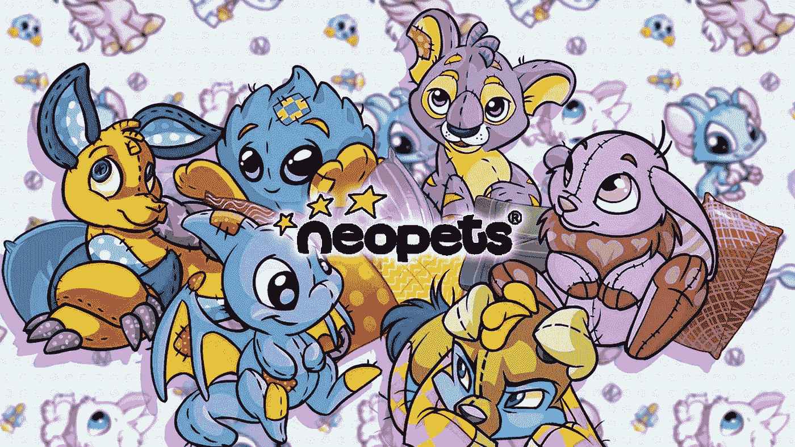
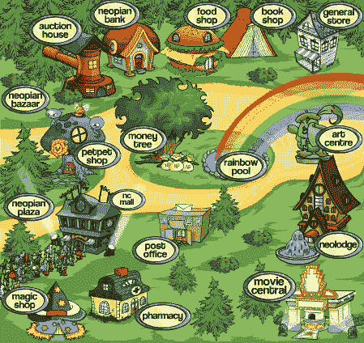
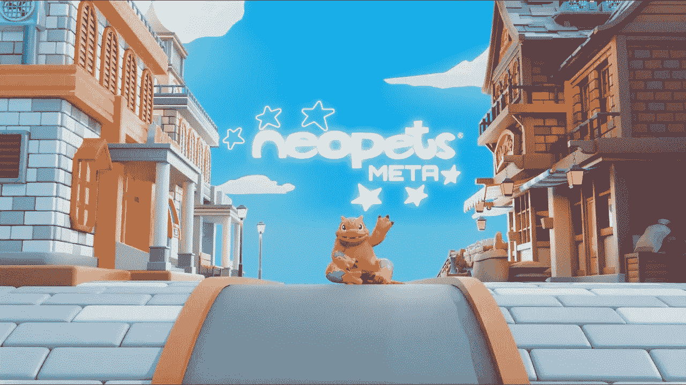

# 体验 Neopets 元宇宙发布会的“21 世纪怀旧”

> 原文：<https://medium.com/coinmonks/experience-the-noughties-nostalgia-with-neopets-metaverse-launch-edc4f276c573?source=collection_archive---------32----------------------->

Neopets Net Worth · worthofweb.com estimates the sites worth to be $39,930,000 due to an estimated 362,667 visits per day on the site.

谁还记得尼奥彼得？

尼奥佩茨出生于 1999 年。

23 年过去了，它还在。

它仍然像几十年前一样可玩，可爱。

我认识一些和尼奥宠物一起长大的人，他们直到 20 多岁才摆脱它们。

我记得我的第一把火画笔，把我的宠物化身的颜色变成了一件神奇的火焰外套。

这是令人兴奋的。

23 年了。

你不知道时间过得有多快，经历了多少。

早期有太多的并发用户使他们的服务器不堪重负。

与其他品牌也有合作。

他们率先推出了前所未见的新颖的游戏内表演和迷你游戏。

Neopets was conceived in 1997 by Adam Powell, a British student at the University of Nottingham at the time.

他们是引入每日免费旋转幸运轮的 OG，如果你每 24 小时回来旋转它，你就可以赢得东西。

这就是粘性和用户保留的诞生，公司开始认真研究这些概念。

现在他们甚至有自己的商店出售实物商品！

你过去只能通过网站进入游戏。

他们正在走向移动化，并在过去几年中多次更名，以适应不断变化的消费者需求。

现在，他们也进入了元宇宙。

Neopets Meta 正在推出其元宇宙的 alpha 版本，并如预期的那样大张旗鼓地推出。

黑客最近的数据泄露显示，他们的数据库中有近 6900 万用户。

我对此感到惊讶。

显然很多孩子还在玩尼奥宠物。

Neopets, the much-beloved virtual pet game that ruled the early internet, is launching a new product called Neopets Metaverse.

那么这意味着什么呢？

每个人都在拥抱 web3。

现在还不算太晚。

像 web3 这样重要的事情永远不会太迟。

Neopets 可能有点老土，有点晚了，但它可能仍然有效。

怀旧有它的价值。

它工作了。

接下来，你知道，垄断，风险，游戏的生活和所有的好老歌也将进入元宇宙！

Since its introduction to the market in 1935, over 250 million Monopoly games have been sold, and the game has been played by more than 1 billion people worldwide.

玩游戏长大的人，现在有办法和钱支付更多的游戏内物品。

更好的是，他们有了孩子，现在可以感同身受，为他们的孩子付出更多，以获得比过去更好的体验。

与 web3 中的其他游戏不同，Neopets 拥有传统和强大的粉丝基础。

23 年前，Neopets 作为一款游戏既有趣又吸引人。

人们玩这个游戏是为了游戏本身的乐趣、故事和刺激。

我很惊讶 Neopets 已经存在了 20 多年，并且仍然很强大。

-

你以前玩过尼奥宠物吗？

-

# startups # business # startupx # growth # success # social media # culture # entrepreneurs # strategy # eth # coin # BTC # exchange #元宇宙# crypto # gamefi # crypto currency # neo pets

> 交易新手？试试[加密交易机器人](/coinmonks/crypto-trading-bot-c2ffce8acb2a)或者[复制交易](/coinmonks/top-10-crypto-copy-trading-platforms-for-beginners-d0c37c7d698c)