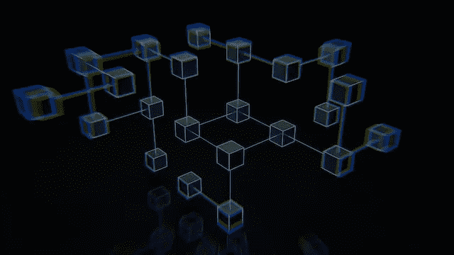
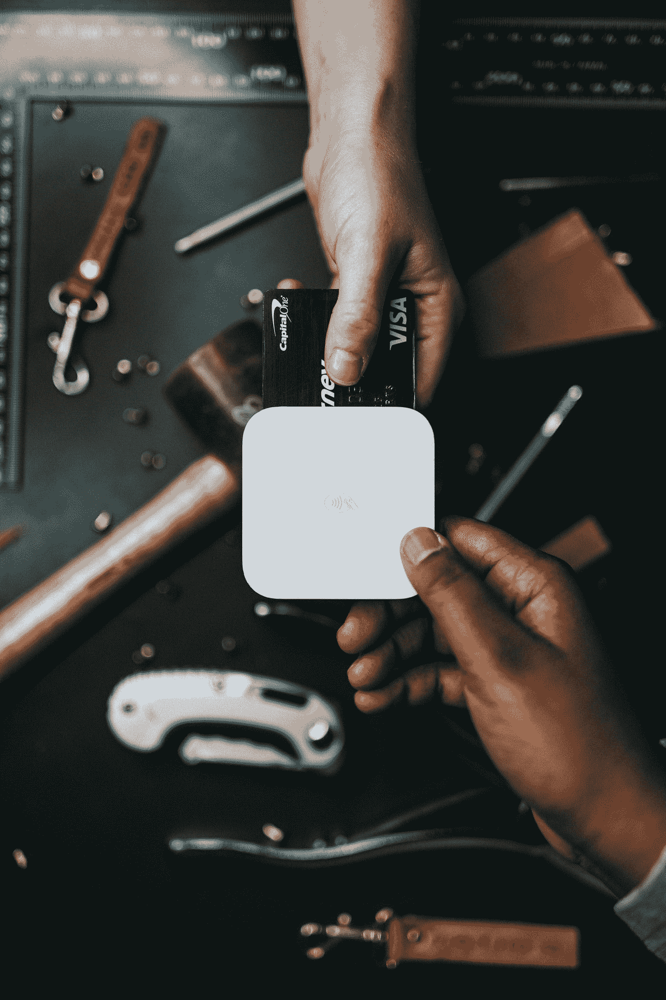
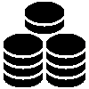
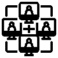

# 给父母讲解区块链👨‍👩‍👦

> 原文：<https://medium.com/coinmonks/explaining-blockchain-to-parents-e0d1212c801e?source=collection_archive---------43----------------------->

Photo by [Shubham Dhage](https://unsplash.com/@theshubhamdhage?utm_source=unsplash&utm_medium=referral&utm_content=creditCopyText) on [Unsplash](https://unsplash.com/s/photos/transaction?utm_source=unsplash&utm_medium=referral&utm_content=creditCopyText)

你好，最近怎么样？

今天我将试着向你解释一种最著名的技术叫做**区块链。**

你们可能都听说过人们谈论区块链。
但它实际上意味着什么呢？

现在，如果我们从书中搜索最简单的定义，我们会发现这一点，**“区块链是一种不可变的分布式账本技术”。**

但是对于任何一个非技术人员来说还是很困惑的？😵‍💫

如果我碰巧把这个定义告诉父母，我知道他们不会理解。

所以我怎么能，我们怎么能让每个人对任何人都明白这一点。
经过思考，我想出了一个我认为最简单的例子来解释区块链技术是什么。

> 从顶级交易者那里复制交易机器人。免费试用。

让我们假设你出去买衣服。你买了一些衣服，现在是付款的时候了，所以你可以用你的借记卡或信用卡付款。当你用信用卡支付时，后台会发生的事情是，你的银行会把钱从你的账户转到另一个收款账户。现在这整个事情或过程被称为**事务**。

Photo by [Nathan Dumlao](https://unsplash.com/@nate_dumlao?utm_source=medium&utm_medium=referral) on [Unsplash](https://unsplash.com?utm_source=medium&utm_medium=referral)

与你类似，每天有数百万人在做这种交易。银行将这些交易作为记录列表存储在一个地方的数据库中。这就是所谓的**总账。**

Ledger

一直到现在都很容易，对吗？现在有趣的事情开始了。

所有这些分类账都在一个集中的地方。这种做法的问题在于，它是集中的，任何人都可以访问它并做出改变。作为银行的所有者，我可以神不知鬼不觉地把钱从任何账户转到我的账户，并清算这笔交易。可怕吧？

避免这种情况的解决方案是使这个数据**不可变**，这样无论他们做什么都没人能改变它。这可以通过使用区块链来实现。

所以，在区块链发生的是，无论区块链上发生什么交易都会被捕获并形成一个 B **锁**。然后，使用加密哈希将该块链接到前一块。

每当生成新的事务时，都会创建一个块(也称为铸造块)并附加到前一个块，从而扩展链。

Minting Block

这个链条不仅仅在一台计算机上运行，而是遍布世界各地的不同计算机。运行这个链的每台计算机被称为**节点**。这些节点彼此同步运行。这就是所谓的**分布式账本技术**。

Multiple Nodes in Sync

如果任何怀有不良意图的人想要搞乱这个链条，它将几乎是不可改变的。

为什么这么问？因为这些块是连在一起的，如果有人试图篡改旧的交易，整个链条都会被打乱。因为这不仅是单链，而且是多链同步运行，如果一个链看起来不一样，每个人都会注意到，这个链就会停止。这就是众所周知的以下**共识**。

如果我们再过一遍定义你现在就可以理解了:
区块链是不可变的(不可改变)，分布式账本技术(遍布全球)。

感谢阅读。

如果这个博客帮助你了解了区块链，请与你的朋友和家人分享🤗。

> 加入 Coinmonks [电报频道](https://t.me/coincodecap)和 [Youtube 频道](https://www.youtube.com/c/coinmonks/videos)了解加密交易和投资

# 另外，阅读

*   [Bitsgap 审查](/coinmonks/bitsgap-review-a-crypto-trading-bot-that-makes-easy-money-a5d88a336df2) | [Quadency 审查](/coinmonks/quadency-review-a-crypto-trading-automation-platform-3068eaa374e1) | [Bitbns 审查](/coinmonks/bitbns-review-38256a07e161)
*   [密码本交易平台](/coinmonks/top-10-crypto-copy-trading-platforms-for-beginners-d0c37c7d698c) | [Coinmama 审核](/coinmonks/coinmama-review-ace5641bde6e)
*   [印度的加密交易所](/coinmonks/bitcoin-exchange-in-india-7f1fe79715c9) | [比特币储蓄账户](/coinmonks/bitcoin-savings-account-e65b13f92451)
*   [OKEx vs KuCoin](https://coincodecap.com/okex-kucoin) | [摄氏替代品](https://coincodecap.com/celsius-alternatives) | [如何购买 VeChain](https://coincodecap.com/buy-vechain)
*   [币安期货交易](https://coincodecap.com/binance-futures-trading)|[3 commas vs Mudrex vs eToro](https://coincodecap.com/mudrex-3commas-etoro)
*   [如何购买 Monero](https://coincodecap.com/buy-monero) | [IDEX 评论](https://coincodecap.com/idex-review) | [BitKan 交易机器人](https://coincodecap.com/bitkan-trading-bot)