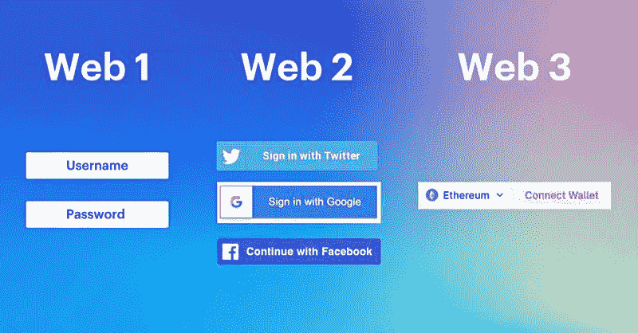
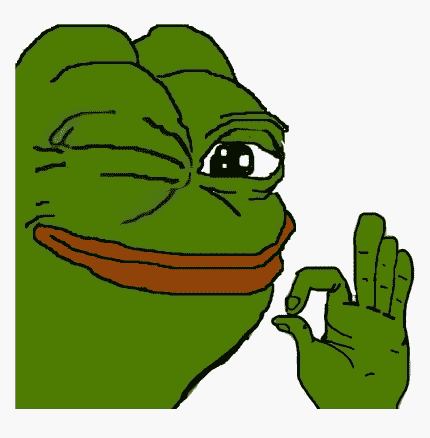
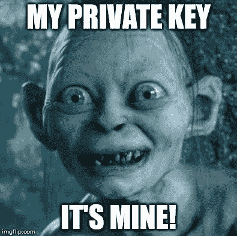
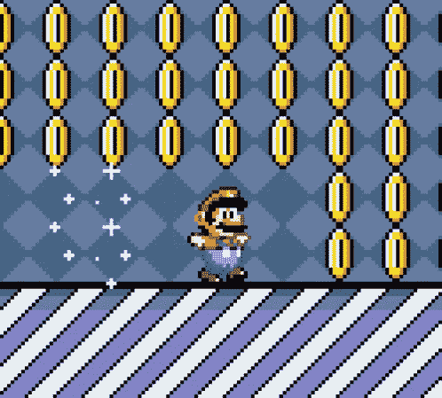
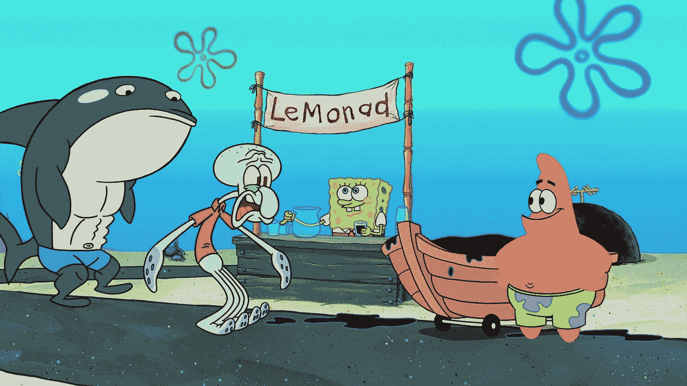
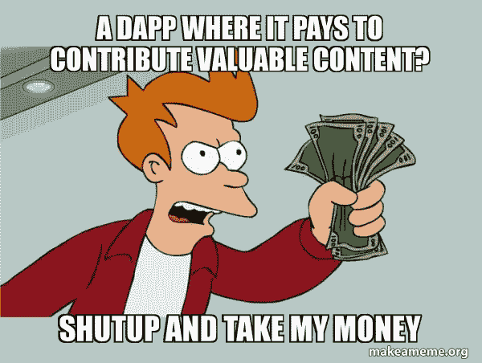
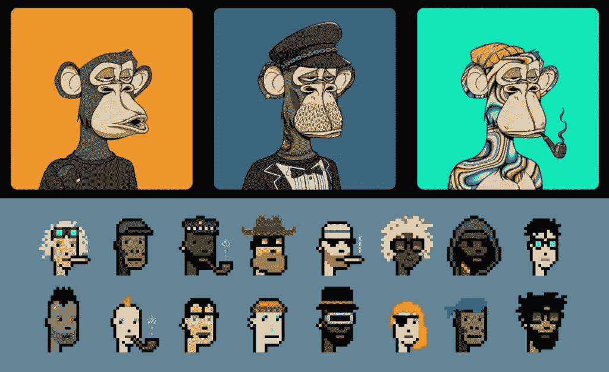
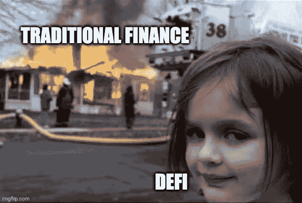

# 向一个五岁的孩子解释互联网(web3)及其层次的演变。

> 原文：<https://medium.com/coinmonks/explaining-the-evolution-of-the-internet-web3-and-its-layers-to-a-five-year-old-602bdd52716?source=collection_archive---------13----------------------->

*吉姆·佛朗哥，DeFi 本地人*

# **简介**

许多人认为，web3 是下一代互联网，它是去中心化的，将权力交还给用户。

Web3 使我们能够建立一种开放、透明和安全新型互联网。

回到 web1 时代，互联网要简单得多，网站和使用方式都很少。

**Web2** 是当今大多数人访问互联网的方式。当你去一个网站，如谷歌或脸书，查找信息或与朋友在线交谈时，你会用到它。Web2 是关于连接人与人和信息的。

在传统网络中，用户对他们的在线体验或他们分享的信息没有多少控制权。他们不得不依靠公司和组织来存储和管理他们的信息，并且他们经常不得不同意服务条款，这些条款给予这些组织对他们如何使用互联网的很大控制。

Web3 与众不同，因为它让用户对他们的在线体验和他们分享的信息有更多的控制权。它通过使用分散式应用程序(dApps)和分散式存储解决方案(如 IPFS)来实现这一点。运行在分散网络上的社交媒体 dApps 允许用户直接与他们互动，而不需要集中的中介。这使用户能够更好地控制他们的数据和他们使用应用程序的方式。

使用 web3 进行支付允许您利用加密货币直接向其他个人发送和接收资金。想象一下，你有一个在线业务，你直接从你的客户那里获得付款，而不需要从 Stripe、PayPal 或其他支付网关支付费用。如果你是一个内容创作者，web3 可以让你控制广告和赞助商，而 YouTube 或脸书不会从你的利润中提成。

**简单地说:**

Web1 —只读

Web2 —读和写

Web3 —读、写和拥有

在本帖中，我们将探索 Web3 的各个层面，以及它们如何共同创造一种新型的数字经济。

# **基础层:区块链**

区块链是 web3 的基础，为所有其他层提供基础架构。区块链是在多台计算机上记录交易的分布式分类账。它被称为“链”，因为它由一系列块组成，每个块包含一组事务。这些块按时间顺序连接在一起，创建了所有交易的防篡改记录。

等等，听起来很复杂；让我们用英语做吧，好吗？

区块链是一种特殊的帮助记录事物的计算机程序。想象一下，你和你的朋友正在玩一个游戏，你们每个人都有一个收集泡泡糖贴纸的清单。您可以互相交换贴纸，但您要确保每个人的贴纸列表都是准确和最新的。你需要一张纸来记录和做笔记。

它是这样工作的:

1.每当有人与他人交换贴纸时，他们都会在一张纸上写下交易的细节(谁给了谁多少贴纸)。

2.然后，他们把这张纸给小组里的其他人看。

3.如果每个人都同意交易是有效的，他们都会将这张纸上的信息添加到自己的贴纸列表中。

4.这样，每个人的单子都保持最新和准确，因为每个人都在一起检查和同意交易。

这是区块链如何运作的一个例子；它类似于数字纸或账本。在现实世界中，区块链用于各种目的，包括跟踪金钱和其他有价值的东西。

然而，这就是数据库的用途吗？是的，区块链是具有独特功能的数据库。

**比特币、以太坊等区块链网络是不可改变的，这意味着所有的用户活动，如交易、转移、接收资产等，一旦被记录，就无法改变。** **这些网络全天候运行，无需维护，没有中央服务器，从未被黑客攻击过，也不受任何人控制。**

# **所有权层:私钥**

私钥赋予用户对其资产的所有权和控制权，无论这些资产是加密货币、不可替代令牌(NFT)还是任何其他数字资产。保管好您的私钥是非常重要的，因为任何能够访问它们的人都可以控制您的资产。

让我这么说吧:
**一个区块链账户总是由一对公钥和私钥组成。**

公钥就像一个电子邮件地址，你可以与任何人分享，这样他们就可以给你发邮件，并确保对方真的是你。

私有密钥**就像只有你知道的秘密代码。这有点像你电子邮件的密码。**

当您使用区块链时，您使用您的私钥来“签署”消息，以证明它来自您。这有点像你用指纹解锁手机。只有你有你的指纹，所以证明解锁手机的是你。同理，只有你有你的私钥，所以证明是你发的消息。

因此，公钥和私钥是管理您的数字资产和保护您的区块链信息安全的一种方式。

# 价值层:加密货币

加密货币是一种数字资产，被用作互联网上的交易媒介。它是分散的，这意味着它不受任何政府或金融机构的控制。比特币和以太是最知名的加密货币，但还有许多其他货币，它们都有自己独特的功能和使用案例。

加密货币有点像你银行账户里的钱，但它不是实物，你不能拿在手里。

**令牌**是一种特殊的加密货币，用于代表其他东西。想象一下，你有一张会员卡，可以用来在一家高级玩具店买东西。会员卡是一种象征，因为它代表你的身份。同样，一些加密货币可以用作代币来代表其他事物，如公司股票、音乐会门票或可用于在街机上玩视频游戏的实际代币。

**硬币**是一种加密货币，你可以用它来买东西或与他人交易。就像你可以用真币或纸币买东西一样，你也可以用比特币或以太坊这样的数字货币在网上买东西。有些人用硬币投资，希望它们增值，比如购买股票或黄金。

**所以，加密货币是一种可以用来在网上买卖东西的数字货币，硬币和代币是不同的。他们都使用复杂的数学和计算机来保证它们的安全，确保它们不能被复制或伪造。**

# 治理层:DAOs

Web3 的治理层是我们发现去中心化自治组织(Dao)的地方。

Dao 是完全基于智能合同运行的组织，没有中央权威。它们允许分散决策，可以用来管理从小型社区到大型公司的任何事情。

想象一下，一群朋友想一起开一个柠檬水摊。

他们可以创建一个 DAO 来经营他们的柠檬水摊位。他们可以将规则写入智能合同，以决定他们将销售多少柠檬水，收取多少费用，以及如何分配他们赚的钱。他们还可以使用智能合同对重要决策进行投票，如销售哪种柠檬水或是否开设第二个柠檬水摊位。

Dao 是一种让人们在不需要实际位置或老板的情况下一起工作和做决定的方式。它们可以用于各种各样的事情，比如经营企业、组织慈善机构或制作艺术品。

# 服务层:dApps

分散式应用程序(dApps)是一种运行在区块链上的软件。它们有点像你在手机或电脑上使用的应用程序，但它们建立在区块链上，而不是中央服务器上。

可以这样想:当你在手机上使用一个应用程序时，你连接到一个存储所有信息并完成所有工作的中央服务器。对于 dApp，没有中央服务器。相反，信息和工作分散在连接到区块链的许多不同的计算机上。

dApps 可以用于各种事情，比如社交网络、游戏和金融服务。它们通常被设计成开放和透明的，这样任何人都可以看到它们是如何工作的，并参与其中。

因为它们运行在区块链上，所以通常比普通应用更安全。它们还可以用来做普通应用程序做不到的事情，比如以无法更改或删除的方式存储重要信息。

dApps 是一种构建和使用软件的新方式，它们有可能改变我们使用互联网和在线互动的方式。

# 身份层:NFTs

不可替代令牌(NFT)是代表独特项目或财产所有权的数字资产。想象你有一个只有你才有的特殊玩具。它是独一无二的，世界上没有其他玩具像它一样。NFT 有点像那个玩具的数字版本。这是一种证明你拥有某种特殊而独特的东西的方式，比如一件数码艺术品或一件虚拟收藏品。

一些昂贵的 NFT 用于指代与特定社交媒体账户或在线个人资料相关联的个人资料图片(PFP)或头像。

下面是一些如何使用 NFTs 的例子:

1.**数字艺术**:一名艺术家创作了一件数字艺术品，并作为 NFT 出售。NFT 代表艺术品的所有权，买家可以像展示实物艺术品一样展示或转售它。

2.**虚拟收藏品**:一款游戏或应用允许用户收集虚拟物品，比如虚拟宠物或武器。一个 NFT 代表每一件物品，用户可以像购买实物收藏品一样购买和出售它们。

3.虚拟不动产:虚拟世界允许用户拥有虚拟的土地或财产，一个 NFT 代表每一块土地。用户可以像买卖实体土地一样买卖 NFT。

4.**门票和通行证**:一个活动或场馆可以将门票或通行证作为 NFTs 出售，这样用户就可以方便地证明所有权，并将门票转让给他人。

5.**实物资产表示**:实物 NFT 可以是实物资产的数字表示，比如一幅画、一栋房子、衣服甚至玩具。

6.**数字身份**:使用 NFT 作为用户身份，可以为用户提供一种方式来证明其链上活动的所有权，也可以为其他用户提供一种方式来在数字环境中相互交互和识别。

这只是几个例子，还有很多其他的使用 NFTs 的方法。从本质上讲，NFT 是一种代表独特数字内容所有权的方式。

# 经济层:DeFi

分散金融(DeFi)使用区块链来创建金融产品和服务。 **DeFi 允许在金融系统中有更大的可及性和包容性，因为它对任何有互联网连接的人开放。**这是一种使用加密货币获得金融服务的方式，如借贷和交易。这有点像银行，但它不受任何一个人或团体的控制。

这是我最喜欢的区块链用例，我已经写了一篇单独的文章来解释和讨论它，以便让新人加入 crypto，特别是 DeFi。

 [## DeFi 101:象征性奖励和高产农业

### DeFi 初学者指南

medium.com](/coinmonks/defi-101-token-rewards-and-yield-farming-e0b1c99c4059) 

# 结论:

Web3 是一个庞大而复杂的生态系统。它由多层组成，每一层都有特定的用途，并有助于系统的整体运行。了解每一层的作用以及它们如何协同工作以参与这一新的数字经济非常重要。

永远记住黄金法则:

# ***“不是你的钥匙，不是你的密码。”***

保管好您的私钥，并时刻注意与 web3 相关的风险。