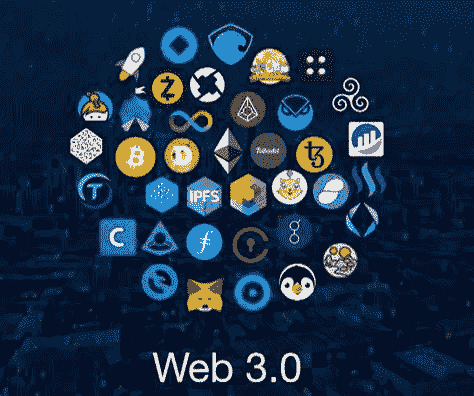
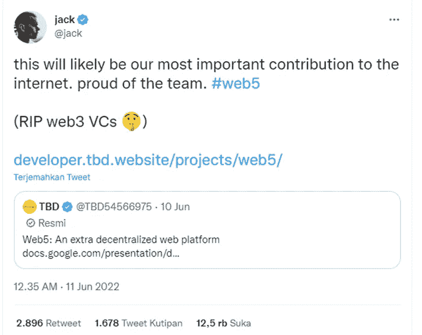

# Web 1 — Web 5 的解释

> 原文：<https://medium.com/coinmonks/explanation-of-web-1-web-5-3cba6704d1c4?source=collection_archive---------52----------------------->

互联网是一个全球互联的计算机网络，使用互联网协议套件(TCP/IP)连接世界各地的设备。互联网离不开网站的名字

web 或我们通常所说的网站是互联网上的万维网(WWW)的一个域中的几个相互连接或相关的页面的集合。这个网站分为 WEB 1，WEB 2，WEB 3，甚至 WEB 5

## WEB 1

**WEB 1.0 是第一代 WEB，是当时互联网世界新革命的开端**。建立在第一代基础上的网站基本上是为获取信息而开发的，具有轻微的交互性，访问者只能阅读，不能输入数据或进行交互。更宽。WEB 1 的一个例子是雅虎！和探险家。

## WEB 2

WEB 2.0 是计算机行业业务的一场革命，在 **web 2.0 时代，许多数字平台出现，为互联网用户提供了更广泛的互动**，这些平台的例子是我们熟悉的，如脸书、Twitter、YouTube、Instagram 和 WhatsApp。

> 从顶级交易者那里复制交易机器人。免费试用。

## WEB 3

**Web 3.0 是世界技术领域的最新革命，Web 3.0 的发展提供了一种更高效的互联网活动方式，甚至是寻找收入和金融服务的方式**。在 web 3.0 中，各种软件将能够更有效地共享信息，因为在 web 3.0 中，它使用了一种人工智能系统，使 Web 性能更广泛，即使在 Web 3.0 中，它也被称为区块链和加密货币。WEB 3 的例子有 ICP、Polkadot、Chainlink 和 Theta。WEB 3 的另一个例子是 P2E 游戏，如 Axie Infinity、Sandbox 和分散的土地

## WEB 5

[jack di Twitter: “this will likely be our most important contribution to the internet. proud of the team. #web5 (RIP web3 VCs 🤫) https://t.co/vYlVqDyGE3" / Twitter](https://twitter.com/jack/status/1535314738078486533)

**什么是 WEB 5.0？杰克·多西(Twitter 前首席执行官)在 2022 年 6 月宣布，他的金融支付公司 Block Head 的比特币业务部门将致力于开发 web5。他们认为 web 5.0 将引入对数据存储和分散身份的更好的用户控制。截至目前，web 5.0 项目都在开源开发的范围内，具体的平台发布日期还有更多时间。**

> 加入 Coinmonks [电报频道](https://t.me/coincodecap)和 [Youtube 频道](https://www.youtube.com/c/coinmonks/videos)了解加密交易和投资

# 另外，阅读

*   如何在 Uniswap 上交换加密？ | [A-Ads 审查](https://coincodecap.com/a-ads-review)
*   [加密货币储蓄账户](/coinmonks/cryptocurrency-savings-accounts-be3bc0feffbf) | [YoBit 审核](/coinmonks/yobit-review-175464162c62)
*   [Botsfolio vs nap bots vs Mudrex](/coinmonks/botsfolio-vs-napbots-vs-mudrex-c81344970c02)|[gate . io 交流回顾](/coinmonks/gate-io-exchange-review-61bf87b7078f)
*   [CoinFLEX 评论](https://coincodecap.com/coinflex-review) | [AEX 交易所评论](https://coincodecap.com/aex-exchange-review) | [UPbit 评论](https://coincodecap.com/upbit-review)
*   [AscendEx 保证金交易](https://coincodecap.com/ascendex-margin-trading) | [Bitfinex 赌注](https://coincodecap.com/bitfinex-staking) | [bitFlyer 点评](https://coincodecap.com/bitflyer-review)