# 探索币安 NFT 的新功能

> 原文：<https://medium.com/coinmonks/explore-binance-nft-new-features-16d8f62e33d6?source=collection_archive---------36----------------------->

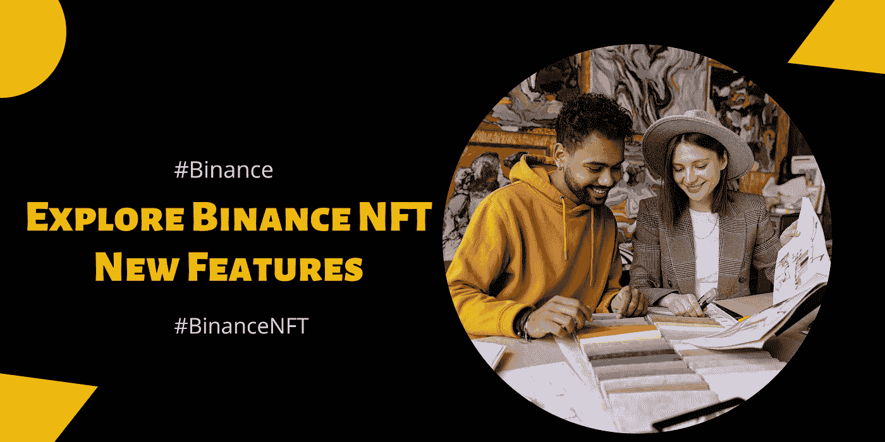

NFT 被认为是 Web 3.0 的先驱。然而，对于大多数人来说，NFT 仍然是一个神秘的概念。不言而喻，技术的早期采用者永远不会失败。一个完美的案例是亚马逊的故事。即使网络泡沫破裂，亚马逊仍继续运营。今天，他们是全世界最富有的公司之一。

如果你刚刚开始接触 NFTs，币安 NFT 可能就是你开始 NFT 之旅所需要的平台。除了是世界上最大的密码交易所，它简单的用户界面对大多数用户来说绝对是一个优势。

币安 NFT 公司一直在推进其平台，以获得最佳用户体验。让我们探索一下…

## 购买币安 NFT NFT 的新方法

用户可以在币安 NFT 市场上找到币安的 NFT。此外，一旦进入市场，用户可以通过“*创作的*”、“*收藏的*”和“*收藏的*”功能搜索特定的创作者。

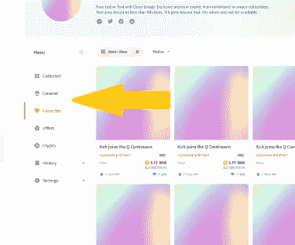

假设 NFT/神秘盒子被列出，用户可以选择使用固定价格直接购买或者在 NFT 拍卖中出价。但是，如果 not 神秘盒子没有列出，你可以向卖家出价。 [***在此了解更多> >***](https://www.binance.com/en/support/faq/777d6487fb7b491696571e3cbf3518f7?ref=431277160)

币安·NFT 展示了两种类型的 NFT 系列。首推系列是与币安·NFT 合作打造的。另一方面，标准收藏是由币安·NFT 网站上未经验证的创作者创作的。

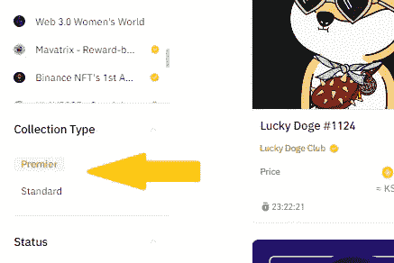

在 marketplace 上，您会在排名板、NFT 详细信息页面、收藏页面、用户资料和 premier 收藏中找到名称旁边的橙色勾号。

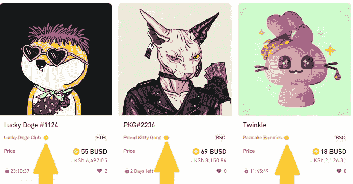

如果你正在寻找高质量的 NFT 项目，你可以探索详细列出币安 NFT 市场顶级销售、收藏和创作者的排名板。

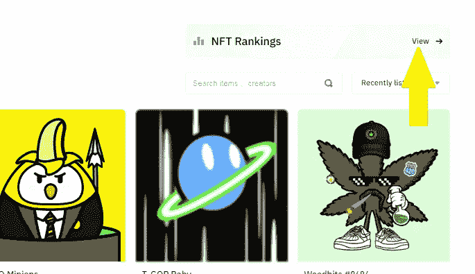

此外，在排名板上，买家可以看到底价、商品、最后价格和交易量的详细概述，以确定每件 NFT 的价值。

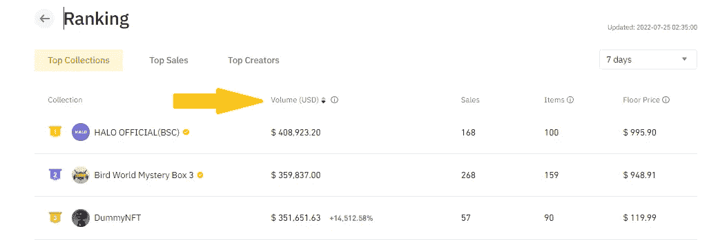

对于那些喜欢探索不同稀有程度的 NFT，或者甚至有机会以更低的价格拆箱一个稀有的 NFT 的买家；神秘盒子页面会成功的。

## 分析指标和重要性

衡量 NFT 的价值对于确定 NFT 的价值非常重要。在这个过程中，度量是非常关键的因素。

购买 NFT 时，以下 NFT 评估指标将会派上用场:

1.  **底价**——这是 NFT 项目中价格最低的 NFT。购买地板被认为是一个伟大的方法，因为它吸引人们加入 NFT 项目。

***重要性:*** 底价决定了一个项目被买家接受的程度。因此，随着对 NFT 需求的增加，地板价格也会增加。

大多数买家会购买一个系列中价格最低的 NFT，并打算在该系列变得更受欢迎时以更高的价格转售。关键是要找到一个项目，平衡高价值和可达性。

**2。最高价** -这是藏品中价格最高的 NFT 的价格，或者是 NFT 的最高售价。

被认为是高风险高回报的策略。

*:当你有很多钱可以花，并且正在寻找最稀有和最受欢迎的数字资产时，就需要购买天花板。*

*本质上，当项目需求增加时，最高限价也会增加。然而，如果项目失去了人气，投资者就会蒙受巨大损失。*

***3。成交量** -这是指交易的总成交量，用来表示一个项目的总体需求。成熟和高质量的收藏往往会有大量的交易。*

****重要性:*** 交易量决定了一个项目的知名度和受欢迎程度。获得高交易量表明人们对购买和出售收藏品充满热情。*

*通过检查交易量，人们可以很容易地确定 NFT 收藏是否受欢迎和受欢迎。因此，交易量越高，市场的流动性就越强。一个流动的市场确保你可以很容易地进入和退出 NFT 头寸。*

***4。Supply** -这是指特定集合中的 NFT 总数。*

****重要性:*** 一个 NFT 项目的供给和通货膨胀率掌握在创造者手中。藏品的供应影响着一个项目的价值和吸引力。从本质上讲，供应量高的藏品通常会有较低的市场价值。由于稀有性和稀缺性，供应量低的藏品会有较高的底价。*

***5。销售额——NFT 销售额是确定一个项目过去和现在受欢迎程度的好指标。***

****重要性:*** 如果一辆 NFT 近期销量多，则是该项目受欢迎的指标。本质上是根据地板价格来考虑运动的方向。在许多 NFT 持有者抛售的情况下，底价持续下降，这可能是兴趣下降或恐慌性抛售的迹象。*

***6。稀有等级** -一件藏品的稀有性源于它所拥有的特质和特征。这个指标也决定了达到特定 NFT 的难度。*

****重要性:*** 稀有等级是投资者用来评估 NFT 藏品价值的重要指标。稀缺和稀有的 NFT 通常会吸引更多的买家，并以更高的价格出售。此外，罕见的非功能性游戏附带独家 NFT 工具，如在*即玩即赚*游戏中的额外好处。*

***7。出处**——这通常是指特定 NFT 从其原产地开始的所有权历史。*

****重要性:*** 该指标用于检查 NFTs，因为它使人们能够通过区块链确认和核实所有权信息的变化。*

****让我们来看看现实世界中 NFT 收藏的币安·NFT 的一些上述因素:****

*币安 NFT 上的量子猿 NFT 收藏是一个相当受欢迎和著名的 NFT 项目。*

*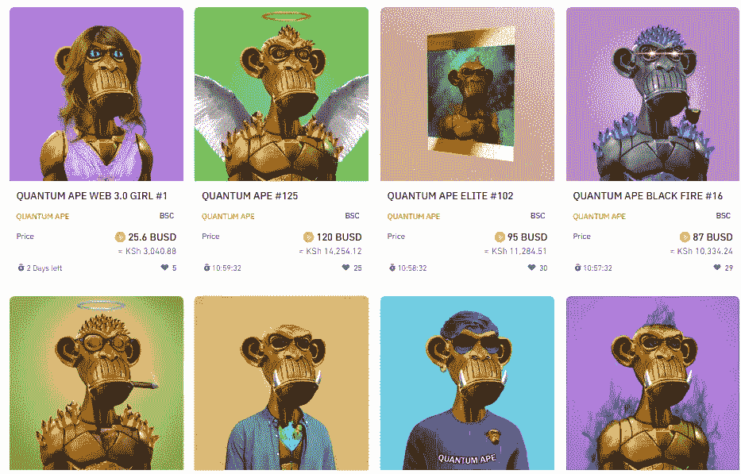*

*I)在这个系列中，底价为 1.35 巴斯德*

*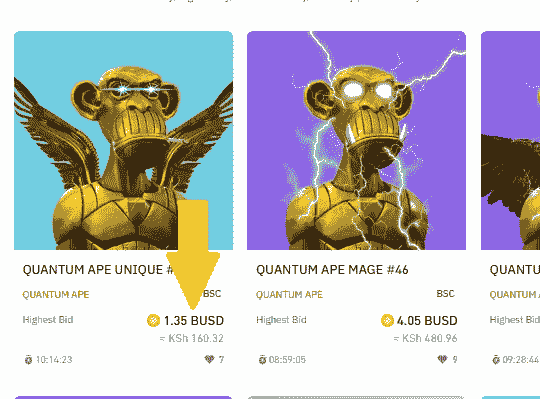*

*ii)最高限价高达 3000 万 BUSD。*

*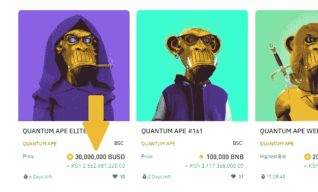*

*iii)Quantum Ape 的总交易量为 19，074.08 美元。*

*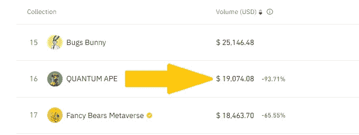*

*iv)Quantum Ape 全部藏品的总供应量为 656 件 NFT 艺术品。*

*v)就稀有等级而言，价格最高的 NFT 作品通常具有最稀有的特征，因此增加了其市场价值。*

*vi)在 Quantum Ape NFT 系列中，每件 NFT 作品都附有出处详情。*

*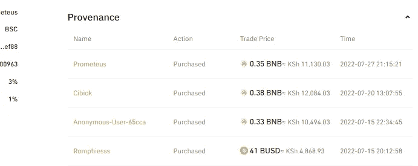*

*[***币安 NFT 今日入门> >***](https://www.binance.com/en/nft?ref=431277160)*

*[***今日开立币安账户> >***](https://accounts.binance.com/en/register?ref=431277160)*

****关联披露:*** *本帖包含关联链接。如果您使用这些链接购买一些东西，我们可能会赚取佣金，对您没有额外的费用。感谢*。*

> *交易新手？尝试[加密交易机器人](/coinmonks/crypto-trading-bot-c2ffce8acb2a)或[复制交易](/coinmonks/top-10-crypto-copy-trading-platforms-for-beginners-d0c37c7d698c)*