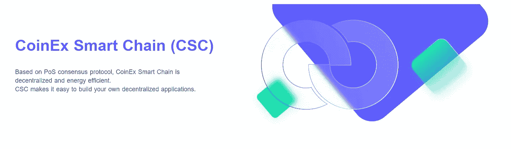
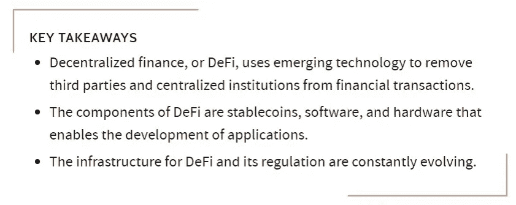

# 探索 CSC 的定义

> 原文：<https://medium.com/coinmonks/exploring-defi-on-csc-5cab59f672e?source=collection_archive---------34----------------------->

## 利用 CSC 开发 DeFi 的各种优势

在美国，美联储和证券交易委员会(SEC)为银行和经纪公司等中央金融机构制定了规则，消费者依靠这些机构直接获得资本和金融服务。DeFi 通过赋予个人点对点的数字交换来挑战这种集中的金融系统。

## **内容**

*   什么是 DeFi
*   DeFi 是如何工作的
*   DeFi 的用途
*   DeFi 的好处
*   探索 CSC

**什么是 DeFi？**

**DeFi(或“分散金融”)是区块链公共金融服务的总称，即 CSC** 。有了 DeFi，你可以做银行支持的大部分事情——赚取利息、借款、贷款、购买保险、交易衍生品、交易资产等等——但它更快，不需要文书工作或第三方。与一般的加密一样，DeFi 是全球性的、点对点的(意味着直接在两个人之间进行，而不是通过一个中央系统进行路由)，匿名的，并且对所有人开放。

DeFi 取消了银行和其他金融公司因使用他们的服务而收取的费用。个人将钱存在一个安全的数字钱包中，可以在几分钟内转移资金，任何有互联网连接的人都可以使用 DeFi。

【DeFi 如何工作

分散金融使用加密货币使用的区块链技术。区块链是一个分布式的安全数据库或分类帐。称为 dApps 的应用程序用于处理事务和运行区块链。

在像 CSC 这样的区块链中，交易被分块记录，然后由其他用户验证。如果这些验证者同意交易，则该块被关闭并加密；创建另一个块，该块中具有关于前一个块的信息。

这些块通过每个前进块中的信息“链接”在一起，给它命名为区块链。不能在不影响后续块的情况下改变先前块中的信息，因此没有办法改变区块链。这个概念与其他安全协议一起，提供了区块链的安全性。

**DeFi 的用途**

点对点(P2P)金融交易是 DeFi 背后的核心前提之一。P2P DeFi 交易是指双方同意在没有第三方参与的情况下用加密货币交换商品或服务。

在 DeFi 中，P2P 可以满足个人的贷款需求，算法会匹配同意贷款人条款的同行，然后发放贷款。P2P 支付是通过一个分散式应用程序(dApp)完成的，在区块链遵循同样的流程。

使用 DeFi 可以:

可访问性:任何有互联网连接的人都可以访问 DeFi 平台，交易不受任何地理限制。

低费用和高利率:DeFi 使任何两方能够直接协商利率，并通过 DeFi 网络贷款。

安全性:在区块链上发布的智能合同和已完成交易的记录可供任何人查看，但不会泄露您的身份。区块链是不可变的，这意味着它们不能被改变。

自主性:DeFi 平台不依赖任何中央金融机构，不会遭遇困境或破产。DeFi 协议的分散性减轻了这种风险。

**DeFi 的好处**

*   I **可修改性:**跨区块链分散架构的防篡改数据协调提高了安全性和可审计性。
*   **可编程性:**高度可编程的智能合约能够自动执行，并创造新的金融工具和数字资产。
*   **透明性:**在公共 CSC 区块链上，每一笔交易都被广播给网络上的其他用户并由他们进行验证。围绕交易数据的这种透明度不仅允许进行丰富的数据分析，而且还确保网络活动对任何用户都是可用的。
*   **开户**:不需要申请任何东西，也不需要“开户”。你只需要创建一个钱包就可以了。
*   **化名**:你不需要提供你的名字，邮箱，或者任何个人信息。
*   **灵活**:你可以随时随地移动你的资产，无需征得许可，无需等待漫长的转账完成，也无需支付昂贵的费用。
*   **快**:利率和回报经常快速更新(快至每 15 秒一次)，可以明显高于传统华尔街。
*   **互操作性:** CSC 的可组合软件堆栈确保 DeFi 协议和应用程序的构建能够相互集成和补充。借助 DeFi，开发人员和产品团队可以灵活地在现有协议的基础上构建、定制接口和集成第三方应用。

利用 DeFi 的优势，CSC 使用户能够创建、定制和模块化他们的业务用例到 DeFi 合成中。

CSC 允许用户:

创建分散的、不可信的定制资产。

接受、分配和分配利润。

支付佣金，股息和更多。

## 探索 CSC

CoinEx Smart Chain——CSC 是一款分散式高效公共区块链。CSC 坚持去中心化的原则，同时保持较高的每秒交易量，降低主要时间的交易成本。CoinEx 智能链为开发人员提供了一个高效、低成本的链上环境，以运行分散式智能合约应用程序(DApps)并存储数字资产。

CSC 拥有丰富的各种 DeFi 软件的活跃生态系统，使用户能够体验分散金融的最大好处。用户通常通过 CSC 上名为 dapps(“分散式应用”)的软件参与 DeFi。与传统银行不同，它不需要填写申请表或开立账户。

以下是用户可以通过 CSC 参与 DeFi 的一些方式:

*   出借:出借你的密码，每分钟赚取利息和奖励，而不是每月一次。
*   **获得贷款**:无需填写文件即可获得贷款，包括传统金融机构不提供的极短期“闪贷”。
*   **交易**:对某些加密资产进行点对点交易——就好像你可以在没有任何经纪公司的情况下买卖股票一样。
*   为未来储蓄:将你的一些密码存入储蓄账户，获得比你通常从银行获得的更高的利率。
*   **购买衍生品**:对某些资产进行多头或空头押注。把这些想象成股票期权或期货合约的加密版本。

**可利用的定义工具&CSC 上的 dapp**

*   [**via wallet—via wallet**](https://viawallet.com/)CoinEx 旗下自主研发的多链钱包，支持 CoinEx 智能链(CSC)上的 DApp 接入和资产存储。
*   [**one swap—one swap**](https://www.oneswap.net/cet)是一种基于智能合约的完全分散式交易协议，支持自动做市(AMM)和订单簿模式以及免许可令牌列表。通过内置的 OneSwap 钱包，它一站式提供各种服务，将用户交互提升到一个新的水平。
*   [**if pool—if pool**](https://ifpool.io/)是一个用于 CSC 节点锁定和令牌锁定挖掘的 DeFi 协议。
*   [**water loan—water loan**](https://waterloan.finance/)是一个分散的借贷协议。通过 WaterLoan，用户可以在 CoinEx 智能链(CSC)上押资产，根据需要借用其他密码。
*   [**IF Swap—IF Swap**](https://ifswap.finance/)是一款基于 CSC 的 AMM 应用，满足用户交换令牌的需求。
*   [**Stakely—Stakely**](https://stakely.io/en/faucet)是一项专业的非托管桩服务，适用于 30 多个网络，以及多芯水龙头服务。

## 结论

分散金融(DeFi)是一种新兴的金融技术，对当前的中央银行体系提出了挑战。DeFi 取消了银行和其他金融公司使用其服务收取的费用，并推广使用点对点(P2P)交易。

传统金融仍然是经济的支柱。许多人仍然选择普通的借贷方式。然而，DeFi 用户的数量迅速增加。考虑到该系统的诸多好处，它完全有可能在未来取代传统的金融系统。

DeFi 的主要好处包括缺乏监管、容易获得、快速交易、匿名以及设计新金融工具的机会。使用这个系统的人可以避免传统金融系统的所有典型的复杂性。任何人都可以在任何时刻成为 DeFi 的用户。

> 交易新手？试试[加密交易机器人](/coinmonks/crypto-trading-bot-c2ffce8acb2a)或者[复制交易](/coinmonks/top-10-crypto-copy-trading-platforms-for-beginners-d0c37c7d698c)