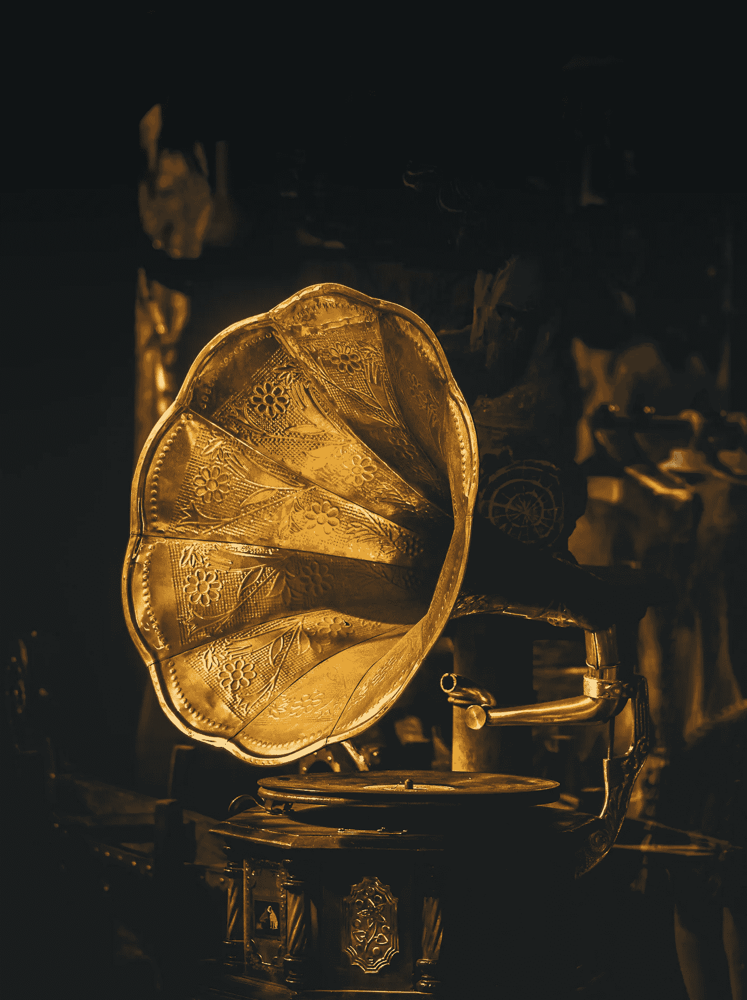

# 探索市场:五种独特的音乐 NFT

> 原文：<https://medium.com/coinmonks/exploring-the-marketplace-five-unique-music-nfts-90277d499342?source=collection_archive---------32----------------------->

音乐界酝酿着众多独特的 NFT 项目，这很容易——只有少数闪亮的宝石受到关注。出版商整理了一份我们发现的可能没有引起公众注意的音乐相关非功能性传播疾病的简要清单:

**梦幻循环**

比特调和像素图形时代的粉丝可以在 [Dreamloops](https://opensea.io/collection/dreamloops) 中找到一个非常棒的项目。这一时尚的 9，520 个独特的 NFT 集合结合了 8 位音乐的复古主题循环，让人想起从马里奥到塞尔达的一切，以及 16 位定制的数字艺术作品。视觉和音频混搭是对复古游戏黄金时代的明确认可，灵感显然来自超级任天堂和 Amiga 等系统。更重要的是，每五个 Dreamloops 代币中就有一个可以兑换成实物收藏品，无论是黑胶唱片还是盒式磁带。你可以在 https://www.bitlectrolabs.com/的[看看 Dreamloops 背后的设计团队。](https://www.bitlectrolabs.com/)

**浮世绘的音景**

虽然东京的制作人兼音乐家 Shintaro Haioka 的最新项目严格来说不是音乐，但它是一个绝对独特和新颖的 NFT 集合，正在扩展 web3 的视听领域。这些代币本身包括一个录制的东京各地的声音场景循环，专门满足海冈更简约和剥离的声音。每个标记还包括记录发生的相应位置的黑白图像。正如创作者所描述的，浮世绘的声景是“先于我的音乐的声音”。点击查看这些独一无二的录音[。](https://opensea.io/collection/ukiyosoundscapes)

地下音乐迷们可以高兴了:Rave-Pigs-Deployer 与柏林的电子制作人 Boysnoize 合作，创作了 6666 首古怪、粗糙、完全独特的音乐专辑。这些代币包括一圈定制的男孩原创音乐，以及个人制作的滑稽的“狂欢猪”数字艺术品。这种艺术风格有点让人想起里克和莫蒂，明显的柏林俱乐部场景的影响通过霓虹灯的颜色和穿着疯狂的化身体现出来。查看奇怪而奇妙的[系列](https://opensea.io/collection/rave-pigs)，目前正在进行销售！

**omgkirby x 通道 Tres**

谈论丰富的内容——数字创作者 omgkirby 与制作人和音乐人频道 Tres 合作，推出了一个庞大的针对独特艺术作品的独特曲目[集合](https://opensea.io/collection/ctomgkirby)。数量庞大的独特歌曲——5550 首，每首代表一件数字艺术品——也不是空洞无聊的循环。它们是由 Tres 频道自己制作的定制曲目，带有流畅的数字化人声和高保真嘻哈节拍。更酷的是——每首 NFT 都为每位购买者提供了出版和所有权，这意味着足够幸运的粉丝可以上传和分发歌曲，以获得这些稀有宝石中的一颗。

**快乐之声**
为了更乐观一点，作曲家兼创作人 [David Choi](https://twitter.com/davidchoimusic) 组合了一张令人难以置信的精致原创的 NFT 专辑，名为[快乐之声](https://opensea.io/collection/happyvoices)。这些声音片段是对音乐过去的呼喊，每首曲目都配有一台单独的动画留声机，可以随着曲调“唱歌”。从视觉和听觉的角度来看，这是一个很好的例子，说明了 web3 场景是如何富有想象力和变革性的，尤其是当它落在有动力的原创者手中的时候！

虽然熙熙攘攘的 web3 空间继续增长，出版商将继续强调和讨论这个不断变化的数字世界。对于各种天赋水平的后起之秀来说，自信地驾驭 NFT 空间可能会很棘手，尤其是如果你想让自己出名的话。令人欣慰的是，出版商致力于为艺术家、粉丝和 NFT 爱好者创建一个平台，完全拥抱音乐产业的去中心化未来。未来的文章请关注我们的媒体，并关注我们即将在[https://the-publicator.com](https://the-publicator.com/)发布的内容。

> *交易新手？试试* [*密码交易机器人*](/coinmonks/crypto-trading-bot-c2ffce8acb2a) *或* [*复制交易*](/coinmonks/top-10-crypto-copy-trading-platforms-for-beginners-d0c37c7d698c)
> 
> *加入 Coinmonks* [*电报频道*](https://t.me/coincodecap) *和* [*Youtube 频道*](https://www.youtube.com/c/coinmonks/videos) *获取每日* [*加密新闻*](http://coincodecap.com/)

# 另外，阅读

*   [复制交易](/coinmonks/top-10-crypto-copy-trading-platforms-for-beginners-d0c37c7d698c) | [加密税务软件](/coinmonks/crypto-tax-software-ed4b4810e338)
*   [网格交易](https://coincodecap.com/grid-trading) | [加密硬件钱包](/coinmonks/the-best-cryptocurrency-hardware-wallets-of-2020-e28b1c124069)
*   [密码电报信号](/coinmonks/top-3-telegram-channels-for-crypto-traders-in-2021-8385f4411ff4) | [密码交易机器人](/coinmonks/crypto-trading-bot-c2ffce8acb2a)
*   [最佳加密交易所](/coinmonks/crypto-exchange-dd2f9d6f3769) | [印度最佳加密交易所](/coinmonks/bitcoin-exchange-in-india-7f1fe79715c9)
*   [面向开发人员的最佳加密 API](/coinmonks/best-crypto-apis-for-developers-5efe3a597a9f)