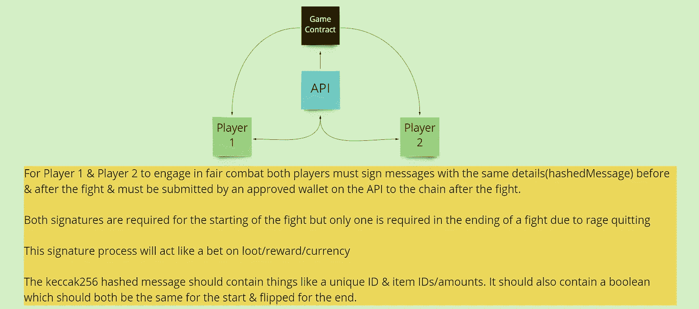
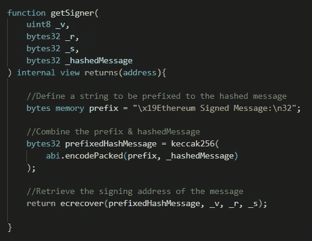
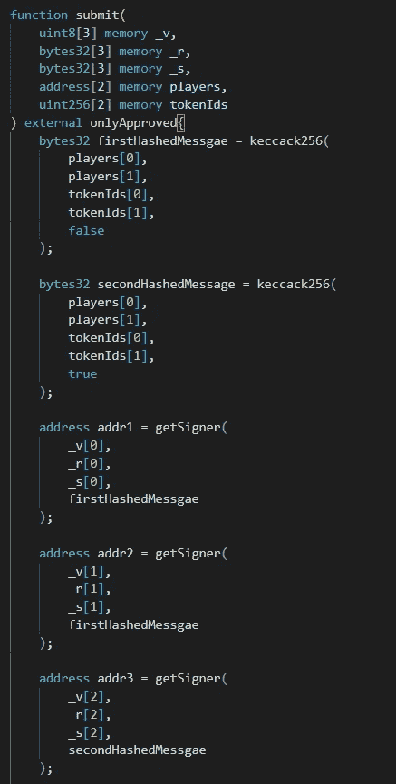
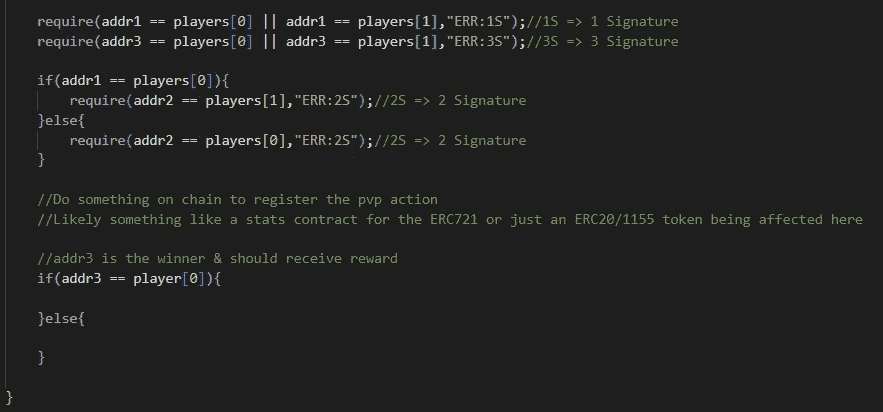

# 公平的 PVP 链上/链下与 ECDSA

> 原文：<https://medium.com/coinmonks/fair-pvp-on-chain-with-ecdsa-63a563c56b96?source=collection_archive---------16----------------------->

目标:使用 ECDSA 在链上实现可验证的 pvp 结果

起初，我不知道如何实现这个目标，但是几个星期后，我突然想到。在比赛前后使用 ECDSA 签名，以确保所有参与者都被记录下来，并通过一个集中的钱包将这些签名提交给链。这里的 Web2 安全性是必须的。如果不在 web2 安全性上花费大量时间，你就不应该尝试实现这种产品版本，因为我们使用的是集中式钱包。

不管怎样…

hashed message = keccak 256(
player 1 addr，
player2Addr，
player1TokenID，
player2TokenID，
bool start，
string uniqueID

我忘记添加唯一的 ID 了。确保在每次函数调用后将 ID 存储在映射中。映射(string => bool)应该没问题。

例子

对于那些不了解 ECDSA(椭圆曲线数字签名算法)的人来说，这里有一个它的实现。_hashedMessage 是前缀&然后我们使用 ecrecover 函数恢复签名者&传入散列消息以及签名的 3 个部分 _v，_r，_s。

你能在你的项目中看到这样的用例吗？

如果你觉得这个有趣，为什么不看看这个呢！
[https://medium.com/p/cd06bca5e541](/p/cd06bca5e541)

坚实发展研究小组—[https://discord.gg/KzbcGmrnfN](https://discord.gg/KzbcGmrnfN)

-多边形联盟—[https://www.polygonalliance.com/](https://www.polygonalliance.com/)

-多边形联盟不和—[https://discord.gg/kJKPCGQu66](https://discord.gg/kJKPCGQu66)

你喜欢这篇文章吗？想请我喝杯咖啡吗？
Polygon/Eth/Bsc—0x4a 581 E0 EAF 6b 71d 05905 e8e 6014 DC 0277 a1 b 10 ad

> *交易新手？试试* [*密码交易机器人*](/coinmonks/crypto-trading-bot-c2ffce8acb2a) *或* [*复制交易*](/coinmonks/top-10-crypto-copy-trading-platforms-for-beginners-d0c37c7d698c) *上* [*最好的密码交易*](/coinmonks/crypto-exchange-dd2f9d6f3769)

> 加入 Coinmonks [电报频道](https://t.me/coincodecap)和 [Youtube 频道](https://www.youtube.com/c/coinmonks/videos)获取每日[加密新闻](http://coincodecap.com/)

# 另外，阅读

*   [免费加密信号](/coinmonks/free-crypto-signals-48b25e61a8da) | [加密交易机器人](/coinmonks/crypto-trading-bot-c2ffce8acb2a)
*   [杠杆代币的终极指南](/coinmonks/leveraged-token-3f5257808b22)
*   [16 款最佳折叠电动自行车](/coinmonks/top-17-folding-electric-bikes-5e296f0918cb)
*   [28 款最佳电动自行车点评](/coinmonks/the-28-best-electric-bikes-review-and-buying-guide-in-2023-7bb3146cb403)
*   前三名[币安期货交易机器人](/coinmonks/top-3-binance-futures-trading-bots-e6031f84b3f9)