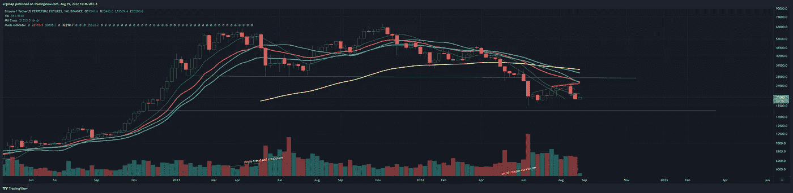
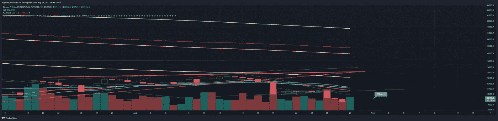
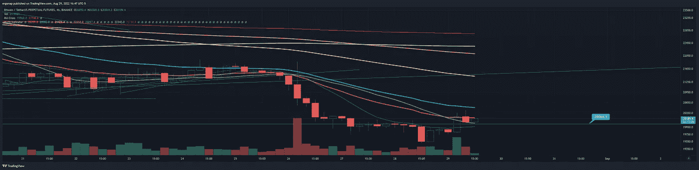
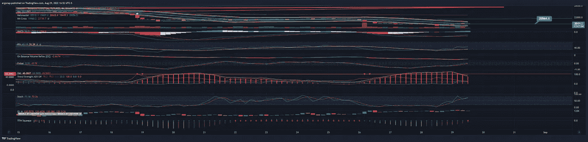
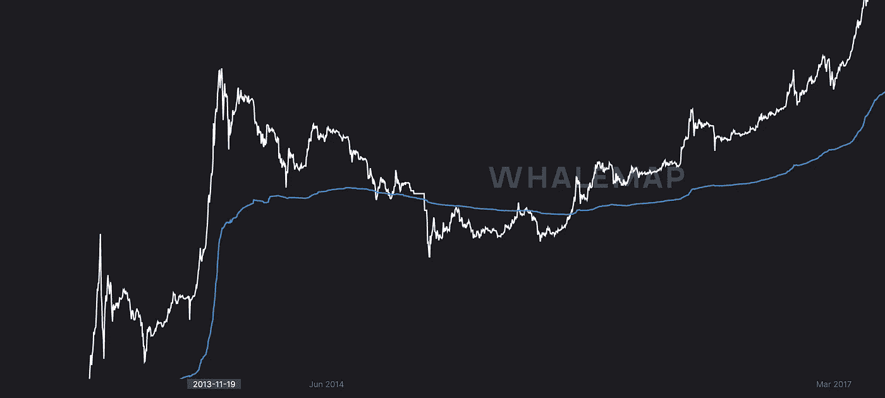
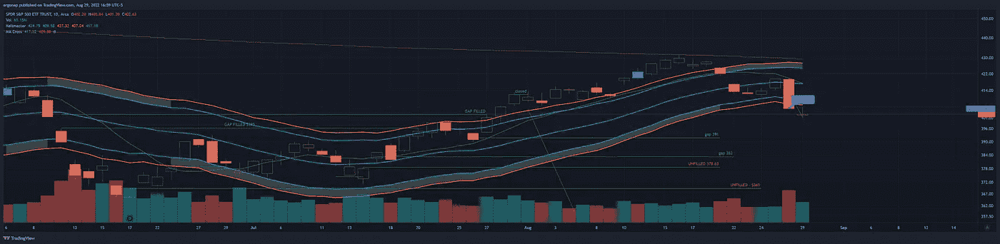

# 造假，可笑

> 原文：<https://medium.com/coinmonks/fakeouts-laughable-d80b4030c3b3?source=collection_archive---------32----------------------->

## 加密货币市场/比特币分析 8/29

那么，我们有什么？我们在稀薄的空气中有#短#挤压。我怀疑有#熊#陷阱，嗯…..是啊。不能说我很惊讶。

此时，周线图基本上没有变化。显然，当我们在一个支点上时，这种假来假去的东西让我有点犹豫不决。

[https://www.tradingview.com/x/J8cJYTLY/](https://www.tradingview.com/x/J8cJYTLY/) — bearish, see ya later. So far.

日线图也说 LOL，因为我们实际上是坐在一个水平支撑的顶部，然而…我们已经在它下面一次了，肯定没有强烈反弹。

Usually when this occurs, market goes down. [https://www.tradingview.com/x/2q3KlQ0m/](https://www.tradingview.com/x/2q3KlQ0m/)

通常领先一天的 4H 图显示，我们可能会继续上涨，或者在收盘后 2 小时左右再次测试。

[https://www.tradingview.com/x/XlOymDQu/](https://www.tradingview.com/x/XlOymDQu/)

没有一个部分是乐观的，这更像是“我们现在是继续下跌，还是先反弹/出局/等等”？至少在基本水平上，动量和字面上的一切都指向下。我们还有什么？融资数据显示一切都是混合的——基本上多头获利了，但 OI 一直在攀升(或者甚至可以说是空头挤压),这些都没有意义。[https://www.binance.com/en/futures/funding-history/4](https://www.binance.com/en/futures/funding-history/4)

如果我们打开其他指标，我们指向均值回归，而不是趋势，基本上是说我们看跌，但现在进入过渡。

[https://www.tradingview.com/x/pSypeT6z/](https://www.tradingview.com/x/pSypeT6z/) . I don’t know what to say, people will buy bitcoin forever no matter what by now.

并不意味着它不会进一步下跌，因为即使是 Saylor 也处于某种准自我毁灭的状态，他在比特币上炸毁了他的整个公司，并辞去了首席执行官的职务，以基本上进一步推进他在比特币上的赌博，尽管许多人都很担心。

[https://imgur.com/a/hbfsVpF](https://imgur.com/a/hbfsVpF) , 2014 chart

Onchain 通常意味着我们看跌，但接近底部，等待一些反弹等等。今天也是如此。然而，所有这一切的关键是，间谍看起来很像 2008 年。

密码与整个市场有着明显而深刻的关联，而我们在正常的股票市场中有着大量的缺口。我们现在非常接近这些差距，即使是短期的差距也有很多。

clearly no gaps. lmao . [https://www.tradingview.com/x/NijsMQ0c/](https://www.tradingview.com/x/NijsMQ0c/)

因此，今天的任何举动都不是看涨，但问题是什么时候是做空的合适时机。答案是，我们没有一个明确的答案，所以这可能不是穿新短裤的时候，但如果你还穿着 23k+的短裤，我肯定不会失眠。

> 交易新手？试试[加密交易机器人](/coinmonks/crypto-trading-bot-c2ffce8acb2a)或者[复制交易](/coinmonks/top-10-crypto-copy-trading-platforms-for-beginners-d0c37c7d698c)