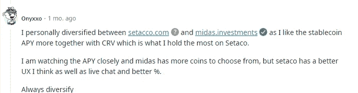
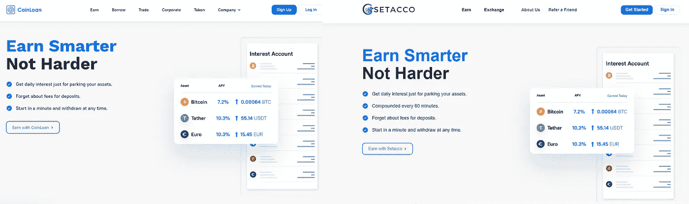
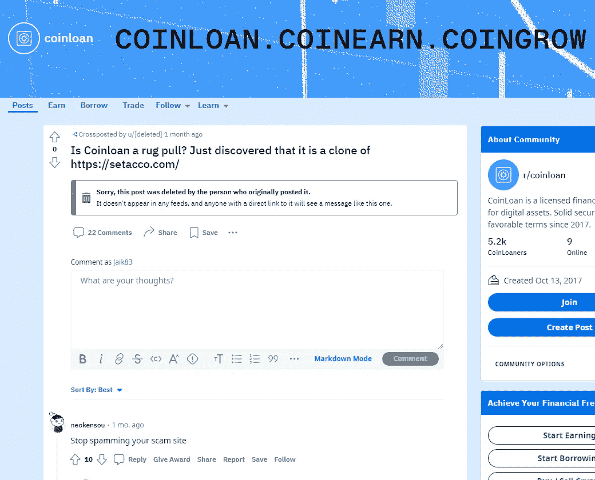
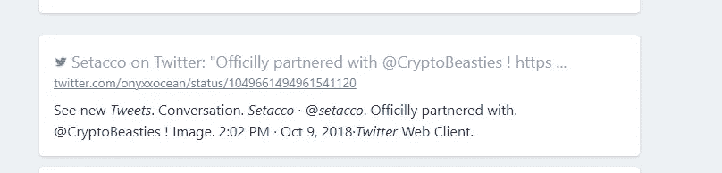
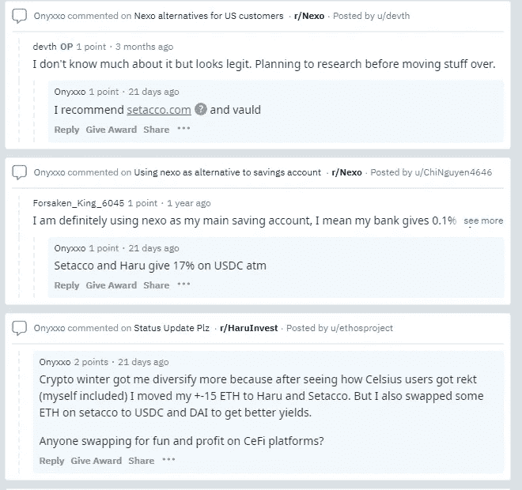
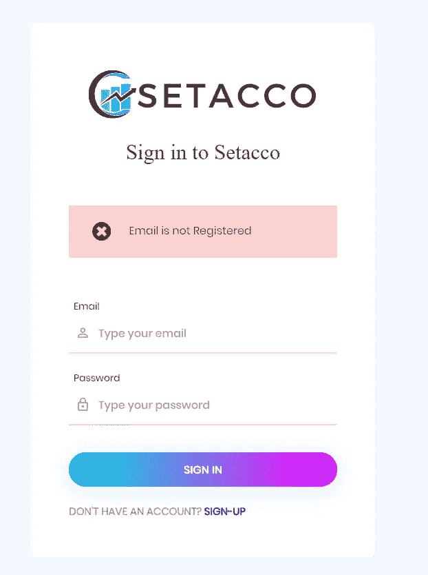

# 成为我第一个秘密骗局的受害者…

> 原文：<https://medium.com/coinmonks/falling-victim-to-my-first-crypto-scam-61936c746a4a?source=collection_archive---------3----------------------->

虽然我对自己被骗的事实感到羞愧和尴尬，但我想我应该分享一下让我走到这一步的经历。让我心烦意乱的是，在我写这篇文章的时候，[这个骗局仍在进行中](https://setacco.com/),我确信人们仍在上当，或者至少在我们说话的时候在考虑上当。如果我的故事可以防止至少一个人在将来犯同样的错误，那么至少我可以睡得着，因为我知道我的错误会拯救其他人。

我听到人们一次又一次地说，如果你在加密空间呆得足够久，最终你会被骗。我以为我能做得更好。我如饥似渴地阅读新闻，所以我认为我听到了所有的故事——[埃隆·马斯克让你发送加密](https://www.theverge.com/2021/5/17/22440425/elon-musk-impersonator-cryptocurrency-bitcoin-twitter-scam-report-ftc)、[免费的 NFT 薄荷糖](https://nftevening.com/free-mint-nft-scams-are-rife-right-now-heres-how-to-stay-safe/)，当然还有[地毯拉手](https://www.cryptovantage.com/news/what-are-the-biggest-crypto-rug-pulls-in-history/)。我认为我知道所有的“安全规则”，比如不要给出你的种子短语，或者不要回应不和谐的不请自来的 DM。然而，我没有想到的是，一个拥有多个假冒用户的完全假冒的 CeFi 平台变得越来越坚固。

当我说一个假的 CeFi 平台时，我不是在说德根平台(即 Celsius，Voyager)，他们在那里拿用户资金做德根剧。正如我稍后将详细介绍的那样，我正在谈论完全虚假的系统，虚假的支持者，reddit 上的虚假用户，虚假的用户评论，虚假的电报，虚假的客户服务代表——等等。

# **背景故事**

如果你一直关注我的其他帖子，我会花很多时间寻找收益，尤其是稳定的股票和蓝筹股。最近，我的任务变得更加专注于产量农业，因为在等待熊市结束时，我一直在寻求尽可能多的分散投资加密货币的机会。问题中的诈骗平台是 setacco.com——一个在 stablecoins(一度约 29%的 APY)和其他蓝筹股上拥有最佳 APY 的平台。

我第一次听说 setacco.com 是在 Midas reddit 上，一位用户 Onyxxo 把它作为他的主要投资策略之一:

我没有在 Reddit 上做任何进一步的挖掘，而是在谷歌上搜索，结果一无所获。我阅读了 Onyxxo 在 Setacco 上的帖子的其他回复，他们也表示从未听说过 Setacco。然而，快速的 twitter 搜索确实发现了一个拥有近 4000 名粉丝的 twitter 账户，甚至还有一个拥有超过 1000 名粉丝的 telegram group。

出于好奇，我决定查看一下这个网站，从快速浏览中，一切看起来都是合法的——他们有 Trustpilot 评论，据报道有成千上万的用户——所以我决定建立一个帐户，这样我就可以多逛逛了。

# **被利率蒙蔽:**

为了完全透明，利率完全关闭了我大脑的前额叶皮层部分——几乎所有稳定的硬币都超过 20%,没有锁定，当然如果你锁定代币至少 30 天，还有机会赚更多。此时，我只是在找理由说服自己，我刚刚发现了一座金矿。事后看来，我应该做的是先相信这是一个骗局，直到我有明确而令人信服的证据证明事实并非如此。

我的大脑中仍然留有一些尽职调查的意识，我继续寻找，注意到他们确实有一个客户支持选项卡，我打开它，开始询问一些关于该公司的问题，包括:

我怎么从来没听说过你们？

[转述回答]:我们成立的时间并不长，直到不久前我们还只对私人投资者开放，最近才对公众开放。

你是如何获得收益的？

[转述回答]:我们使用机器人和人工智能策略来提高产量

在我有机会提出更多的问题之前，他说我是一个博客作者(为我为什么这么爱管闲事提供一些理由)，但客服代表告诉我，我应该给 support@setacco.com 发电子邮件，告诉他我所有的问题，以便得到更深入的回答。他还告诉我，我是一名博客写手，这很好，setacco 很乐意接受评论，并提议我试着存一点钱，亲自看看这个平台是如何运作的。

> 交易新手？试试[密码交易机器人](/coinmonks/crypto-trading-bot-c2ffce8acb2a)或[复制交易](/coinmonks/top-10-crypto-copy-trading-platforms-for-beginners-d0c37c7d698c)

这才是真正吸引我的地方。我最喜欢的一件事就是探索和尝试新事物。无论是弄清楚如何将您的$ETH 连接到 Arbitrum，还是了解验证器节点如何工作，crypto 最令人兴奋的事情是不断有新的东西出现，这些东西正在彻底改变我们看待金融和网络的方式。因此，当我被要求试用它时，我被足够的诱惑去试用它，而没有对平台本身做进一步的尽职调查。

我的时间已经很晚了，我的 OkCoin 账户里已经有大约 0.015 美元 BTC，所以我决定把它送过去，在它发布后(几分钟内)，我把它放入他们的一个 30 天金库，赚取大约 11%的 APY。

直到第二天早上，当我真正开始深入研究 setacco 时，我才开始发现一些令人困扰的事情……然后，严酷的事实开始出现:

**Setacco 的网站几乎是 coinloan.io 的翻版，一个真正合法的网站:**

Can you tell which one is fake?

更令人困惑的是，甚至有人在自己的 reddit 页面上指责 coinloan.io 是骗子:

尽管 setacco.com 在过去一个月左右的时间里对网站进行了一些修改，但仍有一些内容仍然需要复制粘贴，包括他们的公司地址、欧洲金融许可证号码、所有公司信息网站，如隐私政策页面和数据保护链接。虽然他们后来更新了它，但最初他们的许多链接，如 trustpilot 链接(现在链接到一系列不同的我确信是假的评论)，只把你链接回 setacco 的主页。不用说，如果我真的在他们的网站上做了更多的挖掘，或者我熟悉 coinloan.io，我就会(希望)从更远的地方闻到一些可疑的东西。

**Settaco(又名 Onyxxocean)的社交媒体账户**

我对 Setacco 的 twitter 账户做了一点深入调查，发现了几个危险信号。

1.  如果你搜索“Setacco twitter”，就会发现这个账户实际上是“onyxxocean”:

这个名字熟悉吗？这和在 reddit 上兜售 settacco 的同一个用户 Onyxxo 几乎一模一样。在 reddit 上做第二次搜索，你会发现这个人经常使用 settacco，而且很难使用:

但回到 setacco 的 twitter，我开始注意到该帐户有许多关于加密空间发生的不同事情的转发和关于假设的“合作关系”的推文，只有少数实际的推文可能类似于实际的合法平台发布的推文。

Setacco 的电报也是可疑的——即使有 1000 多名粉丝，该组织的普通成员也不允许发表任何问题或评论。我试着给其中一个管理员“杰克·尤格”发 DM，但是当然没有得到回应。

# **保持希望你没有被骗**

等待 30 天后我的$BTC 解锁，我看到了所有的旗帜，但我仍然希望也许，*只是也许*我错了。尽管该网站因为 404 错误而奇怪地关闭了几天，尽管越来越多的人在网上发现了类似骗局的房产，尽管我没有得到任何与 setacco 或他们所谓的客户服务有关的人的回应，尽管揭露 setacco 的真正负面评论最终被张贴出来，我仍然认为也许我可以取出我的资金。当我的 30 天解锁期到来时，我要求退出，这立即进入“24 小时等待期”

第二天早上，当我醒来时，我试图登录，却发现这一点:

很明显，我的账户已经从平台上完全删除了，当然也没有办法使用我的资金。我个人已经通过几个不同的平台联系过他们，但是到目前为止我还没有得到任何回应。

# **我学到的要点**

**骗局真的很复杂**:我们不只是在谈论抄袭的网站，这个骗局有成千上万的虚假关注者，多个虚假账户与不同平台上的不同用户绑定，谈论这个平台有多棒。即使在 reddit 上，也有多个骗子在互相交谈，让这个平台看起来像是合法的。

我非常感谢我没有投入更多的钱:无论我投入多少，我都会损失。是不是有可能计算出骗子只是想从我这里得到任何东西，不管有多少？可能吧，但是 7 个月前，当我开始进入加密领域的时候，我要比德根强得多，我可能会比只有 400 美元的 BTC 多得多。

**尽职调查=不仅仅是触及表面**:我在存入资金后所做的所有研究都应该是事先做好的。如果我多花几分钟时间做更多的挖掘工作，我就更有可能被劝阻不要只是“少量尝试”。

# **结论**

我希望你能从这篇文章中学到一些东西，如果你有自己被骗的故事，我会非常乐意在下面的评论中听到。

也就是说，举报欺诈有多种方式。如果你或你认识的人是骗局的受害者，有多种方式可以举报，包括通过[美国联邦贸易委员会](http://www.reportfraud.ftc.gov/)(FTC)[商品期货交易委员会](http://www.cftc.gov/Complaint)(CFTC)[证券交易委员会](https://www.sec.gov/tcr) (SEC)和[互联网犯罪投诉中心](https://www.ic3.gov/Home/FileComplaint) (IC3)。我建议你向这四个人举报，并且当你看到这种类型的诈骗时，在网上大声疾呼。如果有更多的评论(比如这篇)揭露 setacco 的一些违规行为，我可以很容易地谷歌一下，我会更容易被说服去赌一把。

再次感谢你花时间阅读这篇文章，如果你还没有，一定要在 twitter 上关注我，获取我所有的最新更新:[https://twitter.com/CryptosWith](https://twitter.com/CryptosWith)

免责声明:本文中的任何内容都不是财务建议。请自行研究和/或联系财务顾问，找出最适合你的投资。