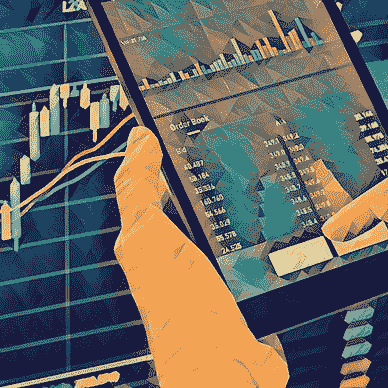
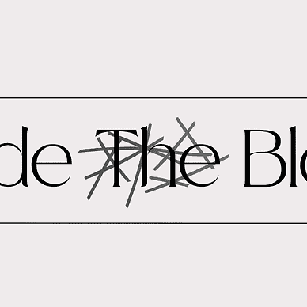
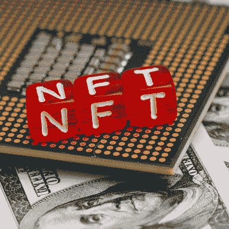

# 数字资产时代的家族办公室

> 原文：<https://medium.com/coinmonks/family-offices-in-the-age-of-digital-assets-3a7d36f3eb4b?source=collection_archive---------29----------------------->

## 数字资产可以为希望提高效率和扩大产品范围的家族企业提供一个令人兴奋的途径。以下是原因和方法。

Photo by [Scott Graham](https://unsplash.com/es/@homajob?utm_source=medium&utm_medium=referral) on [Unsplash](https://unsplash.com?utm_source=medium&utm_medium=referral)

尽管仍是一个利基市场，但过去十年数字资产的崛起，开启了一个全新的投资机会领域，许多机构参与者尚未充分理解和探索。

就大规模资本配置而言，家族理财室在当今经济中扮演着至关重要的角色。他们与富人合作或代表富人，通常寻求投资传统投资者无法获得的资产。在知识方面，家族理财室在分析私募股权、债务和风险资本等非传统资产类别方面拥有独特的技能。因此，家族理财室熟悉非流动性资产、高度动荡的市场和复杂的监管。

本文探讨了什么是数字资产，家族理财室如何寻求接触这种新的资产类别，以及它们必须克服的障碍。

***重点提示:***

*   *数字资产为多元化带来了令人兴奋的机遇*
*   他们远远超越了加密和 NFT
*   *访问数字资产有多种形式*
*   *数字资产可用于获得竞争优势以及投资*
*   *投资数字资产之前，先投资知识*

# 什么是数字资产？

当听到数字资产时，大多数人会直觉地想到加密货币。但这与事实相去甚远。那么什么是数字资产呢？ [Investopedia](https://www.investopedia.com/terms/d/digital-asset-framework.asp#:~:text=A%20digital%20asset%20is%20generally,our%20personal%20and%20professional%20lives.) 将其描述为:

“…通常是指以数字方式创建和存储的、可识别和可发现的、具有或提供价值的任何东西。”

这种描述是尽可能广泛的，但它清楚地表明，我们不仅仅是在谈论加密货币和 NFT。尤其是如果我们从专业投资者的角度来看，我们必须更具体。随着区块链技术的引入，数字资产的世界呈现出全新的动态。有些人会说，在某种程度上，数字资产已经演变成自己的资产类别。

如果你对数字资产完全陌生，请查看我们的“新手区块链指南”

史蒂夫·勒·卡梅尔

## 区块链初学者指南

[View list](https://inside-block.medium.com/list/the-blockchain-beginners-guide-1cc3582f5a82?source=post_page-----3a7d36f3eb4b--------------------------------)8 stories

# 数字资产真的是自己的资产类别吗？

虽然没有统一的定义，但资产类别是一组具有相似特征的投资。传统金融市场中最狭隘的方法定义了四种不同的资产类别；

*   股票
*   结合
*   现金及等价物
*   另类投资

尽管前三者毫无疑问自成一类，但“另类投资”这个术语的定义有点空洞。在今天的市场上，有一种观点认为市场上有四个以上的类别；以房地产和大宗商品为例。

因此，数字资产是否真的是一种资产类别取决于旁观者的看法。至少可以说，自从区块链发明以来，大多数数字资产都有非常独特的特征，使它们有别于更传统的资产类别；

*   开放源码
*   全天候可用性
*   即时交易结算
*   未经许可
*   无边界的
*   完全可定制
*   价值载体

关于如何对数字资产进行分类的进一步讨论超出了本文的范围，可能值得单独讨论。对于本文，我将把数字资产称为它们自己的资产类别。

# 为什么选择数字资产？

既然我们已经确定了什么是(或者不是)数字资产，那么让我们看看为什么它们为家族理财室提供了一个令人兴奋的领域。

尽管数字资产是一个相对较新的概念，但在过去五年里，它们已经积聚了巨大的势头，这主要归功于比特币和以太坊等加密货币。尽管 crypto 和 NFT 占据了头条，但发生的事情远比看到的要多。区块链技术可能会改变整个行业，就像 21 世纪初的互联网一样。这一转型过程带来了多方面的机遇。

因此，家族理财室要么可以将数字资产纳入其业务活动，要么从投资者的角度来看待它，以实现多元化。

# 整合数字资产

自 2008 年金融危机以来，金融业一直在经历一场数字革命。尽管大型传统机构会发现，由于自身的规模和复杂性，它们很难适应数字时代，但家族理财室处于技术进步的前沿，能够为未来的业务提供保障，并获得竞争优势。能够采用新的先进技术有助于降低成本、提高效率和增加透明度。非常适合中小型企业。

面向家族企业的数字资产解决方案涵盖了从客户数据管理、数据来源和报告到完整的保管解决方案和智能签约的方方面面。随着技术的发展，产品也在发展。

虽然建立一个完全数字化的家庭办公室可能有点遥不可及，但熟悉这个快速发展的领域并拥有数字资产友好的 it 解决方案无疑是一个优势。

财富代际转移等外部因素将要求家族理财室迎合新一代精通技术的客户的需求，否则就有失去业务的风险。因此，寻求将最先进的技术融入他们的商业文化可以作为一种营销策略，并有助于留住下一代客户。

整合数字资产功能还可以为更好地理解作为投资组合的数字资产打下基础。对数字资产优缺点的第一手体验大大加快了学习曲线，并可能带来竞争优势。

# 投资数字资产

管理资产和配置资本是大多数家族理财室活动的核心。许多人倾向于忽略传统的资产类别，已经投资于快节奏、流动性差、波动性大、尽职调查要求高的投资，如私募股权和债券。

虽然对更传统的机构来说，直接投资加密和非加密金融工具可能过于陌生，但他们总是可以通过投资数字资产公司和支持者来寻求间接投资。其中许多是初创企业，正在寻找资本。最近，数字资产领域一些更为突出的参与者甚至在全球交易所上市，使他们可以通过传统的股票和债券进行交易。

有了正确的研究能力，这种投资的风险可以量化，并用于投资组合的多样化。

某些加密货币可以通过交易所交易基金(ETF)等传统投资工具获得，这为在传统投资框架内运营时获得风险敞口提供了另一种简单的方法。

各种知名资产管理公司通过基金结构提供数字资产投资，消除了家族理财室对主动投资管理的需求。此外，许多此类基金结构是在便于报告和法律问题的监管框架下建立的。

对于旨在发挥更积极作用的家族理财室而言，许多项目的社区驱动方式提供了该行业特有的参与度。许多数字资产项目通过代币持有和投票机制提供直接参与。

然而，寻求接触数字资产的不仅仅局限于与区块链相关的公司。数字资产最终与其他部门紧密交织在一起。这方面的例子包括 IT 基础设施、自然资源、能源提供商以及寻求尽早采用数字资产以获得竞争优势的传统公司。

金融机构尝试数字资产和加密货币。一些工业公司寻求通过区块链驱动的供应链来提高效率，硬件公司竞相提供更强大的计算解决方案。因此，与其挑选下一个数字资产独角兽，家族理财室可以采取更被动的方式，简单地尝试识别可能受益于这项新技术的企业和行业。

# 障碍和机遇

尽管数字资产最近很受欢迎，但它们尚未被大规模采用。主要归因于一些持续存在的障碍。让我们讨论其中的一些障碍并触及解决方案。

## 规程

**问题:**数字资产的许多方面仍然很大程度上不受监管，尽管这个问题正在日益得到解决。尽管多个司法管辖区正在制定数字资产和相关公司的监管和法律框架，但我们还远远没有广泛采用标准。当涉及到不受监管的资产时，机构投资者往往会受到投资限制。这使得竞争环境变得不均衡，并给愿意接受数字资产相关风险的专业利基参与者带来了不对称的优势。

此外，许多项目的分散性意味着它们缺乏管辖权，这在发生纠纷时可能会令人不安。

**解决方法:**地点，地点，地点。瑞士和迪拜等地已开始引入保护投资者的规则和法规，并正在建立法律框架，允许机构投资者进入这一新的资产类别。选择正确的地点有助于进入，并为投资者、管理当局和其他市场参与者提供法律安慰。

许多数字资产友好的司法管辖区有专业的服务提供商，如法律和咨询公司，可以帮助导航监管雷区。大型家族理财室可以从雇佣内部数字资产专家担任看门人的角色中获利。

## 复杂性

**问题:**数字资产领域高度分散。区块链技术是一项相对较新的发明，其能力和复杂性还有待于人们充分了解。类似于 21 世纪初的互联网，我们只看到一手实用的、真实世界的应用。许多项目缺乏透明度，或者没有解决任何重大问题。智能合同、DeFi、NFTs 和其他区块链解决方案的概念要求理解技术、编码，并熟悉抽象概念，如分散自治组织(Dao)。而且，即使家族理财室理解数字资产的复杂性，它也有教育客户的艰巨任务。

**解决方法:**教育，教育，教育。寻求接触数字资产的家族理财室被建议获取尽可能多的知识。这可以通过雇佣或外部合作伙伴来实现。这样做的成本似乎很高，但它应该被视为对家族理财室未来的投资。虽然没有必要仅仅为了理解数字资产而雇佣一个区块链的开发者，但是手头拥有一些专业知识将会带来安慰，并有助于保持在最新的行业发展的顶端。

许多地方定期举办峰会和会议，通报数字资产领域的最新发展。他们提供了一个极好的平台来会见行业专家和确定趋势。

许多加密平台，如[币安](https://academy.binance.com/en)、[北海巨妖](https://www.kraken.com/learn)和[比特币基地](https://www.coinbase.com/learn)提供免费教育和网络研讨会，这可以成为获得对该问题基本了解的良好起点。数字资产基于网络的特性提供了大量的在线内容，每个人都可以随时获取。然而，必须以谨慎和批判性的常识来使用这些信息。

## 跟踪记录和可比数据

**问题:**数字资产代表了一个相对较新的行业，因此许多项目缺乏跟踪记录和可比较的数据。对于许多机构投资者来说，这是一个重大障碍，通常需要大量数据来进行风险建模和报告。许多项目的数字化和分散性也意味着传统的分析方法举步维艰。

**解决方案:**对于一个项目或一家公司缺乏的跟踪记录，几乎无能为力。但对于经验丰富的初创公司投资者来说，这并不是一个常见的问题。除了项目本身，人们还必须关注软因素，如参与的人员、公司的管辖范围、商业计划和其他可比较的因素。久而久之，跟踪记录会变得更长，比较也变得更容易。但就像所有其他新兴行业一样，早期采用和参与可以带来竞争优势和显著的风险溢价。同样，强烈建议与行业专家合作。

或者，家族理财室可以通过传统公司和行业进行更间接的投资，这可能会受到数字资产转型的影响。这将使他们能够在更熟悉的环境中运营，同时仍能关注数字资产。

## 缺乏专业知识和可信度

问题:尽管这个话题与之前讨论的问题相比有些过于宽泛，但还是值得一提。对于许多公司来说，找到合适的专家可能是一个重大问题，因为他们要么成本高昂，要么缺乏可信度，最糟糕的情况是两者兼而有之。数字资产领域仍处于淘金热，吸引了许多黑幕人物和自称的专家。

**解决方案:**投入必要的时间和资源来获得所需的专业知识是一项物有所值的投资。家族理财室可以与专业解决方案提供商合作，如数字资产托管人、大宗经纪商和数字资产监管交易所。专业的法律和咨询公司提供教育、项目管理和案例研究。许多数字资产友好型司法管辖区是第三方 IT 解决方案提供商的所在地，它们提供与现有遗留系统的集成和兼容性，以确保家族办公室能够继续运营并平稳过渡到数字时代。

# 结论

正如我们所见，家族理财室可以通过多种方式接触数字资产。一旦数字资产仅由密码和非加密技术组成的观念被抛弃，一系列的机会就会出现。

虽然数字资产的相关风险需要仔细考虑，但仍有很多机会可以探索。与所有资产类别一样，知识和教育是必不可少的。带着健康的好奇心探讨这个话题，可以帮助家族理财室通过向客户提供前沿解决方案来获得竞争优势。

随着法律框架的跟上，数字资产正在成为今天的互联网。我们花了近二十年的时间才理解互联网、人工智能和云计算的真正力量、风险和好处。而且很多情况下，我们还在学习。互联网已经成熟，并牢牢地嵌入到我们的日常生活中，有一个合理的假设是，数字资产也将经历类似的旅程。

强烈建议任何寻求接触数字资产的家族办公室投入时间和资源，尽早了解技术、风险和潜力。

使用专门的第三方提供商和可信的合作伙伴可以促进这一过程，有助于避免代价高昂的错误，并最终增强家族理财室的产品。

寻找伙伴开始旅程？在街区内的**，我们致力于帮助我们的客户找到适合他们需求的解决方案。我们作为独立的顾问，不受偏见和限制，根据您的具体需求和问题量身定制我们的建议。**

如果这篇文章引起了您对数字资产的兴趣，并且您想了解更多，请联系我们。今天就让我们一起开始这段旅程吧。

 [## 在块内部|链接树

### 穿越噪音&提供关于区块链、Web 3.0、NFTs 和 DeFi 的信息

linktr.ee](https://linktr.ee/Insidetheblock) 

**作者的一句话:**
欢迎联系我或在评论区发起一场对话！

请务必订阅并访问我们关于[Medium.com](/@inside-block)的其他文章

并在 [Telegram](https://t.me/insidtheblock) 、[脸书](https://www.facebook.com/insidetheblockmc)、 [Instagram](https://www.instagram.com/insideblock/) 和 [Twitter](https://twitter.com/InsideTheBlock3) 上加入“街区内部”来了解 crypto 和区块链。

*免责声明:本文中的任何信息都是基于我的个人经验，并根据我的知识和能力出于个人兴趣而撰写的。本文没有宣传目的，不代表投资建议，文中提到的任何名称、品牌和报价仅用于说明目的。小心使用任何相关链接，风险自负。永远做你自己的研究。*

另请阅读:

*   [https://www . PwC . com/GX/en/services/family-business/family-office/tech-trends . html](https://www.pwc.com/gx/en/services/family-business/family-office/tech-trends.html)
*   [https://medium.com/r/?URL = https % 3A % 2F % 2fwww . wealth briefing . com % 2f html % 2f article . PHP % 3 FID % 3d 194077% 23。YuEHOnZBxaY](https://www.wealthbriefing.com/html/article.php?id=194077#.YuEHOnZBxaY)

> 交易新手？试试[加密交易机器人](/coinmonks/crypto-trading-bot-c2ffce8acb2a)或者[复制交易](/coinmonks/top-10-crypto-copy-trading-platforms-for-beginners-d0c37c7d698c)
> 
> 加入 Coinmonks [电报频道](https://t.me/coincodecap)和 [Youtube 频道](https://www.youtube.com/c/coinmonks/videos)获取每日[加密新闻](http://coincodecap.com/)

## 另外，阅读

*   [复制交易](/coinmonks/top-10-crypto-copy-trading-platforms-for-beginners-d0c37c7d698c) | [加密税务软件](/coinmonks/crypto-tax-software-ed4b4810e338)
*   [网格交易](https://coincodecap.com/grid-trading) | [加密硬件钱包](/coinmonks/the-best-cryptocurrency-hardware-wallets-of-2020-e28b1c124069)
*   [密码电报信号](/coinmonks/top-3-telegram-channels-for-crypto-traders-in-2021-8385f4411ff4) | [密码交易机器人](/coinmonks/crypto-trading-bot-c2ffce8acb2a)
*   [最佳加密交易所](/coinmonks/crypto-exchange-dd2f9d6f3769) | [印度最佳加密交易所](/coinmonks/bitcoin-exchange-in-india-7f1fe79715c9)
*   [面向开发人员的最佳加密 API](/coinmonks/best-crypto-apis-for-developers-5efe3a597a9f)
*   最佳[密码借贷平台](/coinmonks/top-5-crypto-lending-platforms-in-2020-that-you-need-to-know-a1b675cec3fa)
*   [免费加密信号](/coinmonks/free-crypto-signals-48b25e61a8da) | [加密交易机器人](/coinmonks/crypto-trading-bot-c2ffce8acb2a)
*   杠杆代币的终极指南