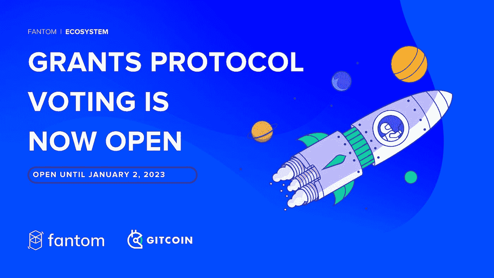
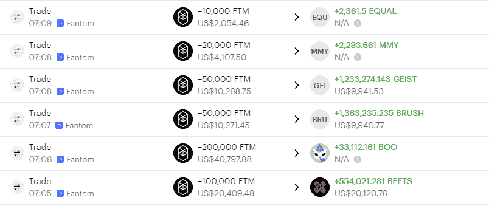
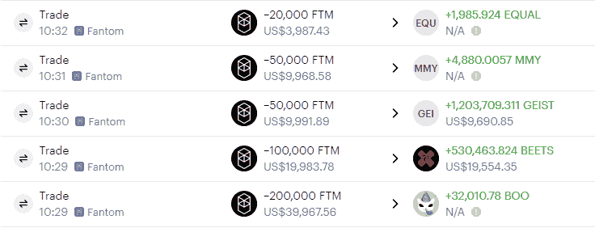
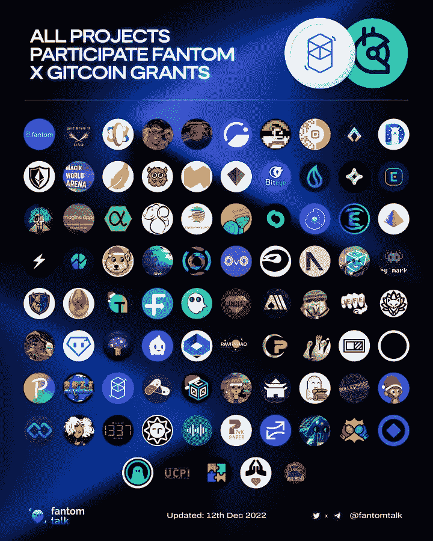

# Fantom $FTM 资助计划支持他们的生态系统

> 原文：<https://medium.com/coinmonks/fantom-ftm-grant-program-support-their-ecosystem-febbcf5e8196?source=collection_archive---------33----------------------->

[https://twitter.com/FantomFDN/status/1602305483536273409/photo/1](https://twitter.com/FantomFDN/status/1602305483536273409/photo/1)

FANTOM 基金会，也称为 FANTOM $FTM，最近支持了他们的 Fantom 生态系统。

> 交易新手？在[最佳密码交易所](/coinmonks/crypto-exchange-dd2f9d6f3769)上尝试[密码交易机器人](/coinmonks/crypto-trading-bot-c2ffce8acb2a)或[复制交易](/coinmonks/top-10-crypto-copy-trading-platforms-for-beginners-d0c37c7d698c)

Fantom $FTM 提供的支持形式是在他们的生态系统中回购项目令牌。Fantom 生态系统加密项目包括:

1.  [斯布克斯瓦普](https://defillama.com/protocol/spookyswap)(德克斯)
2.  [贝多芬 X](https://defillama.com/protocol/beethoven-x)
3.  [艾斯特金融](https://defillama.com/protocol/geist-finance)(借贷平台)
4.  MMY
5.  [均衡器交换](https://defillama.com/protocol/equalizer-exchange) (DEX)
6.  刷

引自推特[@ bitcoinmember](http://twitter.com/BitcoinEmber)

[Bit 余烬 di Twitter: “Fantom 基金会最近开始使用基金会资金来回购帮助 Fantom 生态上的项目代币。 前天早上使用 43 万 FTM 购买了 BOO、BEETS、BRUSH、GEIST、MMY、EQUAL 等六种代币。 刚才又使用 42 万 FTM 购买了 BOO、BEETS、GEIST、MMY、EQUAL 等五种代币。 https://t.co/zgZcfci3Zc" / Twitter](https://twitter.com/BitcoinEmber/status/1608295663414149122/photo/1)

[Bit 余烬 di Twitter: “Fantom 基金会最近开始使用基金会资金来回购帮助 Fantom 生态上的项目代币。 前天早上使用 43 万 FTM 购买了 BOO、BEETS、BRUSH、GEIST、MMY、EQUAL 等六种代币。 刚才又使用 42 万 FTM 购买了 BOO、BEETS、GEIST、MMY、EQUAL 等五种代币。 https://t.co/zgZcfci3Zc" / Twitter](https://twitter.com/BitcoinEmber/status/1608295663414149122/photo/2)

Fantom 的资助从 2，000 美元到 40，000 美元不等。此前，Fantom 也曾宣布将于 2022 年 12 月 15 日进行“**Fantom X git coin 之间的资助计划”**。赠款计划包括:

[Fantom Foundation (@FantomFDN) / Twitter](https://twitter.com/FantomFDN)

Fantom 开展的资助计划是 Fantom 支持其生态系统的方式之一。正如我们所知，加密市场正受到许多负面情绪的冲击。区块链保持生态系统运行非常重要，因为生态系统中支持链的组件都在运行

> *加入 Coinmonks* [*电报频道*](https://t.me/coincodecap) *和* [*Youtube 频道*](https://www.youtube.com/c/coinmonks/videos) *了解加密交易和投资*

# 另外，阅读

*   [Bookmap 评论](https://coincodecap.com/bookmap-review-2021-best-trading-software) | [美国 5 大最佳加密交易所](https://coincodecap.com/crypto-exchange-usa)
*   [加密交易机器人](/coinmonks/crypto-trading-bot-c2ffce8acb2a) | [造币评论](https://coincodecap.com/coingate-review)
*   最佳加密[硬件钱包](/coinmonks/hardware-wallets-dfa1211730c6) | [Bitbns 评论](/coinmonks/bitbns-review-38256a07e161)
*   [新加坡十大最佳密码交易所](https://coincodecap.com/crypto-exchange-in-singapore) | [收购 AXS](https://coincodecap.com/buy-axs-token)
*   [红狗赌场评论](https://coincodecap.com/red-dog-casino-review) | [Swyftx 评论](https://coincodecap.com/swyftx-review)