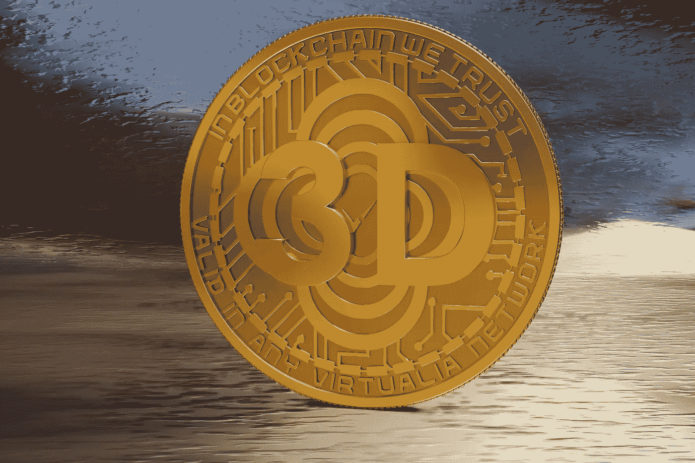

# 智能合同常见问题

> 原文：<https://medium.com/coinmonks/faq-on-smart-contracts-546c420cc832?source=collection_archive---------56----------------------->

## 你只需要知道几句话。

Our Virtualia coin involves many smart contracts

# 什么是智能合约？

区块链技术的出现不仅促进了加密货币的发展。相反，它成为了其他相关应用程序的中心。金融科技行业的一个突破是智能合约。顾名思义，这些合同是虚拟的，涉及几个编程功能。

如果你想掌握智能合约的诀窍，那你就来对地方了。遵循这个简单的指南，熟悉智能合约的基础知识。

> 交易新手？在[最佳加密交易](/coinmonks/crypto-exchange-dd2f9d6f3769)上尝试[加密交易机器人](/coinmonks/crypto-trading-bot-c2ffce8acb2a)或[复制交易](/coinmonks/top-10-crypto-copy-trading-platforms-for-beginners-d0c37c7d698c)

**智能合同与实物合同有何不同？**

智能合约是自动执行的，这意味着它们将在满足几个条件后完成。他们不涉及任何第三方，整个合同发生在区块链技术。然而，另一方面，实物合同有时涉及第三方和大量的文书工作。

程序员编写一个代码，并把它放在区块链技术公司，创建一个智能合同。一旦代码附带的所有条件都得到满足，智能合约就完成了。例如，考虑一个人通过智能合同购买一处房产。一个典型的智能合同将涉及一个人，A，向 B 支付任何 X 数量的加密货币来购买财产。

一旦该条件被批准，智能协定将自动执行，A 将获得该属性。

**智能合约的优势**

智能合同可以让你的生活变得轻松。以下是它们的一些深远的好处:

*   整个代码和过程都在区块链上加密。因此，没有黑客入侵的机会，使您的合同安全。
*   你不需要中间的银行等任何中介来促成合同。因此，您可以节省佣金成本和可能的时间滞后。
*   该过程完全是数字化和自动化的，因此快速且无差错。此外，没有文件或文书工作，使它成为一个无差错的合同。

# **智能合约是如何工作的？**

大多数智能合约都在以太坊上运行，以太坊是第二大加密货币，使用一种叫做以太的货币。所有智能合约的代码都由 Solidity 编程语言编写，通过以太坊虚拟机执行。智能合同的整个流程包括创建业务逻辑代码，这些代码必须放在像区块链这样的分布式分类账上。

首先，您必须决定执行智能合同的条件和标准，包括付款细节或运输信息。之后，开发人员必须在代码中包含复杂的代码，如金融衍生工具，安全专家应对其进行安全测试。

一旦代码被授权，就可以在区块链上部署。数据流源“Oracle”观察条件的完成情况，并向智能合约发送信号。一旦获得所有条件，就执行智能合约。

简而言之，智能合约按照代码的程序运行。但你必须有一个加密账户，有足够的加密货币来参与智能合约。

**智能合同的使用**

您可以在任何处理合同设置的业务中部署智能合同。一些例子包括:

*   保险业务
*   数据记录业务
*   选举投票过程
*   贸易和抵押贷款
*   财产

# **智能合同常见问题解答部分**

**什么是智能合同？**

智能合同是自动执行的合同，协议条款直接写入代码行。代码和其中包含的协议存在于区块链网络上，使它们透明、防篡改和安全。

智能合同是如何工作的？

当满足指定条件时，智能合同通过执行协议条款自动运行。它可以在区块链网络上的各方之间接收、存储和发送数据和加密货币资产。

**智能合约的目的是什么？**

智能合同的目的是促进、验证和执行合同的协商或履行。它们可以实现流程自动化，降低交易成本，并最大限度地降低欺诈和人为错误的风险。

**使用智能合约有什么好处？**

与传统的合同流程相比，智能合同具有增加透明度、不变性、安全性和降低成本等优势。它们还提供了一种分散的、不可信的执行协议的方式。

**智能合约使用哪些编程语言？**

编写智能合约最常用的编程语言是 Solidity，用于以太坊区块链。也可以使用其他语言，如蝰蛇语和竹子语。

**智能合同是如何存储和验证的？**

智能合同存储在区块链网络上，并由网络节点通过协商进行验证。这意味着智能合约中的代码和协议一旦部署就不能更改，从而确保了它们的完整性和安全性。

**智能合约有哪些局限性？**

智能合约的一个限制是，它们只能在代码设置的约束内运行。如果一个契约没有被正确地编程，它可能导致意想不到的后果。此外，智能合约依赖于它们接收的数据的可用性和准确性，这也会影响它们的性能。

**智能合约如何应用于不同的行业？**

智能合同可以用于各种行业，包括金融、供应链管理、房地产等等。他们可以在这些行业中实现流程自动化、降低成本、提高效率和安全性。

**智能合约一旦部署，还能更改吗？**

不可以，智能合同一旦部署到区块链上就不能更改。这是因为它们存储在一个分散的网络上，并经过一致认可，这使得它们防篡改且安全。对合同的任何更改都需要部署新版本。

**智能合同可以用于所有类型的协议吗？**

虽然智能合同有可能使各种协议自动化，但它们可能并不适合所有类型的合同。在当前的技术状态下，需要主观判断或自由裁量权的复杂协议可能不太适合通过智能合同实现自动化。

智能合同具有法律约束力吗？

智能合同的法律地位因管辖区域而异。在一些国家，智能合同可能被视为具有法律约束力，而在其他国家，其地位可能不太明确。然而，智能合同在某些行业的使用越来越多，在区块链社会中被普遍视为一种有效的协议形式。

**智能合约有多安全？**

智能合约的安全性取决于它们的代码和实现。如果一个智能合约写得很好并且经过测试，它可以提供高度的安全性。但是，如果代码中存在漏洞，合同可能会受到黑客攻击或其他类型的利用。

**智能合约可以进行安全性审计吗？**

是的，智能合同可以由第三方安全专家进行安全审计。这对于确保契约没有漏洞并按预期运行非常重要。

**智能合约能处理纠纷吗？**

在某些情况下，智能合同可以通过提供透明和自动化的争议解决机制来处理争议。例如，房地产交易的智能合同可以包括解决支付金额争议的机制。

**智能合约在未来有哪些潜在用途？**

智能合约的潜在用途非常广泛，并且会随着技术的进步而不断发展。在未来，智能合同可以被用来自动化从供应链管理到投票系统等广泛的过程。随着越来越多的行业采用区块链技术，智能合同的使用可能会增加。

智能合同可以与传统合同结合使用吗？

是的，智能合约可以与传统合约结合使用，以补充和增强其功能。例如，传统合同可能概述交易条款，而相应的智能合同可以自动执行商定的条款。

**智能合同如何强制遵守法规？**

智能合同可以通过纳入反映监管要求的规则和条件来强制遵守某些法规。例如，金融行业中的智能合同可以通过编程来执行“了解您的客户”( KYC)和反洗钱(AML)法规。

**与传统合约相比，智能合约的表现如何？**

与传统合同相比，智能合同可以提供更好的性能，因为它们可以自动化流程，降低交易成本，并将人为错误的风险降至最低。智能合约的速度和效率还取决于部署它们的区块链网络的性能。

**智能合约能否用于分散金融(DeFi)应用？**

是的，智能合约广泛用于分散金融(DeFi)应用，如借贷平台、交易所和稳定账户。这些应用程序利用智能合约的安全性、透明性和自动化功能来提供金融服务，而无需中介。

**智能合约可以处理多种加密货币吗？**

是的，智能合约可以通过对合约进行编程来自动管理不同类型的资产，从而处理多种加密货币。例如，智能合约可以被编程为根据特定条件自动将一种加密货币转换为另一种加密货币。

**总结**

*智能合同是存储在区块链网络上的自动执行的数字协议，它自动执行有关各方同意的条款和条件。与传统合同相比，它们提供了更好的性能和更高的安全性，并具有广泛的潜在应用，包括分散金融(DeFi)和供应链管理。*

**参考文献**

[https://www.investopedia.com/terms/s/smart-contracts.asp](https://www.investopedia.com/terms/s/smart-contracts.asp)

[https://www . bit degree . org/crypto/tutorials/what-is-a-smart-contract](https://www.bitdegree.org/crypto/tutorials/what-is-a-smart-contract)

[https://search compliance . techtarget . com/definition/smart-contract](https://searchcompliance.techtarget.com/definition/smart-contract)

# 去了解更多我们的工作

1-通过订阅@ [虚拟团队](https://medium.com/u/228f9c6c3983?source=post_page-----dff196398580--------------------------------)继续关注我们的媒体文章活动

2-阅读我们的[第一篇介绍性文章](/@virtualia/presenting-virtualia-interactive-technologies-dff196398580)，第二篇关于[虚拟生态系统的精神](/@virtualia/the-spirit-of-the-virtualia-ecosystem-54423c200486)，第三篇关于我们对未来的[愿景](/@virtualia/vision-of-the-future-embraced-by-virtualia-dddf44b8d91e)面对万亿次超级计算机、类人工智能交互、纳米技术和 3D 打印以及区块链 P2P 支付的技术挑战。第四篇文章是关于[2030 年生态系统的未来](/@virtualia/the-full-virtualia-experiment-by-2030-a70303af08b8)。

3-访问我们的公司网站 https://virtualia.ai 以了解更多关于我们在 Virtualia Interactive Technologies 所做的事情，并更好地了解 3DVRAR 应用如何对现实和虚拟经济产生重大影响。

4-参观我们在 https://virtualiaworlds.com[的元宇宙、混合和多元宇宙世界的旅程](https://virtualiaworlds.com)

5-访问我们的虚拟购物平台，网址为 [https://virtualia.shop](https://virtualia.shop) ，跟随我们的旅程，构建零售电子商务的未来&！

6-访问我们的 3D 设计架构公司，该公司正在利用人工智能和自动化 3D 沉浸式体验在 realtech 中开发下一个大项目，网址为[https://virtualytics . design](https://virtualytics.design)。

7-在 LinkedIn 上关注我们，网址为[https://www . LinkedIn . com/company/virtualia-interactive-technologies/](https://www.linkedin.com/company/virtualia-interactive-technologies/)

> 加入 Coinmonks [电报频道](https://t.me/coincodecap)和 [Youtube 频道](https://www.youtube.com/c/coinmonks/videos)了解加密交易和投资

# 另外，阅读

*   [Bookmap 点评](https://coincodecap.com/bookmap-review-2021-best-trading-software) | [美国 5 大最佳加密交易所](https://coincodecap.com/crypto-exchange-usa)
*   [加密交易机器人](/coinmonks/crypto-trading-bot-c2ffce8acb2a) | [硬币门评论](https://coincodecap.com/coingate-review)
*   最佳加密[硬件钱包](/coinmonks/hardware-wallets-dfa1211730c6) | [Bitbns 评论](/coinmonks/bitbns-review-38256a07e161)
*   [新加坡十大最佳加密交易所](https://coincodecap.com/crypto-exchange-in-singapore) | [购买 AXS](https://coincodecap.com/buy-axs-token)
*   [红狗赌场评论](https://coincodecap.com/red-dog-casino-review) | [Swyftx 评论](https://coincodecap.com/swyftx-review)