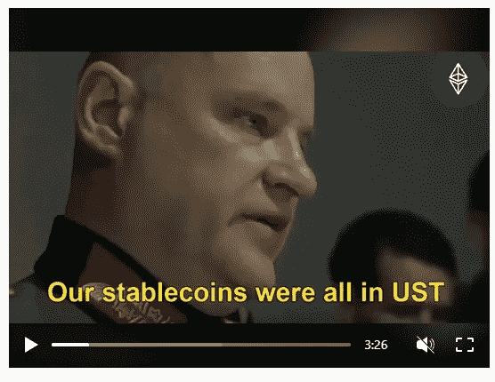

# 获取所有区块链相关更新的最快方式

> 原文：<https://medium.com/coinmonks/fastest-ways-to-get-all-the-blockchain-related-updates-4fe1bb025788?source=collection_archive---------9----------------------->

 [## 领英上的佩兴斯·伊格韦:#科技#区块链

### 我参加#tech。你犯了什么罪？#区块链...

www.linkedin.com](https://www.linkedin.com/posts/patienceigwe-_tech-blockchain-activity-6955135379536556032-B_nM?utm_source=linkedin_share&utm_medium=member_desktop_web) 

这正是在信息很少或没有信息的[#区块链](https://www.linkedin.com/feed/hashtag/?keywords=blockchain&highlightedUpdateUrns=urn%3Ali%3Aactivity%3A6955134032779075584)空间的感觉。

信息就是一切，如果你是一个密码交易员，投资者或研究员，你会同意我的观点，时间就是一切。

你开始交易的时间，
你结束交易的时间
一条消息宣布的时间，等等。

仅仅几个小时不积极上网就可能导致你丢失全部信息，正如你已经知道的，接收这些信息的时机将决定你下一步的正确行动。

但不要担心，因为有很多方法可以赶上或跟踪区块链空间发生的所有事情，我将介绍其中的一些。

获取所有区块链相关更新的最快方法

1.首先，积极了解区块链空间最新动态的最佳方式之一是加入一个社区。众所周知，社区是 [#web3](https://www.linkedin.com/feed/hashtag/?keywords=web3&highlightedUpdateUrns=urn%3Ali%3Aactivity%3A6955134032779075584) 的基石，任何没有社区的项目都等于不存在。有许多社区分享关于这个领域的信息和更新，如[区块链非洲社区](https://t.me/blockchainafricancommunity) (BAC)、 [Crypto Bootcamp 社区](https://twitter.com/bootcamp_crypto?t=rjaqN_B4-Laz5K6X5Hb2-Q&s=09)等等。你所需要的就是加入社区并向他们学习。像 BAC 这样的社区有一个 Q & A 环节和一个新闻快讯环节，成员可以在这里提问以及了解关于空间的最新动态。

2.接下来就是跟着对的人走。这可能非常棘手，因为虽然我们有真正谈论区块链空间的人，但还有很多其他人(有影响力的人)被付费来推广不同的项目，这就是为什么你必须在投资任何项目之前总是做自己的研究(DYOR)并确定那些真正分享他们观点的人。然而，你应该注意，跟随一些有影响力的人也是好的，因为这将让你接触到你可以投资的早期宝石。
尽管我即将发表一篇文章，介绍一些你必须关注的区块链空间中的人，这里只列出几个:迈克尔·塞勒、泰勒和卡梅隆·文克莱沃斯等。

3.经常查看与区块链相关的新闻网站。这些新闻网站会给你深入的趋势新闻知识。像[coin market cap](https://www.linkedin.com/company/coinmarketcap/)[coin telegraph](https://www.linkedin.com/company/cointelegraph/)[coin desk](https://www.linkedin.com/company/coindesk/)和许多其他网站只是你可以获得最新消息的几个地方。

4.关注社交媒体上的标签。这也是从其他人那里获得更新和意见的最快方法之一。相信我，只要你是一个加密人，你就需要 cryptotwitter 的所有更新。

> 交易新手？尝试[加密交易机器人](/coinmonks/crypto-trading-bot-c2ffce8acb2a)或[复制交易](/coinmonks/top-10-crypto-copy-trading-platforms-for-beginners-d0c37c7d698c)

总之，我是一名区块链[#内容作者](https://www.linkedin.com/feed/hashtag/?keywords=contentwriter&highlightedUpdateUrns=urn%3Ali%3Aactivity%3A6955134032779075584)和[#数字营销者](https://www.linkedin.com/feed/hashtag/?keywords=digitalmarketer&highlightedUpdateUrns=urn%3Ali%3Aactivity%3A6955134032779075584)，我的目标是简化区块链相关的新闻/信息/更新，让每个人都容易理解，即使它们只有 5 条。

此外，如果你需要我的任何服务，请告诉我，因为我对新的关系和工作持开放态度。