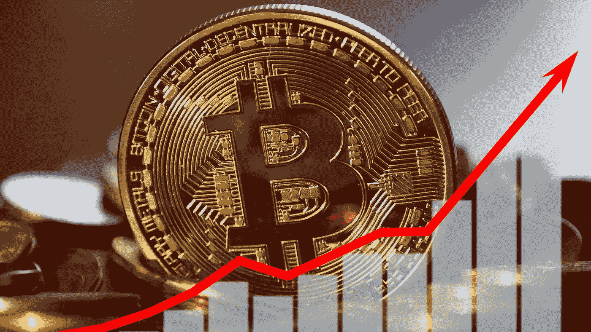

# 美联储第四次加息 75 个基点，BTC 将如何进入 2023 年？

> 原文：<https://medium.com/coinmonks/fed-adds-75-bps-for-4th-time-how-will-btc-go-into-2023-cdf0aa11c9d9?source=collection_archive---------2----------------------->

昨天，美联储将利率提高了 75 个基点。因为这与预期一致，比特币的价格没有太大变化。

虽然比特币价格超过 2 万美元，但股市就没那么幸运了。主要股指已经下跌，今天下跌趋势仍在继续。这是否是比特币开始脱钩，找到自己出路的标志？