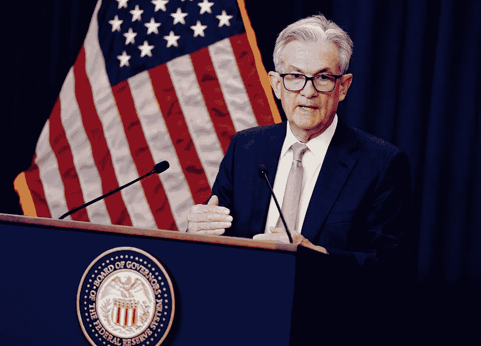

# 随着经济放缓迹象的增长，美联储将宣布再次大幅加息

> 原文：<https://medium.com/coinmonks/fed-to-unveil-another-large-rate-hike-as-signs-of-economic-slowdown-grow-4c5ea861c1ad?source=collection_archive---------40----------------------->

路透华盛顿 7 月 27 日电---预计美联储将于周三将关键利率上调 0.75 个百分点，以对抗高通胀，人们的注意力将转移到政策制定者对经济可能放缓迹象的关注程度上。