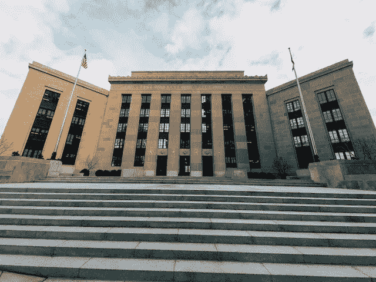

# 美联储测试数字美元

> 原文：<https://medium.com/coinmonks/federal-reserve-tests-digital-dollar-ceecd4045ec2?source=collection_archive---------12----------------------->

美联储正在外汇市场测试央行数字货币(CBDC)。

纽约美联储于 2022 年 11 月 4 日公布了雪松项目。雪松项目是美联储纽约创新中心(NYIC)对外汇市场 CBDC 的测试。雪松项目是美联储对批发 CBDC 的首次测试

