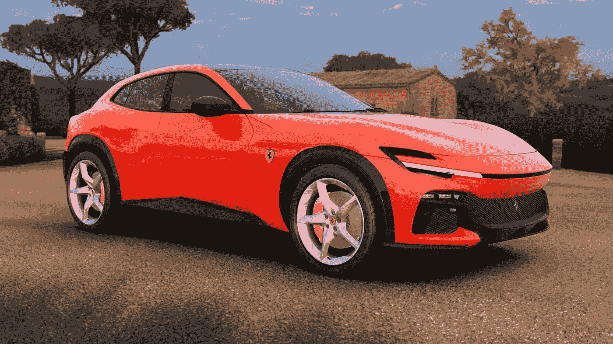
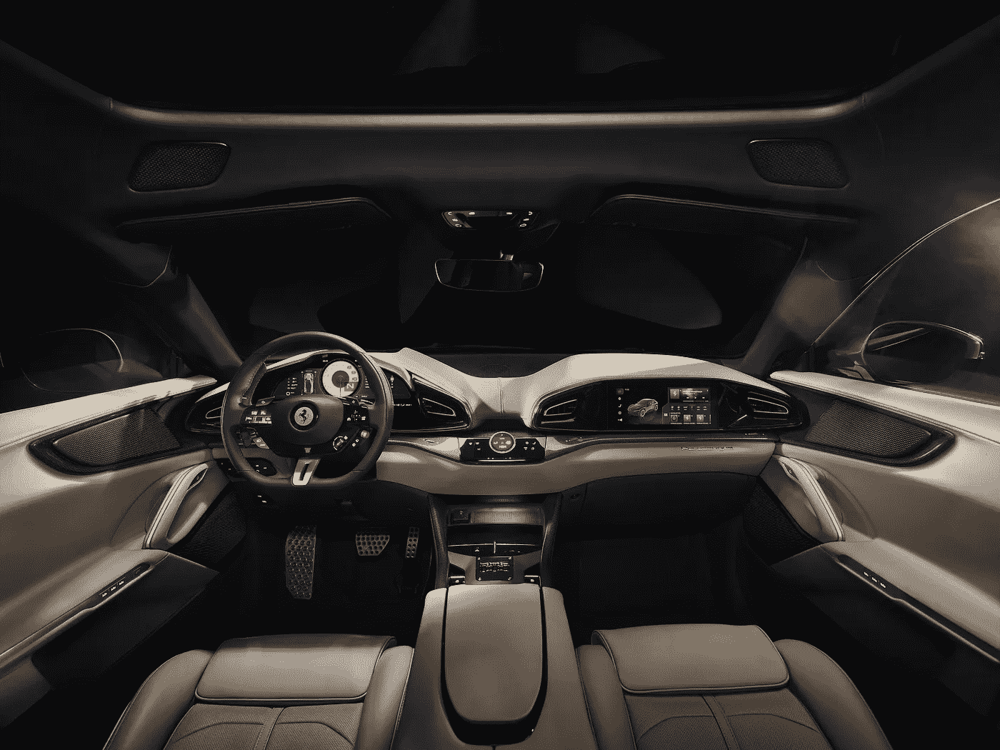
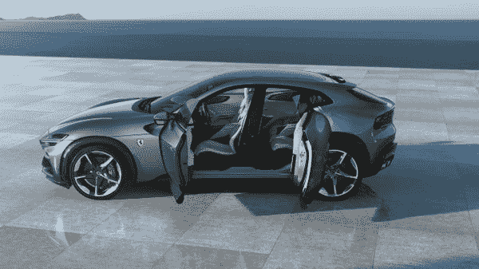
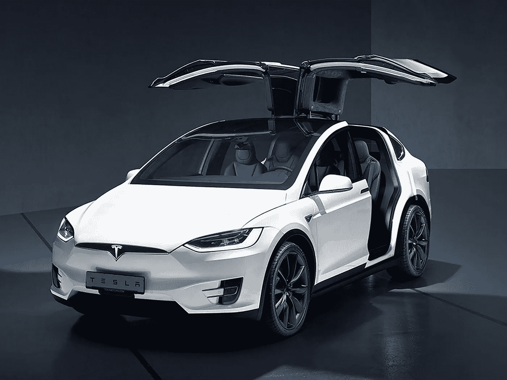

# 法拉利炫耀其新的 40 万美元的 SUV，但不希望我们称之为 SUV。

> 原文：<https://medium.com/coinmonks/ferrari-flaunts-its-new-400k-suv-but-doesnt-want-us-to-call-it-an-suv-be49a2b13798?source=collection_archive---------18----------------------->

**The Ferrari Purosangue starts at $400k!**

新款**法拉利 Purosangue 打破了它的承诺，但不是我们的心。**

全新的，令人垂涎欲滴的，**法拉利 Purosangue。**

你能正确地发音吗？

法拉利做到了。

他们承诺永远不做四座跑车。

他们违背诺言了吗？

不完全是。

按照意大利的方式，他们坚持说这不是一辆 SUV，而是一个刹车闸。

让我们看看好吗？

它有 4 个门，它的外形肯定不是跑车，但也不像传统的 SUV。

它有自杀门，让后排乘客以绝对的方式进入。

它有一个漂亮的内部，填充了所有最新的法拉利技术和纹理。

Ferrari does a good job with the interior of their latest SUV.

与传统法拉利相比，Purosangue 拥有一个巨大的行李箱。

心脏是一个可怕的自然吸气 6.5 升 V12 发动机产生 715 匹马。

这是最原始的。

当然，在一个有泰斯拉斯、卢西德和里维安的时代，这个普罗桑格可能不是最快或最酷的孩子，但它肯定会回头率。

法拉利徽章的可怕标志，四人座，四轮驱动，拥有灰熊原始 V12 发动机的所有可爱的咆哮和咆哮，这是最真实的。

如果你想要纯粹的直线速度和完整的功能，买一辆特斯拉 Model X。

如果你想要一辆 4 座跑车，配备 V12 引擎，在狭窄的道路上比赛，那就选法拉利 Purosangue 吧。

但是，当然，除非你挣的是华尔街银行家或对冲基金经理的薪水，否则你不必担心 40 万美元的价码。

Yep, the **Purosangue** doors open suicide style!

阿特拉斯，法拉利必须对这个市场做出回应，在这个市场上，许多其他公司都已经投降了。

我说的是广受喜爱(和厌恶)的 SUV 类别。

保时捷有卡宴和 Macan。

本特利有本塔伊加。

阿斯顿马丁有 DBX。

劳斯莱斯拥有库里南。

甚至他们最接近的竞争对手兰博基尼也有 Urus。

法拉利不得不做出回应。

The Tesla Model X is a fearsome SUV that is both sporty and functional.

令我印象深刻的是，它与市场上的其他产品既如此相似，又如此不同。

Purosangue 的某些部分会让您想起法拉利 FF，但其外形和性能却是现代和顶级的。

所以好吧，如果你开的是特斯拉 Model S 或者 Lucid Air，这不会给你留下深刻印象。

它吸引了热爱道路感觉、发动机轰鸣声和法拉利传统的纯粹主义者。

我喜欢法拉利没有回避竞争，并推出了全新的风格和设计，与他们通常的阵容截然不同。

冒险和尝试新事物需要勇气，而不这样做要容易得多。

所以，请不要害怕做你想做的事情。

去打几个鸡蛋！

-

你喜欢新的法拉利 Purosangue 吗？

-

#创业#商业#创业#成长#成功#社交媒体#文化#创业#战略#法拉利# **法拉利#跑车# suv #新车#驾驶#意大利**

> 交易新手？试试[加密交易机器人](/coinmonks/crypto-trading-bot-c2ffce8acb2a)或者[复制交易](/coinmonks/top-10-crypto-copy-trading-platforms-for-beginners-d0c37c7d698c)