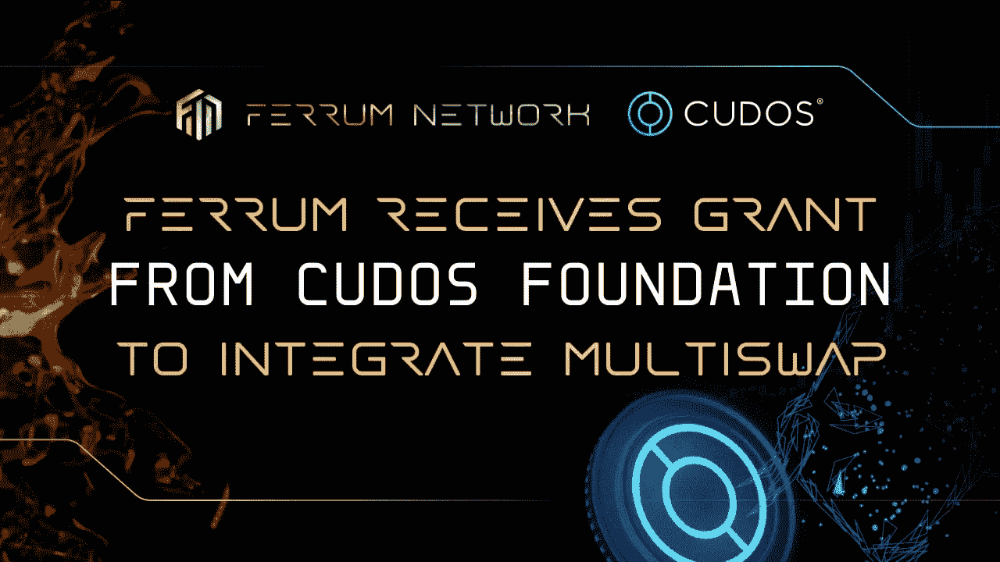

# from 获得 Cudos 基金会的资助，用于集成 MultiSwap

> 原文：<https://medium.com/coinmonks/ferrum-receives-grant-from-cudos-foundation-to-integrate-multiswap-7f7019bc63ac?source=collection_archive---------15----------------------->

## 有了这笔赠款，multi WAP 成为市场上第一个兼容 CosmWasm 的互操作性协议，并将允许 Ferrum 将 Cudos 和其他兼容 Cosmos 的网络与 multi WAP 集成。

很高兴我们能够说，我们是库多斯基金会赠款的自豪接受者。经过深思熟虑，Cudos 的团队对铁姆寄予了厚望。

# 这笔资助需要什么？

在铁姆公司，我们一直努力在市场趋势以及可扩展和互操作网络的未来方面保持领先。

# Cudos 与 MultiSwap 的集成

铁将集成 Cudos 网络和我们新的多链 DEX 聚合器 MultiSwap。通过将 MultiSwap 与 Cudos 区块链集成，铁将:

*   在网络上驱动 TVL(总值锁定)
*   减少新用户和网络之间的摩擦
*   使 Cudos 上的资产更加可组合
*   增加网络音量

> “我们很高兴欢迎铁网络加入我们的资助计划，并坚信这对 Cudos 基金会和 Cudos 区块链整体而言都是一次有益的合作。
> 
> 这一过程的第一步是确保 Cudos 安全有效地连接，达到所有关键的里程碑。我们期待与铁姆团队共同发展！"
> 
> —李·伍德汉姆，Cudos 基金会主席，CudoVentures 首席运营官。

# MultiSwap 成为首个兼容 CosmWasm 互操作性协议

Cudos 将成为 Cosmos 生态系统中的第一个网络，我们将整合该网络，并在未来为其他人提供构建模块。据我们所知，MultiSwap 将是市场上第一个兼容 CosmWasm 的互操作性协议，我们感谢 Cudos 给我们这个机会！"

# 库多斯将加入钢铁联盟

我们很高兴能让库多斯加入[钢铁联盟](https://ferrum.network/iron-alliance/)。行业中很少有生态系统像钢铁联盟那样为其成员提供如此多的价值。Iron Alliance 是一个有凝聚力的项目集体，总是寻求改善分散协议的前景。我们很幸运能够获得 Cudos 这样一个慈善项目，我们期待看到联盟对 Cudos 的回报。

# 最后

我们期待着与 Cudos 开始我们的旅程，并相信这将是一个持久而富有成效的关系。在接下来的几个月里，我们将不断更新社区的信息。感谢 Cudos 基金会给我这个机会，也感谢 iron 社区对我坚定不移的支持！

敬请期待！

非常真诚地属于你，

*铁网团队*

# 关于 Cudos

Cudos 网络是第 1 层区块链和第 2 层计算，而 oracle 网络是旨在确保分散、无权限地访问大规模高性能计算，并支持将计算资源扩展到 100，000 个节点。一旦连接到以太坊、Algorand、Polkadot 和 Cosmos，Cudos 将在所有桥接的区块链上实现可扩展的计算和第 2 层 Oracles。

# Cudos 基金会重要链接

[电报](https://t.me/cudostelegram) | [推特](https://twitter.com/CUDOS_) | [脸书](https://www.facebook.com/cudos.org) | [领英](https://www.linkedin.com/company/cudos1/) | [博客](https://www.cudos.org/blog/)

# 关于 Cudos 基金会

成立 [Cudos 基金会](https://cudos.foundation/grants/)是为了促进 [Cudos 区块链网络](https://www.cudos.org/)的发展和增长，以支持其成为去中心化云计算领域的卓越领导者。凭借 5000 美元至 250000 美元的资助机会，众所周知，Foundation 对 DeFi、NFT、metaverses、游戏、基础设施令牌化以及以大规模采用为重点的工具和桥梁表现出了特别的兴趣，开拓并扩展了大规模高性能计算的分散、无许可访问的理念。

# Cudos 基金会重要链接

[网站](https://www.cudos.foundation/) | [推特](https://twitter.com/CudosFoundation) | [电报](https://t.me/cudostelegram) | [YouTube](https://www.youtube.com/c/CUDOS) | [不和](https://discord.com/invite/cudos) | [媒体](https://medium.com/cudos) | [播客](https://anchor.fm/cudoscast-cudos)

# 铁网络重要环节

[网站](https://ferrum.network/) | [电报](http://telegram.ferrum.network/) | [推特](https://twitter.com/FerrumNetwork) | [YouTube](https://www.youtube.com/channel/UCN658dMRTaH4C4dP32VHi6Q) | [不和](https://discord.gg/HEfKq57asd)

> 交易新手？尝试[加密交易机器人](/coinmonks/crypto-trading-bot-c2ffce8acb2a)或[复制交易](/coinmonks/top-10-crypto-copy-trading-platforms-for-beginners-d0c37c7d698c)