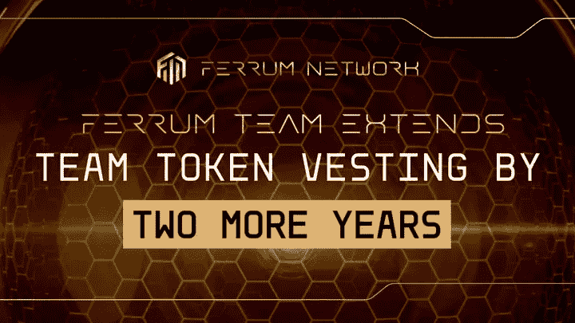

# 铁之队延长两年队令牌归属

> 原文：<https://medium.com/coinmonks/ferrum-team-extends-team-token-vesting-by-two-more-years-89ec38361b85?source=collection_archive---------36----------------------->

## 在再次增加团队代币的授权后，铁姆再次证明了他们是长期存在的，并对铁姆的未来充满信心！

亲爱的铁社区:

铁姆最初的令牌组学是在 2018 年设计的，这在 Web3 中是一个永恒——大多数在那个时候推出的加密项目已经不复存在。相反，铁从未有过如此强劲的基本面，并将继续保持下去。为了支持铁无限层 mainnet 的预期发布，我们很高兴地告诉大家，我们正在对$FRM 令牌组学进行几项改进。

我们正在修改我们的代币分配，以反映团队对长期成功的承诺，同时不牺牲支持指数增长所需的资源。我们坚信，这些更新的表征组学将更准确地描述铁的当前状态，并使我们能够实现我们的长期愿景和目标。

# 铁将团队授权再延长 2 年

我们想透露的第一件事，因为它与新的令牌组学有关，可能是授权计划中最大的变化——铁*队*令牌。这个类别占*最大供应量*的 10%。

该团队将长期参与其中，并同意大幅延长团队令牌授权期。最初，该团队有一年的悬崖，这意味着令牌将在推出后 12 个月或 2020 年 8 月开始授予。随后的发布时间表持续了 3 年。到 2023 年 8 月，*队*代币将被完全授予。2020 年 8 月，该团队决定将锁定期延长至 3 年，并将发布时间表从 24 个月延长至 36 个月。这意味着到 2025 年 8 月，*队*的代币将被完全授予…

铁队又成功了。这一次，他们同意将*团队*令牌再锁定 12 个月，并将发布时间表从 36 个月延长到 48 个月！这些大约 3300 万枚代币的发行要到 2023 年 8 月才会开始，而且要到 2027 年 8 月才会完全归属！这是铁公司为他们自己的代币增加的额外 2 年授权。

***注意:大多数 Web3 团队有 6 到 12 个月的悬崖，发布时间表持续 12 到 36 个月，其中 48 个月的总授权处于高端。铁姆现在有一个 48 个月的悬崖，然后是一个持续 48 个月的线性释放时间表，总计 96 个月的归属！***

***自从铁姆公司成立以来，这个团队等待分配到$FRM 的时间增加了一倍。这是一种奉献精神，也清楚地证明了铁还能带来更多！***

## 团队令牌现在基于表现，更加分散

不像大多数项目那样，不管团队成员的影响如何，都提供团队标志，铁姆采取了一种不同的方法，更紧密地与利益相关者的利益保持一致。*团队*令牌将颁发给那些证明自己对组织最有益的团队成员。给予单个团队成员的金额将基于单个团队成员的季度评估。任何没有达到他们的期望为项目提供有意义的利益的团队成员将不会从该季度的*团队*类别中获得代币。因此，团队标志将被用作一种机制，以激励团队成员长期发挥最佳能力，从而协调所有铁网络利益相关方的利益。

此外，*团队*代币原本是给一个小得多的团队成员的。现在，在过去的 2 年中，团队规模急剧扩大，*团队*类别的代币将被分配给更多的个人，进一步分散供应。

## 公司状况的证明

最重要的是，延长团队授权的决定证明了铁姆公司持续运营的效率。有了两年的跑道，铁姆不仅不需要去碰*团队*的代币，也不需要去碰*金库*的代币。铁姆公司利用其产品和服务产生的收入向大约 35 名全职员工支付工资。

点击了解更多关于铁的状态[。虽然这篇文章是几个月前写的，但同样的原则今天依然存在！](/ferrumnetwork/ferrum-network-a-bullish-update-during-bearish-times-b4f8eb70fa30)

**总之** 我们很高兴向社区发布新设计的令牌组学的第一次更新！我们认为，这些改进的象征性经济学将继续与我们在铁的各个方面努力坚持的透明度水平持平。然而，最重要的是，这些新设计的令牌组学将有助于在我们继续推进铁的 InfinityLayer mainnet 和我们的互操作性 2.0 愿景时，为铁的成功做好准备！关于 FRM 和 FRMx tokenomics 的更多更新将在未来几周和几个月内发布，同时发布的还有另一个有新闻价值的 token 相关更新。

# 关于铁网

铁正在引领区块链互操作性 2.0 时代。由称为量子门户的多链消息引擎提供动力，铁网络的 mainnet 将为行业中的每个链带来价值、数据和功能互操作性。

利用铁网络在一个网络上构建和部署解决方案，并立即启用多链功能，而没有管理多链基础架构带来的负担或技术债务。

# 铁网络重要环节

[网站](https://ferrum.network/) | [电报](http://telegram.ferrum.network/) | [推特](https://twitter.com/FerrumNetwork) | [YouTube](https://www.youtube.com/channel/UCN658dMRTaH4C4dP32VHi6Q) | [不和](https://discord.gg/HEfKq57asd)

> 交易新手？尝试[加密交易机器人](/coinmonks/crypto-trading-bot-c2ffce8acb2a)或[复制交易](/coinmonks/top-10-crypto-copy-trading-platforms-for-beginners-d0c37c7d698c)