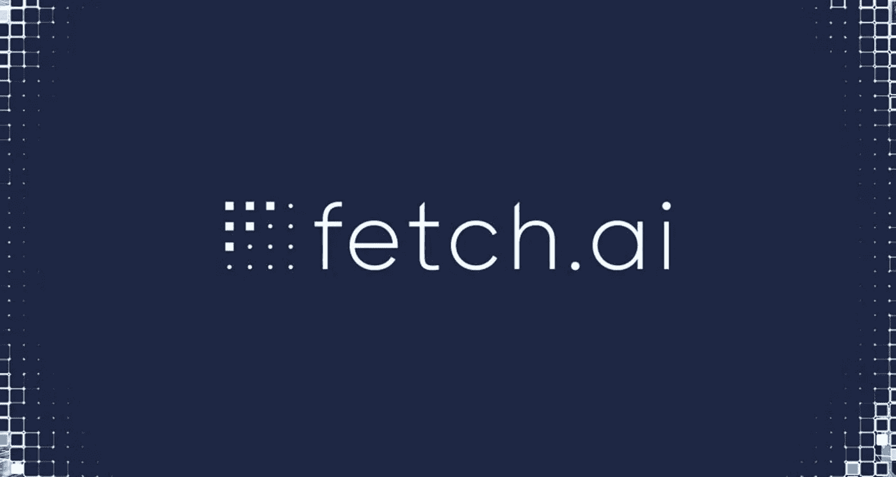

# 旨在引入人工智能的 Fetch AI (FET)区块链项目

> 原文：<https://medium.com/coinmonks/fetch-ai-fet-blockchain-based-project-aimed-at-introducing-artificial-intelligence-7a41d3a9c86?source=collection_archive---------13----------------------->

FETCH AI (FET)加密货币是 Fetch.ai 的原生加密货币，FETCH . AI 是一个位于区块链的项目，旨在将 AI(人工智能)引入加密货币经济。主要卖点是其 AEAs(自主经济代理)由人工智能(自动化分散财务功能)驱动。自主经济代理被创造为智能软件代理；这些代理可以执行不同的任务，比如找到去某个特定目的地的最便宜的机票，或者在网上向可能的最高出价者出售物品。

FETCH AI (FET)加密货币成立于 2017 年，于 2019 年 3 月在币安通过 IEO 推出；FETCH AI (FET) CRYPTOCURRENCY 是一个人工智能实验室，用一个简单的加密网络构建了一个无许可、开放、去中心化的机器学习网络。FETCH AI (FET)加密货币通过一个无许可的网络使人工智能技术的访问民主化，任何人都可以通过使用一些自主人工智能来执行将利用全球数据网络的任务来连接和访问安全数据集。此外，FETCH AI (FET)加密货币植根于一些用例，如智能能源电网、优化 Defi 交易服务、交通网络(如微移动、停车等)以及任何依赖于大规模数据集的复杂数字系统。

> 在**上多读一些这样的隐秘故事**

# **Fetch Ai (Fet)加密货币的创始人是谁？**

**FETCH AI (FET)加密货币由胡马云·谢赫、托比·辛普森和托马斯·海恩创建。托马斯·海恩(Thomas Hain)是 Fetch Ai 的前首席科学官(CSO)，也是 Koemei 的联合创始人和董事。胡马云·谢赫(Humayun Sheikh)是 FETCH AI (FET)加密货币的现任首席执行官，也是 its 和 Uvue 的创始人，Mettalex 的联合创始人。另一方面，托比辛普森是前首席运营官，现在是 FETCH AI 加密货币顾问委员会的新成员。他还曾是 Ososim Limited 的首席技术官和 DeepMind 的软件设计主管。**

# **是什么让 Fetch Ai (Fet)加密货币独一无二？**

**FETCH AI (FET)加密货币实用令牌旨在创建、部署和训练数字双胞胎。这是平台智能合约和神谕的重要组成部分。通过 FETCH AI (FET)加密货币，用户可以在网络上部署和构建他们的数字双胞胎。开发人员可以使用 FETCH AI (FET)加密货币令牌访问基于机器学习的实用程序，以训练自主数字双胞胎并在网络上部署集体智能。验证节点也通过标桩 FET 令牌来启用，从而促进网络验证和信誉。**

# **Fetch Ai (Fet)加密货币的四个不同元素是什么？**

****以下是 FETCH AI (FET)加密货币的主要元素:****

1.  **数字双胞胎框架提供了模块化组件，帮助团队为数字双胞胎建立技能、市场和智能以进行连接。**
2.  **开放经济框架为数字双胞胎提供了发现和搜索功能。**
3.  **数字孪生大都会——这是一组智能合同，运行在 WASM (Web Assembly)虚拟机上，维护数字孪生之间不可改变的协议记录**
4.  **Fetch.ai 区块链结合了多方密码术和博弈论，以提供安全、可靠、抗审查的共识和一些快速的链同步，这将支持数字孪生应用。**

**当谈到 FETCH AI (FET)加密货币平台的核心组件时，有一个学习者，其中每个用户都是实验中的学习者。它代表了一个独特的私有数据集和一个机器学习系统。当所有用户集体训练机器学习模型时，全球市场也来自集体学习实验。此外，FETCH AI (FET)加密货币区块链是一个区块链网络，支持智能合约，安全地允许协调和治理。**

> **原载于**

> ****交易新手？尝试[加密交易机器人](/coinmonks/crypto-trading-bot-c2ffce8acb2a)或[复制交易](/coinmonks/top-10-crypto-copy-trading-platforms-for-beginners-d0c37c7d698c)****