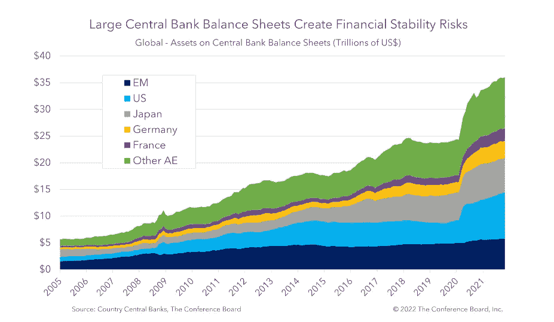
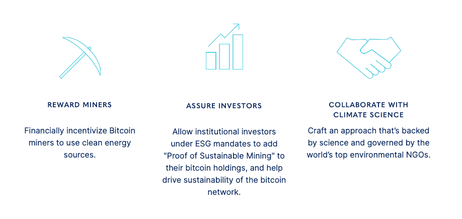

# 菲亚特和加密是一体的

> 原文：<https://medium.com/coinmonks/fiat-and-crypto-are-one-7ad8d829298a?source=collection_archive---------35----------------------->

这篇博客分享了我作为央行行长的转变之旅，我有 16 年的经验:1)监督联系汇率制度的运作，2)研究 T2 外汇基金的资产配置和 ESG 政策，以及最近在 T4 可持续发展比特币协议中的新角色。

作为一名禅宗学生，我被教导要警惕歧视和二元思维，并避免被任何意识形态所束缚。如果我们不继续扩大我们理解的范围，我们将看不到新的发展和机会。这种教学帮助我以开放的心态研究数字资产领域，让我看到法定货币、加密货币、美元和比特币，因为它们没有不适当的依恋、判断或兴奋。

菲亚特与加密、传统金融与分散金融等之间正在进行的辩论令人想起一场宗教战争，两个阵营都声称自己的政权至高无上，并相互驳斥，有时是以辩论的方式。我无法预测这场“战争”将如何展开，也不支持任何一方。我宁愿充分利用我们手中的牌。凭借我的中央银行背景，我注意到两大阵营可以相互提供见解，为它们的创造者——人类——所面临的无数挑战性问题提供解决方案，如果我们能够培养开放、非歧视和不执着于我们的观点的话。

My teacher said “all of us are only human, and we have wrong perceptions every day…we should not trust our perceptions too much.” He urged us to ask ourselves — “Are you sure of your perceptions?”

因此，我想在这里分享我的拙见，以促进我的学习，并与来自菲亚特和密码社区的朋友进行有价值的讨论。您的评论和反馈非常重要，有助于我更好地理解当前的货币演变浪潮，我希望在我职业生涯的后半段对此做出更多贡献！

*不要错过绿化加密世界“UST”的机会*

我想谈的第一个话题是对比特币的主要批评——它的能源使用，正如媒体定期报道的那样，这与一些国家不相上下。因此，一些人主张全球禁止比特币挖矿，而一些人呼吁将代码从工作证明改为更节能的利益证明，这两种情况在可预见的未来都不太可能发生。与此同时，尽管加密市场最近出现了动荡，但鉴于其越来越直观的采用(见示例[此处](https://www.bridgewater.com/research-and-insights/the-evolution-of-institutional-investors-exposure-to-cryptocurrencies-and-blockchain-technologies)、[此处](https://www.barrons.com/articles/fidelity-fintech-bitcoin-401k-51658523063)和[此处](https://www.bloomberg.com/news/articles/2022-08-11/blackrock-offers-bitcoin-investing-to-big-institutional-clients#xj4y7vzkg))、不断扩大的用例(见示例[此处](https://consensys.net/blockchain-use-cases/))以及元宇宙的主流兴趣(见示例[此处](https://www.forbes.com/sites/forbesagencycouncil/2022/07/15/what-we-can-learn-from-top-brands-already-in-the-metaverse/?sh=41c06e3e3a70)和[此处](https://fortune.com/2022/08/24/metaverse-the-sandbox-alpha-season-three-blockchain-nfts-crypto-animoca-brands/))，预示整个加密行业的终结是不明智的。

Metaverse platform The Sandbox launches its newest alpha season and expects half a million users

事实上，最近的市场调整将有助于将焦点从投机性质转移回加密生态系统的基本效用。在这种背景下，提出解决比特币开采的环境影响的方案是必要和务实的。为什么是比特币？虽然目前各种限制阻止了比特币的广泛采用，但它仍然是加密行业的支柱，就像加密世界中的美国财政部一样。

比特币是许多投资者购买其他加密货币之前的门户加密货币。举个例子，2014 年，比特币被用作第二大加密货币以太网的初始硬币发行的融资货币。这是由于比特币作为最可靠的加密货币的地位，尽管如此，它需要一个工作证明奖励系统以及与该过程相关的能源成本，以保护其稳健性。

注:*如果你和我一样是比特币新手，想了解更多，我强烈推荐你阅读这本* [*的书*](https://www.amazon.com/gp/product/1633538001/ref=as_li_tl?ie=UTF8&camp=1789&creative=9325&creativeASIN=1633538001&linkCode=as2&tag=bitsonblocks-20&linkId=d2a3e009c7a818623eb18ec9367a7d78) *。*

此外，作为市值最大、流动性最强的加密货币，比特币在分散金融(DeFi)的发展中扮演着重要的抵押品角色，这种金融依赖于在缺乏信用检查和个人数据的情况下过度抵押。因此，为了以可持续的方式实现更广泛的加密生态系统的持续发展和成熟，不同的组织和公司正在试图使比特币采矿过程的能源足迹更清洁、更高效，例如提高采矿芯片的能源效率和使用可再生能源。这是一个令人鼓舞的发展，因为我们现在有机会绿化加密世界的“美国财政部”，这对于菲亚特世界中的对应方——真正的美国财政部——来说是不可想象的。

在我之前支持提交联合国负责任投资原则的角色中，我对美国国债和其他主权债券的碳足迹(占资产所有者投资的大部分)在很大程度上被忽视和分析的事实感到困惑。我们的数据供应商解释说，这是由于缺乏适当的指标和可操作的洞察力。就指标而言，不清楚如何界定一个国家排放的碳的所有权和责任，因为它涉及公共和私营部门的各种利益攸关方，以及基于生产和基于消费的不同方法。至于可操作的洞察力，主权债务的资产配置通常是一种被动的功能，取决于央行的货币制度或养老基金和捐赠基金的负债匹配需求。换句话说，公众投资者发现很难(如果不是不可能的话)调整他们的主权债券配置或与政府进行有效接触，即使碳足迹信息可以获得。可悲的是，自 2008-2009 年全球金融危机以来，央行本应保持市场中立的干预可能显示出对碳密集型行业现有企业的意外结构性偏向，许多国家对基础设施项目的关注和住房贷款的增加就是明证。

Major central bank balance sheets ballooned to roughly US$36 trillion after COVID, compared to around US$5 trillion prior to the 2008–9 Global Financial Crisis.

*只有可衡量的东西才能得到管理。*

而对于比特币来说，情况更有希望，因为鉴于区块链采矿过程的完全透明，适当的指标并非完全遥不可及。然而，要将这些指标转化为有意义的行动，需要强大的科学评估和利益相关方的深入参与。我们可持续发展比特币协议一直在与可再生能源和能源审计领域的领先非营利组织和科学家密切合作，以开发一种科学、合理和系统的方法来激励可持续的比特币开采。简而言之:

*   使用清洁能源开采比特币的矿工向可持续比特币协议申请认证。
*   可持续比特币协议验证比特币是使用绿色能源开采的，并为每一个开采的 BTC 颁发可持续比特币证书，作为区块链堆栈上的智能合同。
*   可持续比特币证书允许矿商和投资者在不破坏可替代性的情况下，为他们拥有的 BTC 提出可持续性要求。

与其他可持续倡议类似，这个问题没有单一的灵丹妙药。合作是建立意识和有效的多学科方法的关键，以推动比特币社区和更广泛的金融和加密市场的可持续和包容性发展。正如禅宗教义所说，“我们是一体的。”我们的目标是与大家一起推动一个更绿色的未来，并使加密技术得到更广泛的采用和应用。

感谢你阅读这篇文章。非常感谢您的提问和评论。您的反馈将帮助我积累知识，并鼓励我使用我的中央银行和新训练的加密大脑深入研究感兴趣的主题！

在 www.sustainablebtc.org 了解更多关于可持续比特币协议的信息。

在[推特](https://twitter.com/SustainableBTC) & [Linkedin](https://www.linkedin.com/company/sustainablebtc/) 上查看我们

在 Linkedin 上与我联系

*此处的信息并非基于对任何个人投资者情况的考虑，不是投资建议，也不应以任何方式解释为税务、会计、法律或监管建议。*

> 交易新手？尝试[加密交易机器人](/coinmonks/crypto-trading-bot-c2ffce8acb2a)或[复制交易](/coinmonks/top-10-crypto-copy-trading-platforms-for-beginners-d0c37c7d698c)