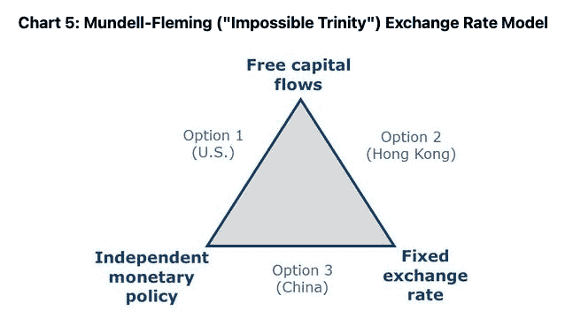
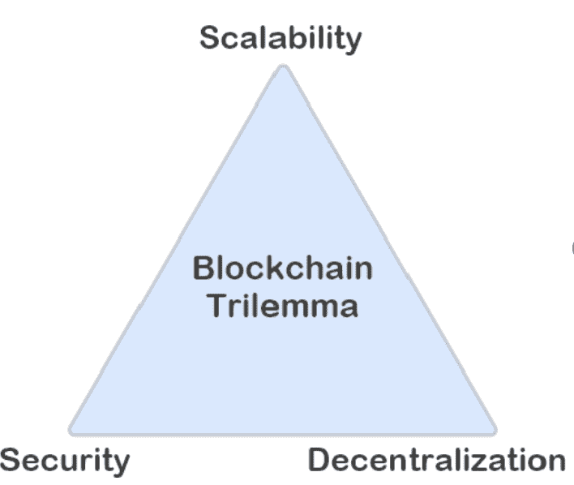
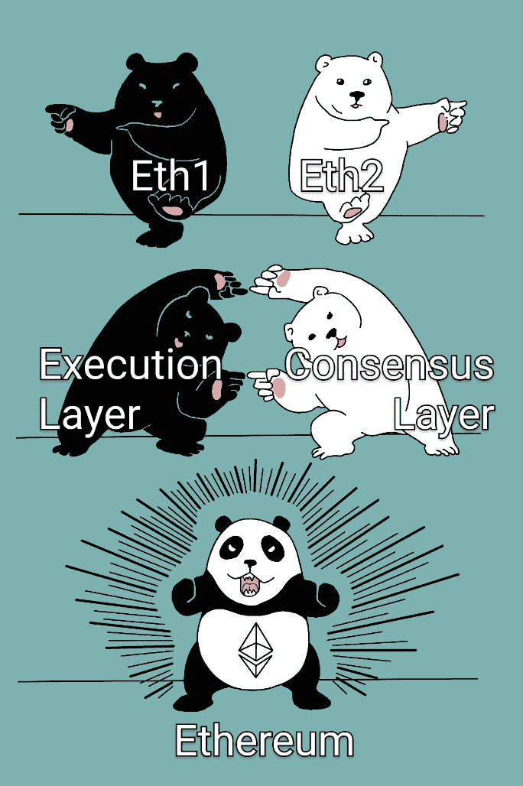

# 法定和加密三难以及工作证据和利害关系证据之争

> 原文：<https://medium.com/coinmonks/fiat-crypto-trilemmas-and-the-debate-between-proof-of-work-proof-of-stake-52e45a930f9?source=collection_archive---------26----------------------->

这篇博客分享了我作为央行行长的转变之旅，我有 16 年的经验:1)监督联系汇率制度的运作，2)研究 T2 外汇基金的资产配置和 ESG 政策，以及最近在 T4 可持续发展比特币协议中的新角色。虽然我的新眼睛可能会看到一些有趣的东西，但必须有足够的空间来加深和扩展我的知识。因此，我们非常重视并感谢您的意见和反馈！

作为一名在香港出生、长大并在香港央行工作的经济学学生，我对蒙代尔-弗莱明模型特别感兴趣，这是 IS-LM 模型的开放经济版本。用更通俗的话来说，该模型通常被称为“不可能的三位一体”或“政策三元悖论”，它认为，一个经济体不可能同时保持(1)固定汇率，(2)资本自由流动，以及(3)独立的货币政策。如下图所示，决策者只能实现三个政策目标中的两个。

为什么这样如果一个开放的经济体系维持独立的货币政策，例如降低本地利率以刺激经济，其货币一般会贬值，因此汇率会失去稳定。如果一个开放的经济体的汇率是固定的，并与另一种货币挂钩，货币政策的独立性就无法实现，因为挂钩和币值通常是通过使其利率与其支持货币的利率保持一致来维持的。或者，可以实行资本管制，以维持固定汇率，同时在与管制水平相称的程度上保持货币政策的独立性。

***区块链世界中的三难困境***

有趣的是，区块链和加密货币也存在类似的三元悖论。理解这一概念有助于解决我在分享我在推动比特币网络可持续发展的新角色时得到的一个常见回应——“为什么不干脆将比特币的共识机制从工作证明改为其他更高能效的方案，如股权证明？”

我以前也有同样的想法，因为我只是从一些引人注目的推文中了解到与加密相关的流行词汇，而没有深入研究它们的内在结构和属性。然而，在担任我的角色之前，我花了一些努力去更深入一点，看看我是否能被我未来的工作说服。加密三难是一个基本概念，用来解释为什么每个加密方案都有自己的利弊，更具体地说，为什么工作证明使比特币成为现在的样子。

那么什么是区块链三难困境呢？与 fiat FX 世界中的政策三难困境类似，以太坊的联合创始人区块链·维塔利克·布特林提出的概念区块链三难困境指出，加密货币只能在区块链网络的三个主要属性中的两个属性上表现良好——去中心化、安全性和可扩展性。让我们简单解释一下它们是什么。

注意:在这篇博文中，我避免使用诸如“无权限”和“无信任”这样的术语，对我来说，当我开始学习这个主题时，这些术语有点晦涩难懂。

去中心化是指将控制权和决策权从一个集中的实体转移到一个分布式网络中。在分布式网络中，每个交易都通过不同的共识机制(例如工作证明和利益证明)进行验证和批准。通过避免集中式实体，它可以使网络免于 I)单点漏洞(例如，银行挤兑或黑客攻击)和 ii)对可信第三方的依赖(即，没有单个实体具有绝对权力)。因此，网络越分散，对外部攻击的抵抗力就越强，因此区块链的安全性就越高。这反过来有助于保护用户信心，促进加密货币的广泛采用和长期发展。然而，分散的、安全的网络是以可扩展性或速度为代价的，因为交易需要多次确认并消耗更多资源。

由于去中心化是大多数加密货币的基石，区块链三元悖论通常可以归结为根据加密货币的关键功能和愿景，在安全性和可扩展性之间取得正确的平衡。比特币的[白皮书](https://bitcoin.org/bitcoin.pdf)将其关键功能概括为“电子现金的纯粹点对点版本将允许在线支付直接从一方发送到另一方，而无需通过金融机构。”为此，比特币采用工作证明是很自然的，这是一种将安全性置于可扩展性之上的共识机制。但是如何做到这一点呢？

简单来说，赢得比特币方块奖励的机会与你参加猜谜比赛的计算能力成正比。它被故意设计成在电力和硬件方面很昂贵，作为对恶意攻击的防御。理论上，颠覆比特币网络需要获得 51%的总计算能力，鉴于网络的规模，这即使不是不可能，也是极其昂贵的。工作证明确保参与者在游戏中有皮肤，激励他们花费昂贵的资源诚实地加入竞争，赚取比特币奖励并保护网络的健壮性。

***为什么不干脆改用股权证明？***

那么，你们中的一些人可能会问，为什么第二大加密货币以太，即以太坊的原生加密货币，从工作证明(即合并)转换为股权证明是合理的。答案回到了加密货币的功能和愿景。与比特币不同，以太坊的目标是成为智能合约和去中心化应用的区块链平台，正如其在[白皮书](https://ethereum.org/en/whitepaper/)中所述。以太坊区块链越来越受欢迎，它托管了大多数 NFTs、DeFi 和其他 Web3.0 应用程序，已经开始扼杀这个系统。因此，对于社区来说，花费数年的研究和开发来计划向“比工作证明更复杂”但“更适合实施新的扩展解决方案”的利益证明的过渡是有意义的，包括在其[网站](https://ethereum.org/az/developers/docs/consensus-mechanisms/)上提到的分片。

同样，这篇博文关注的是加密开发的概念方面，而不是技术方面。感兴趣的读者不妨参考以太坊的网站，深入探究一下过渡的细节。然而，我想强调的是，工作证明和利益证明都有其利弊，如这里的、这里的和这里的所讨论的。

***范式转变必须得到相关指令或使命的支持***

尽管从 2020 年以来的几次延期证明了以太坊的转型具有复杂性和挑战性，但为了实现以太坊作为 web3.0 平台的目标，以太坊的转型是完全合理的。相比之下，比特币作为点对点电子现金系统的关键功能得到了很好的验证。比特币的稳健性和简单性是支撑其作为流动性最强、市值最大的加密货币的基础。虽然可扩展性对于实现大规模采用至关重要，但比特币社区更喜欢其他保持工作证明协议不变的[可扩展性解决方案](https://lightning.network/)。此外，加密社区正在开发不同种类的加密货币，以集体的方式解决区块链三难问题。

回到法定货币的世界，每个货币体系都试图实现自己的政策目标。如果考虑不周、处理不当，汇率制度的转变可能会给资产市场和数百万人的生活带来严重破坏。因此，除非由金融危机引发，否则货币范式的转变必须在仔细考虑经济、金融和发展需求后得到充分证明。

一些人认为，由量化宽松(QE)推动的过度信贷增长将导致生产过剩和浪费，只有通过引入货币纪律(如重新引入金本位制)才能避免这种情况。然而，没人知道金融市场和地缘政治将如何在这种范式转变中发挥作用。类似地，呼吁改变比特币的编码，让其现有机制很好地服务于其关键功能也是不明智的。

***尊重授权促进可持续性***

我们能不能不改变现有法令和密码系统的基本原理，同时解决它们各自的可持续性挑战？肯定是的。例如，欧洲央行开始将可持续性相关债券纳入其资产购买计划，以促进 COVID 后的[绿色复苏。同样，我们可持续发展比特币协议正在促进可持续开采，这与已建立的比特币生态系统完全兼容，正如我的第一篇文章](https://www.ecb.europa.eu/press/pr/date/2022/html/ecb.pr220704~4f48a72462.en.html)[中简要讨论的那样。](/p/7ad8d829298a#7dbf-b6b50bdaf1c0)

最后，工作证明和利害关系证明之间的争论就像另一场宗教战争，类似于我在第一篇文章中提到的 fiat 和 crypto 之间的战争。被歧视和二元思维或任何意识形态所束缚，只会把我们都带入一个无尽的循环。我希望加密社区将联合起来，相互补充，共同建立一个更有效、更健壮、更安全的生态系统。

**************

*在 www.sustainablebtc.org***了解更多关于可持续比特币协议的信息。**

**查看我们在*[*Twitter*](https://twitter.com/SustainableBTC)*&*[*Linkedin*](https://www.linkedin.com/company/sustainablebtc/)*

**在*[*Linkedin*](https://www.linkedin.com/in/arnold-hui/)上和我联系*

**此处的信息并非基于对任何个人投资者情况的考虑，不是投资建议，也不应以任何方式解释为税务、会计、法律或监管建议。**

> *交易新手？尝试[加密交易机器人](/coinmonks/crypto-trading-bot-c2ffce8acb2a)或[复制交易](/coinmonks/top-10-crypto-copy-trading-platforms-for-beginners-d0c37c7d698c)*