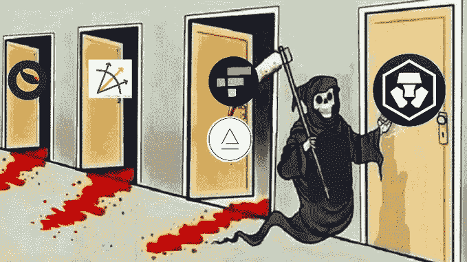

# 平板网关和路障

> 原文：<https://medium.com/coinmonks/fiat-gateways-and-road-blocks-6acdcd2e52d4?source=collection_archive---------22----------------------->

~dwulf

## 战斗岗位

Crypto 正处于新的世界经济大融合的边缘。目前唯一真正的问题是少数交易(公用事业、天然气、租金等)所需的国家美元。).这是菲亚特网关的亮点，但由于民族国家的合法性和监管机构的授权，所有隐私在 KYC 授权期间都暴露了。

通常意味着进入加密场景，你的名字和细节在进入点被丢弃。这对一些人来说可能是个问题，但对绝大多数人来说，他们根本不在乎，就像你必须出示身份证和社会保险才能开立银行或经纪账户一样，不是吗？

所以你知道了，你逃不出 KYC，也逃不出你不可避免的对隐私的侵犯，所以为什么要尝试呢。

# KYC 菲亚特期权

## 贝宝朋克

先把最坏的事情放在第一位，因为房间里的大象需要被解决。Paypal 是最糟糕的，他们不仅单方面控制你上传到 Paypal 平台的任何资金，而且最近(也许他们一直都有这种能力)，他们完全可以在未经你允许的情况下，从任何连接到它的银行扣除你的所有资金。

这个爪回功能(bug？)对任何使用 Paypal 的用户都没有好处，一旦附加到你的银行账户，Paypal 的路径就设定好了。我的建议是摆脱贝宝，并建立一个新的银行账户，只是为了确保这种联系实际上被切断。

## 现金应用

好吧，现金应用更好，但仍然需要 KYC，并有自己的 BTC 钱包，你可以将 BTC 转入和转出。是的，这不是你的钱包，现金应用程序有钥匙，但当你想兑现时，它可以是一个现在的钱包。我喜欢现金应用程序，还没有任何问题，但我知道它是什么，仍然在坡道上寻找替代菲亚特。

我不得不说，取下这些菲亚特训练轮是一件很难的事情。

# 不带 KYC 的菲亚特期权

这是它介入的地方，更具体。在任何情况下，如果你能接触到第一世界旧经济银行，你将在各自的中央银行机构有 KYC 的档案。

在没有银行的情况下，法定兑现期权变得更加困难和复杂，但这是可能的。他们只是需要更有创意的方法来找到愿意出售和购买密码的用户群，当地的 BTC 自动取款机是一个更糟糕的选择(费用非常高)，礼品卡(亚马逊，沃尔玛等)。)是比 BTC 自动取款机更好的选择，但需要一定程度的警觉，并计划预算零售商户和供应商的选择。最好的当然是群组和聚会，用于直接的点对点交流。

## 寻找密码供应商和商人

诀窍是用你的闪电或 defi 钱包投票。寻找加密友好的供应商和商人是最好的商业秩序。这通常会重建购买习惯，使其更加以加密为中心，这很好，并使您和相应的供应商和/或商家之间的交易对等。

像这样的商业安排保护了双方的隐私，并通过集中监控系统排除了交易。收入可以考虑 0 级，优化，DAO 收入，并相应处理。

## 用户组和会议

下一个选择是直接与其他用户进行点对点交易，meetups 很适合这种情况。每个人都在公共场所，每个人都带着美元或沙特阿拉伯货币用于隐私交易，应该有更多这样的东西。

如果你打算以美元出售 sat(或其他密码)或以美元出售 sat，要注意安全，公共场所，在有 WiFi 的咖啡店，3 次交易就完成了，但 1 次交易真的足够了。

## BTC 自动取款机

也许最糟糕的是，大多数自动取款机收取疯狂的费用，并且如果它们安装了现金盒，就开始限制菲亚特进出。如果他们不是，那么这是一个单向与信用卡或借记卡。

在某种程度上，BTC 的自动取款机会变得越来越不友好，需要 KYC，也许那时它们就没用了。

## 保持在第 1 层和第 2 层，API 事务

这是优步级别，程序员的天堂，但用户的地狱。

可以肯定的是，这是一条没有 KYC 的路线。

在这个层次上，不受法规、政策或法律的约束。人们可以不受惩罚地行动。唯一的法律是法典的法律，当你知道了法典，你就知道了法律。

为了直接访问 API 而去掉 UI，可以将 JSON 对象提供给 feed，进行解析和分发，用于 Oracle 比较以捕获套利，或者用于交易所交易本身，通常只需很少或零汽油费用。

## 结论

作为用户，你必须掌握控制权。这意味着尽可能多地了解你所工作的链条的机械细节。

对我们来说，这意味着了解铁锈和戈朗，并实施使用基板和油墨！以及 EVM 和 WASM 如何与所有被创造的密码链相互作用。

这不是一件容易的事情，因为每一段代码都需要高超的技巧，并且需要道德操守来保持系统的诚实。区块链在本质上是一台真理机器，但对智能合约和区块链之上的完整图灵程序的深入了解是它变得复杂的地方。

底线是少一些信任，多一些真实。

> 交易新手？试试[加密交易机器人](/coinmonks/crypto-trading-bot-c2ffce8acb2a)或者[复制交易](/coinmonks/top-10-crypto-copy-trading-platforms-for-beginners-d0c37c7d698c)